# AGENTS.md – AgentEval Framework Development Guide

This file provides instructions for AI coding agents working on the AgentEval framework codebase.

---

## 📦 Project Overview

**AgentEval** is a local, agnostic, sequential testing framework to evaluate AI coding agents. It provides a Vitest-like DX for orchestrating, isolating (via Git), evaluating (via LLM-as-a-Judge), and tracking AI agent performance.

### Monorepo Structure

```
agent-eval/
├── AGENTS.md              ← You are here
├── PRD.md                 ← Product requirements document
├── pnpm-workspace.yaml    ← Workspace config (apps/* + packages/*)
├── .github/workflows/
│   ├── ci.yml             ← CI pipeline (lint → test → build → typecheck)
│   ├── release.yml        ← Automated releases via Changesets
│   └── docs.yml           ← VitePress docs deployment to GitHub Pages
├── docs/
│   └── adrs/              ← Architecture Decision Records
│       ├── 001-why-custom-framework.md
│       ├── 002-sqlite-over-jsonl.md
│       ├── 003-sequential-execution.md
│       ├── 004-llm-as-judge.md
│       ├── 005-monorepo-layout.md
│       ├── 006-code-quality-gates.md
│       └── 007-solid-architecture.md
├── apps/
│   ├── docs/              ← VitePress documentation site
│   ├── eval-ui/           ← Dashboard UI (React + Tailwind + Recharts)
│   └── example-target-app/ ← E2E target app for integration tests
├── packages/
│   └── agent-eval/        ← Core framework (agent-eval)
│       ├── src/
│       │   ├── core/      ← Core modules
│       │   │   ├── types.ts       ← All TypeScript interfaces
│       │   │   ├── config.ts      ← Config file loader (jiti)
│       │   │   ├── config.test.ts
│       │   │   ├── context.ts     ← TestContext (storeDiff, runCommand)
│       │   │   ├── context.test.ts
│       │   │   ├── runner.ts      ← Sequential test execution engine
│       │   │   ├── runner.test.ts
│       │   │   ├── expect.ts      ← Fluent assertion API
│       │   │   └── index.test.ts  ← test() registration tests
│       │   ├── git/       ← Git isolation
│       │   │   ├── git.ts         ← reset --hard, clean -fd, diff
│       │   │   └── git.test.ts
│       │   ├── judge/     ← LLM-as-a-Judge
│       │   │   └── judge.ts       ← Vercel AI SDK + Zod structured output
│       │   ├── ledger/    ← SQLite result storage
│       │   │   ├── ledger.ts      ← node:sqlite DatabaseSync
│       │   │   └── ledger.test.ts
│       │   ├── cli/       ← CLI binary
│       │   │   └── cli.ts         ← agenteval run|ledger|ui
│       │   └── index.ts   ← Public API (test, describe, expect, defineConfig)
│       ├── tsup.config.ts ← Build config (ESM + CJS + DTS)
│       └── tsconfig.json
└── docs/adrs/             ← Architecture Decision Records
```

---

## 🛠️ Development Commands

```bash
# Install all dependencies
pnpm install

# Build the core package
pnpm build

# Run unit tests
pnpm test

# Lint the codebase (ESLint)
pnpm lint

# Auto-fix lint issues
pnpm lint:fix

# Format the codebase (Prettier)
pnpm format

# Check formatting without writing
pnpm format:check

# Run the docs site locally
pnpm dev

# Type-check the core package
pnpm --filter agent-eval typecheck
```

---

## ✅ Mandatory Workflow: Lint → Format → Test → Build → Commit

**Every change MUST follow this workflow. No exceptions.**

> 💡 The Husky pre-commit hook enforces this automatically — `lint-staged` (ESLint + Prettier on staged files), `pnpm test`, and `pnpm build` all run before every commit. If any step fails, the commit is rejected.

### 1. Lint and format

```bash
pnpm lint:fix && pnpm format
```

All ESLint rules must pass. All files must be Prettier-formatted.

### 2. Run tests

```bash
pnpm test
```

All tests must pass. If a test fails, fix it before proceeding.

### 3. Run the build

```bash
pnpm build
```

Build must succeed with zero errors.

### 4. Commit when green

Once lint + format + tests + build all succeed, **commit immediately**:

```bash
git add -A
git commit -m "<type>(<scope>): <description>"
```

### 5. Open a Pull Request before merging

**Every change MUST go through a Pull Request (PR). Never push directly to `main`.**

Create a feature branch, push your commits, then open a PR on GitHub:

```bash
# Create a feature branch from main
git checkout -b feat/<scope>-<short-description>

# ... make your changes, commit ...

# Push the branch
git push origin feat/<scope>-<short-description>

# Open a PR via GitHub CLI
gh pr create --title "<type>(<scope>): <description>" --body-file -
```

#### PR Description Template

The PR description **must** contain a structured summary (always in English) that clearly explains the entire feature. Use the following template:

```markdown
## Summary

One-paragraph high-level description of **what** this PR does and **why**.

## Changes

Bullet list of all meaningful changes, grouped by area:

### Core (`packages/agent-eval/src/`)

- `core/types.ts` — Added `Foo` interface, extended `Bar` with `baz` field
- `core/runner.ts` — Integrated new `Foo` into execution pipeline
- ...

### UI (`apps/eval-ui/src/`)

- `components/FooCard.tsx` — New component for displaying Foo data
- `pages/Overview.tsx` — Added Foo KPI card to dashboard
- ...

### Documentation (`apps/docs/`)

- `guide/configuration.md` — Added Foo config section with Mermaid diagram
- `api/expect.md` — Updated JudgeOptions with new `foo` option
- ...

### Tests

- Added X new tests (total: Y core + Z UI = N)
- Key test scenarios: ...

## How to test

Step-by-step instructions for the reviewer to verify the feature:

1. `pnpm install && pnpm build`
2. `node --experimental-strip-types scripts/seed-ledger.ts`
3. `cd apps/eval-ui && pnpm dev` — check the dashboard
4. `pnpm test` — all N tests should pass

## Screenshots / Recordings

_(Optional but recommended for UI changes)_

## Breaking changes

List any breaking changes, or write "None" if backward compatible.
```

#### PR Rules

- **One feature per PR.** Don't bundle unrelated changes.
- **The PR title follows [Conventional Commits](https://www.conventionalcommits.org/)** — same format as commit messages.
- **The description must be in English**, even if the discussion happens in another language.
- **All CI checks must pass** before merging (lint, test, build, typecheck).
- **Squash-merge into `main`** to keep a clean linear history.
- **Delete the feature branch** after merging.
- **Link related issues** using `Closes #123` or `Fixes #456` in the description when applicable.

```mermaid
flowchart LR
    A["Feature branch\nfeat/thresholds"] --> B["Commits\n(lint+test+build)"]
    B --> C["Push branch"]
    C --> D["Open PR\n(structured description)"]
    D --> E["CI passes ✅"]
    E --> F["Review & Approve"]
    F --> G["Squash-merge\ninto main"]
    G --> H["Delete branch"]

    style A fill:#6366f1,color:#fff
    style D fill:#f59e0b,color:#000
    style E fill:#10b981,color:#fff
    style G fill:#4f46e5,color:#fff
```



### Commit Convention

Use [Conventional Commits](https://www.conventionalcommits.org/):

| Type       | When                                    |
| ---------- | --------------------------------------- |
| `feat`     | New feature or capability               |
| `fix`      | Bug fix                                 |
| `test`     | Adding or updating tests                |
| `refactor` | Code change that neither fixes nor adds |
| `docs`     | Documentation only                      |
| `chore`    | Build config, deps, tooling             |

Examples:

```bash
git commit -m "feat(runner): add timeout support for agent execution"
git commit -m "fix(ledger): handle corrupted SQLite database gracefully"
git commit -m "test(context): add unit tests for storeDiff and runCommand"
git commit -m "docs(readme): add quick start guide"
```

### ⚠️ Rules

- **ALL 4 gates must pass before committing:** lint ✅ → format ✅ → test ✅ → build ✅
- **Husky enforces this automatically.** The pre-commit hook runs `lint-staged` (ESLint + Prettier on staged files), `pnpm test`, and `pnpm build`. A failure at any step blocks the commit.
- **NEVER push directly to `main`.** Always go through a Pull Request.
- **NEVER leave working code uncommitted.** If it passes all gates, commit it.
- **NEVER commit broken code.** Never use `--no-verify` to bypass the hook.
- **Commit frequently.** Small, focused commits are better than large ones.
- **Write tests for every new feature or bug fix.**
- **Open a PR with a structured description** before merging into `main`.
- **If you're unsure whether to commit, commit.** You can always amend or squash later.

### Testing Guidelines

- Tests use **Vitest** and are **colocated** next to the source file they test
- Name test files `<module>.test.ts` (e.g., `ledger/ledger.test.ts`, `core/context.test.ts`)
- Colocated means: `src/git/git.ts` → `src/git/git.test.ts` (same folder)
- Use `describe` / `it` blocks with clear descriptions
- Mock external dependencies (git commands, LLM APIs) — don't make real API calls in tests
- Test edge cases: empty inputs, missing files, malformed data
- **Every source file must have a corresponding test file**
- Aim for **95%+ coverage** (statements, functions, lines) and **85%+ branch coverage**

### eval-ui Testing Guidelines

The `apps/eval-ui` dashboard uses **Vitest + Testing Library** for component tests:

- **Framework**: Vitest with `jsdom` environment, `@testing-library/react`, `@testing-library/jest-dom`, `@testing-library/user-event`
- **Colocated tests**: `src/components/Sidebar.tsx` → `src/components/Sidebar.test.tsx`
- **Every component and page must have a test file**
- **Test helpers** in `src/test/`:
  - `setup.ts` — Vitest setup file with jest-dom matchers
  - `fixtures.ts` — Mock data factories (`createMockRun()`, `createMockRuns()`, `createMockStats()`)
  - `render.tsx` — `renderWithRouter()` for components needing React Router, `renderPage()` for pages needing `useOutletContext`
- **Mocking patterns**:
  - Mock API functions with `vi.mock("../lib/api")` — never make real API calls
  - Mock `recharts` `ResponsiveContainer` to avoid SVG measurement issues in jsdom
  - Use `waitFor()` for async state updates (data fetching, etc.)
- **CSS `uppercase`**: Text styled with CSS `uppercase` retains its original casing in the DOM — match against source text, not visual text
- **Run tests**: `pnpm --filter eval-ui test` or `cd apps/eval-ui && npx vitest run`

### Coverage Requirements

- **Every source file MUST have a colocated test file** (e.g., `runner.ts` → `runner.test.ts`)
- Coverage is measured with `@vitest/coverage-v8` (configured in `vitest.config.ts`)
- **Minimum thresholds:** Statements ≥ 95%, Branches ≥ 85%, Functions ≥ 95%, Lines ≥ 95%
- Excluded from coverage: `src/cli/**` (entry point), `src/core/types.ts` (pure types)
- Run coverage check: `npx vitest run --coverage` inside `packages/agent-eval/`
- Coverage reports are generated in `text`, `text-summary`, and `lcov` formats

---

## 📖 Mandatory Documentation Updates

**Every code change MUST include corresponding documentation updates. No exceptions.**

When you modify code, you MUST update all related documentation **in the same commit**. Documentation lives in `apps/docs/` (VitePress) and uses **Mermaid diagrams** for visual explanations.

### Documentation Map

Use this map to identify which docs to update when changing code:


### Code → Documentation Cross-Reference

| Code file changed  | Documentation files to update                                                    |
| ------------------ | -------------------------------------------------------------------------------- |
| `core/types.ts`    | `api/define-config.md`, `api/test.md`, `api/expect.md`, `api/context.md`         |
| `core/config.ts`   | `guide/configuration.md`, `api/define-config.md`                                 |
| `core/context.ts`  | `api/context.md`, `guide/writing-tests.md`                                       |
| `core/runner.ts`   | `guide/runners.md`, `guide/architecture.md`                                      |
| `core/expect.ts`   | `api/expect.md`, `guide/writing-tests.md`                                        |
| `git/git.ts`       | `guide/architecture.md`                                                          |
| `judge/judge.ts`   | `guide/judges.md`, `api/expect.md`                                               |
| `ledger/ledger.ts` | `api/ledger.md`, `guide/architecture.md`                                         |
| `cli/cli.ts`       | `guide/cli.md`                                                                   |
| `apps/eval-ui/**`  | `guide/dashboard.md`                                                             |
| Any new feature    | `guide/getting-started.md` (if user-facing), `README.md`, `AGENTS.md`            |
| Any config option  | `guide/configuration.md`, `api/define-config.md`, examples in `guide/runners.md` |
| Any new provider   | `guide/runners.md` or `guide/judges.md`, `guide/configuration.md`                |

### Mermaid Diagram Guidelines

Use Mermaid diagrams in documentation to visually explain:

- **Flowcharts** (`flowchart TD/LR`) — for decision trees, execution flows, and pipelines
- **Sequence diagrams** (`sequenceDiagram`) — for interactions between modules (runner ↔ agent ↔ judge)
- **ER diagrams** (`erDiagram`) — for data models (ledger schema)
- **Color coding**: Use `fill:#10b981,color:#fff` for success (green), `fill:#ef4444,color:#fff` for failure (red), `fill:#f59e0b,color:#000` for warnings/agent (amber), `fill:#6366f1,color:#fff` for system (indigo), `fill:#4f46e5,color:#fff` for CLI/entry points (dark indigo)

When adding a new feature or modifying a flow, **update or add a Mermaid diagram** in the relevant doc page. VitePress has Mermaid support via `vitepress-plugin-mermaid` — use standard ` ```mermaid ` code blocks.

### ⚠️ Documentation Rules

- **NEVER merge a code change without updating the linked docs.** If you add `expectedFiles` to `JudgeOptions`, update `api/expect.md`, `guide/judges.md`, AND `guide/writing-tests.md`.
- **Keep examples current.** If the API changes, update all code examples across all doc pages.
- **Update AGENTS.md** if the change affects development workflows, project structure, or conventions.
- **Update README.md** if the change affects user-facing features or the quick start guide.
- **Add Mermaid diagrams** for any new flow, decision tree, or data model — text-only explanations are not sufficient for complex flows.

---

## 🏗️ Architecture

> **See `docs/adrs/` for full Architecture Decision Records explaining each choice.**

### Sequential Execution ([ADR-003](docs/adrs/003-sequential-execution.md))

All tests run **sequentially** (no concurrency). This is intentional – agents mutate the filesystem and Git state, so parallel execution would cause conflicts. The runner uses `for...of` loops.

### Git Isolation

Before each test iteration, the runner executes `git reset --hard HEAD && git clean -fd`. This guarantees a pristine working directory. **Never** skip git reset between test runs.

### LLM-as-a-Judge ([ADR-004](docs/adrs/004-llm-as-judge.md))

The judge module uses the Vercel AI SDK (`ai` package) with structured output (`generateObject` + Zod schema) to guarantee the judge returns `{ pass, score, reason }`. The judge prompt includes the git diff and all command outputs from the test context.

### SQLite Ledger ([ADR-002](docs/adrs/002-sqlite-over-jsonl.md))

All results are stored in `.agenteval/ledger.db` using Node 22's built-in `node:sqlite` (DatabaseSync). This provides:

- Zero external dependencies
- SQL-powered aggregations (getRunnerStats, getLatestEntries)
- Indexed queries on `test_id` and `timestamp`
- **Note:** Requires Node.js 22+. The `node:sqlite` module is experimental and produces `ExperimentalWarning`.

### API-Based Runners

Runners can be `type: "cli"` (spawn a CLI command) or `type: "api"` (call an LLM directly). API runners:

- Use Vercel AI SDK `generateObject()` with a Zod schema
- Support providers: `anthropic`, `openai`, `ollama`
- Output structured `files[]` array with `{ path, content }` written to disk
- Dynamic provider import (unused providers are never bundled)

---

## 📝 Coding Conventions

### TypeScript

- **Strict mode** enabled. No `any` types.
- Use **explicit return types** on exported functions.
- All types live in `core/types.ts` – import from there.
- Use `.js` extensions in imports (ESM resolution).

### Naming

- Files: `kebab-case.ts`
- Types/Interfaces: `PascalCase`
- Functions/variables: `camelCase`
- Constants: `UPPER_SNAKE_CASE` only for true constants

### Error Handling

- Throw descriptive `Error` objects with context.
- Runner catches errors per-test and records them in the ledger.
- Never let a single test failure crash the entire run.

### Imports

- Node built-ins: `import { x } from "node:fs"`
- Internal: relative paths with `.js` extension
- External: bare specifiers

---

## 🧪 Adding a New Feature

> **Remember:** Every code change requires a corresponding documentation update. See [📖 Mandatory Documentation Updates](#📖-mandatory-documentation-updates) above.

### Adding a new Judge provider

1. Add the provider type to `JudgeConfig.provider` in `core/types.ts`
2. Add a new `case` in `resolveModel()` in `judge/judge.ts`
3. Install the AI SDK provider package if needed
4. Add tests in `judge/judge.test.ts`
5. **Update docs:** `guide/judges.md` (provider section + table), `guide/configuration.md` (judge config table)

### Adding a new Agent runner provider

1. Add the provider type to `AgentRunnerConfig.api.provider` in `core/types.ts`
2. Add a new `case` in `resolveRunnerModel()` in `core/runner.ts`
3. Install the AI SDK provider package if needed
4. Add tests in `core/runner.test.ts`
5. **Update docs:** `guide/runners.md` (provider section + table), `guide/configuration.md` (runner config example)

### Adding a new CLI command

1. Add the command in `cli/cli.ts` using `program.command()`
2. **Update docs:** `guide/cli.md` (command + options + examples), `README.md` (CLI reference table)

### Adding a new Context utility

1. Add the method signature to `TestContext` interface in `core/types.ts`
2. Implement in `EvalContext` class in `core/context.ts`
3. Add tests in `core/context.test.ts`
4. **Update docs:** `api/context.md`, `guide/writing-tests.md` (usage example)

### Modifying the Ledger schema

1. Update `LedgerEntry` in `core/types.ts`
2. Update SQLite table schema in `ledger/ledger.ts` (add column with DEFAULT for backward compat)
3. Update `appendLedgerEntry` and query functions
4. Update tests in `ledger/ledger.test.ts`
5. **Update docs:** `api/ledger.md` (schema table + ER diagram), `guide/architecture.md` (ER diagram)

### Modifying the Dashboard UI

1. Make changes in `apps/eval-ui/src/`
2. Add or update component tests (Testing Library)
3. **Update docs:** `guide/dashboard.md` (features, architecture, screenshots)

---

## 🚀 Release Workflow

### Changesets

We use [Changesets](https://github.com/changesets/changesets) for version management and npm publishing.


#### How to Create a Release

```bash
# 1. Create a changeset (interactive: select packages + semver bump)
pnpm changeset

# 2. Commit the changeset file with your PR
git add .changeset/ && git commit -m "chore: add changeset"

# 3. When ready to release: consume changesets, bump versions, update CHANGELOG
pnpm version

# 4. Commit the version bump, tag it, and push
git add -A && git commit -m "chore(release): v$(node -p "require('./packages/agent-eval/package.json').version")"
git tag "v$(node -p "require('./packages/agent-eval/package.json').version")"
git push && git push --tags
```

The `release.yml` workflow triggers on the `v*` tag push, runs tests, builds everything (including UI bundling), publishes to npm, and creates a GitHub Release with auto-generated notes.

#### Versioning Rules

| Change Type     | Semver Bump | Example       |
| --------------- | ----------- | ------------- |
| Bug fix         | `patch`     | 0.1.0 → 0.1.1 |
| New feature     | `minor`     | 0.1.0 → 0.2.0 |
| Breaking change | `major`     | 0.1.0 → 1.0.0 |

- **Every PR with code changes SHOULD include a changeset** (unless purely internal/docs-only)
- Changesets are consumed by the Release GitHub Action when merged to `main`
- `CHANGELOG.md` is auto-updated by the changesets version command

### CI/CD Pipelines

Three GitHub Actions workflows:

| Workflow    | File          | Trigger                       | Purpose                                      |
| ----------- | ------------- | ----------------------------- | -------------------------------------------- |
| **CI**      | `ci.yml`      | Push + PR                     | Lint, format check, test, build, typecheck   |
| **Release** | `release.yml` | Tag `v*`                      | Test, build, publish to npm + GitHub Release |
| **Docs**    | `docs.yml`    | Push to `main` (docs changed) | Build & deploy VitePress to GitHub Pages     |

### UI Bundling

The `agenteval ui` CLI command serves a bundled copy of the React dashboard:

```bash
# Build everything with UI bundled into the CLI package
pnpm build:all    # builds eval-ui → builds agent-eval → copies UI dist to agent-eval/dist/ui

# For development, run the UI dev server separately
cd apps/eval-ui && pnpm dev   # Vite dev server on :5173, proxies API to :4747
agenteval ui                   # API server on :4747
```

---

## ⚠️ Common Pitfalls

1. **Don't use `execSync` with `stdio: "inherit"` in context.runCommand** – we need to capture stdout/stderr.
2. **Don't run tests in parallel** – Git state will be corrupted.
3. **Always use `encoding: "utf-8"`** when capturing exec output.
4. **Don't forget `.js` extensions** in ESM imports.
5. **The judge prompt is critical** – changes to `buildJudgePrompt()` in `judge/judge.ts` affect all evaluations.
6. **Node 22 required** – `node:sqlite` (DatabaseSync) is only available in Node 22+.
7. **`@ts-expect-error`** is needed on `import { DatabaseSync } from "node:sqlite"` (no stable types yet).
8. **API runner providers are dynamically imported** – ensure the SDK package is installed before using a provider.

---

## 🔮 Roadmap (from PRD)

- [x] **Phase 1**: Core runner, config, test/expect API, CLI, JSONL ledger
- [x] **Phase 2a**: SQLite ledger migration (node:sqlite), ADRs
- [x] **Phase 2b**: API-based agent runners (anthropic, openai, ollama)
- [x] **Phase 2c**: CI/CD pipeline (GitHub Actions)
- [x] **Phase 3**: E2E integration test with dummy target app
- [x] **Phase 4**: Visual dashboard (`apps/eval-ui` with React + Recharts)
- [ ] **Future**: Benchmark suites, plugin system, remote execution
