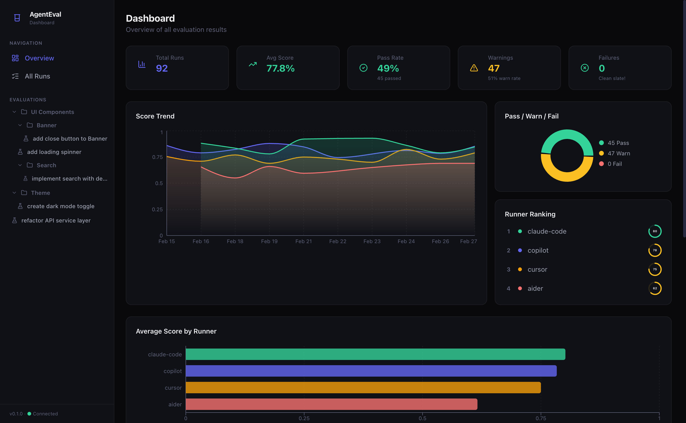
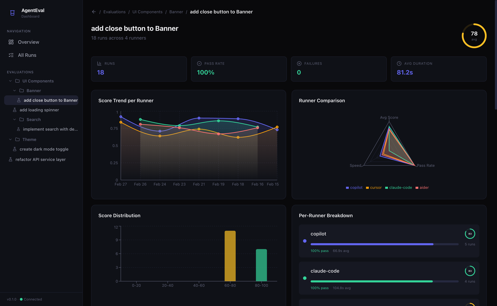
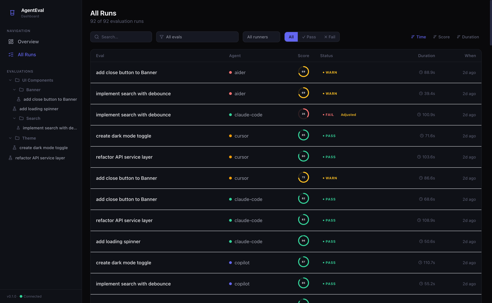
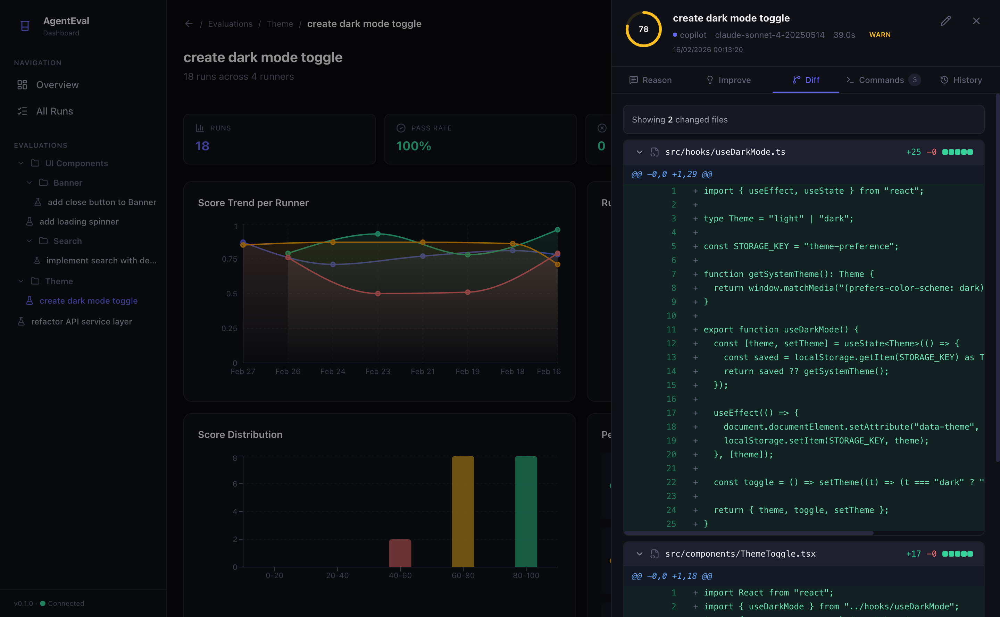

<p align="center">
  
</p>

<h1 align="center">AgentEval</h1>

<p align="center">
  <strong>AI coding agent evaluation framework with Vitest-like DX.</strong>
</p>

<p align="center">
  Test, judge, and track AI coding agents — locally, sequentially, and model-agnostically.
</p>

<p align="center">
  <a href="https://tlahey.github.io/agent-eval/">📖 Documentation</a> ·
  <a href="https://github.com/Tlahey/agent-eval">GitHub</a>
</p>

---

## Dashboard

<p align="center">
  
</p>

<p align="center">
  
</p>

<details>
<summary>More screenshots</summary>

<p align="center">
  
</p>

<p align="center">
  
</p>

</details>

---

## Features

- **Vitest-like API** — `test()` / `expect()` syntax designed for evaluating AI agents
- **Declarative Pipeline** — `agent.instruct()` + `ctx.addTask()` for zero-boilerplate evaluations
- **Config-level Hooks** — `beforeEach` at config, file, or describe level for shared verification tasks
- **Git Isolation** — automatic `git reset --hard` between runs for pristine environments
- **LLM-as-a-Judge** — structured evaluation via any `IModelPlugin` (Anthropic, OpenAI, Ollama, or custom)
- **Model Matrix** — compare multiple agents/models on the same test suite
- **Weighted Scoring** — tasks with weights for nuanced, multi-criteria evaluation
- **Expected Files** — scope analysis detects agents that modify too many files
- **Improvement Feedback** — judge returns actionable suggestions alongside scores
- **SQLite Ledger** — local, privacy-first historical tracking of all evaluation results
- **Visual Dashboard** — React dashboard with charts, diff viewer, and per-evaluation breakdowns
- **Plugin Architecture** — swap ledger, LLM, judge, or environment via SOLID plugin interfaces
- **Dry-Run Mode** — preview execution plans without running agents
- **CLI-first** — `agenteval run`, `agenteval view`, `agenteval ledger`

> 📖 For a detailed comparison with Vitest, Promptfoo, and Langfuse, see [Why AgentEval?](https://tlahey.github.io/agent-eval/guide/getting-started#why-agentevalval)

---

## Quick Start

### Prerequisites

- **Node.js ≥ 22** (required for `node:sqlite`)
- **pnpm ≥ 10**

### Install

```bash
pnpm add -D agent-eval
```

Or install globally to use across projects:

```bash
pnpm add -g agent-eval
agenteval --version
```

### Configure

```ts
// agenteval.config.ts
import { defineConfig } from "agent-eval";
import { CliModel, OpenAIModel } from "agent-eval/llm";
import { SqliteLedger } from "agent-eval/ledger";

export default defineConfig({
  // Agent runners — plain { name, model } objects
  runners: [
    { name: "copilot", model: new CliModel({ command: 'gh copilot suggest "{{prompt}}"' }) },
  ],

  // Judge — LLM model used to score every test
  judge: {
    llm: new OpenAIModel({ model: "gpt-4o" }),
  },

  // Ledger plugin (default: SQLite)
  ledger: new SqliteLedger({ outputDir: ".agenteval" }),

  // Config-level beforeEach — register shared verification tasks
  beforeEach: ({ ctx }) => {
    ctx.addTask({
      name: "Tests",
      action: () => ctx.exec("pnpm test"),
      criteria: "All tests must pass",
      weight: 3,
    });
  },
});
```

> 📖 Full configuration reference: [Configuration Guide](https://tlahey.github.io/agent-eval/guide/configuration) · [defineConfig() API](https://tlahey.github.io/agent-eval/api/define-config)

### Write a test

```ts
// evals/banner.eval.ts
import { test, expect } from "agent-eval";

test("Add a Close button to the Banner", ({ agent, ctx }) => {
  // 1) Instruct the agent (declarative pipeline)
  agent.instruct("Add a Close button to the Banner component");

  // 2) Add a weighted verification task
  ctx.addTask({
    name: "Close button renders",
    action: () => ctx.exec('grep -q "aria-label" src/components/Banner.tsx && echo "found"'),
    criteria: 'A close button with aria-label="Close" is rendered and calls onClose when clicked',
    weight: 3,
  });

  // 3) Required: define final judge criteria and expected scope
  expect(ctx).toPassJudge({
    criteria: "Uses a proper close button, has aria-label, existing tests pass, build succeeds",
    expectedFiles: ["src/components/Banner.tsx", "src/components/Banner.test.tsx"],
  });
});
```

> 📖 More examples: [Writing Tests](https://tlahey.github.io/agent-eval/guide/writing-tests) · [Declarative Pipeline](https://tlahey.github.io/agent-eval/guide/declarative-pipeline)

### Run

```bash
npx agenteval run            # Run all eval tests
npx agenteval run -f banner  # Filter by test title
npx agenteval run --dry-run  # Preview execution plan
```

### View Results

```bash
npx agenteval view           # Launch dashboard (port 4747)
npx agenteval ledger         # View results in terminal
npx agenteval ledger --json  # Export as JSON
```

> 📖 Full CLI reference: [CLI Guide](https://tlahey.github.io/agent-eval/guide/cli)

---

## Plugin Architecture

AgentEval is built around SOLID plugin interfaces. Every major concern is swappable without touching the core:

| Interface            | Purpose                  | Built-in Implementations                       |
| -------------------- | ------------------------ | ---------------------------------------------- |
| `IModelPlugin`       | LLM provider abstraction | `AnthropicModel`, `OpenAIModel`, `OllamaModel` |
| `ICliModel`          | CLI command execution    | `CliModel`                                     |
| `ILedgerPlugin`      | Result storage           | `SqliteLedger`, `JsonLedger`                   |
| `IJudgePlugin`       | Custom evaluation logic  | _(bring your own)_                             |
| `IEnvironmentPlugin` | Execution sandbox        | `LocalEnvironment`, `DockerEnvironment`        |

All plugins are imported via **sub-path exports** — unused providers are never bundled:

```ts
import { AnthropicModel, CliModel, OllamaModel, OpenAIModel } from "agent-eval/llm";
import { JsonLedger, SqliteLedger } from "agent-eval/ledger";
import { DockerEnvironment, LocalEnvironment } from "agent-eval/environment";
```

> 📖 How to create your own plugin: [Plugin Architecture](https://tlahey.github.io/agent-eval/guide/plugins) · [LLM Plugins](https://tlahey.github.io/agent-eval/guide/plugins-llm) · [Ledger Plugins](https://tlahey.github.io/agent-eval/guide/plugins-ledger) · [Environments](https://tlahey.github.io/agent-eval/guide/plugins-environments)

---

## Architecture

```
agent-eval/
├── apps/
│   ├── docs/                  # VitePress documentation
│   ├── eval-ui/               # Dashboard UI (React + Tailwind + Recharts)
│   └── example-target-app/    # E2E target app for integration tests
├── packages/
│   └── agent-eval/            # Core framework (npm package)
│       └── src/
│           ├── index.ts       # Public API (test, expect, defineConfig, beforeEach)
│           ├── core/          # Types, config, context, runner, expect, interfaces
│           ├── git/           # Git isolation (reset, diff)
│           ├── judge/         # LLM-as-a-Judge (Vercel AI SDK + structured output)
│           ├── ledger/        # Ledger plugins (SQLite, JSON)
│           ├── llm/           # Model plugins (Anthropic, OpenAI, Ollama)
│           ├── environment/   # Environment plugins (Local, Docker)
│           └── cli/           # CLI binary (Commander.js)
├── docs/adrs/                 # Architecture Decision Records
└── AGENTS.md                  # AI agent development guide
```

### Key Design Decisions

| ADR                                                | Decision                                                   |
| -------------------------------------------------- | ---------------------------------------------------------- |
| [ADR-001](./docs/adrs/001-why-custom-framework.md) | Why a custom framework (not Vitest / Promptfoo / Langfuse) |
| [ADR-002](./docs/adrs/002-sqlite-over-jsonl.md)    | SQLite over JSONL for the ledger                           |
| [ADR-003](./docs/adrs/003-sequential-execution.md) | Sequential execution (no parallelism)                      |
| [ADR-004](./docs/adrs/004-llm-as-judge.md)         | LLM-as-a-Judge with Vercel AI SDK                          |
| [ADR-005](./docs/adrs/005-monorepo-layout.md)      | Monorepo layout (apps/ + packages/)                        |
| [ADR-006](./docs/adrs/006-code-quality-gates.md)   | Code quality gates (ESLint + Prettier + Husky)             |
| [ADR-007](./docs/adrs/007-solid-architecture.md)   | SOLID architecture principles                              |

> 📖 Full architecture deep-dive: [Architecture Guide](https://tlahey.github.io/agent-eval/guide/architecture)

---

## Development

> 📖 Full contributing guide: [Contributing](https://tlahey.github.io/agent-eval/guide/contributing)

### Prerequisites

- Node.js ≥ 22 (required for `node:sqlite`)
- pnpm ≥ 10

### Setup

```bash
git clone https://github.com/Tlahey/agent-eval.git
cd agent-eval
pnpm install
```

### Commands

| Command                              | Description               |
| ------------------------------------ | ------------------------- |
| `pnpm build`                         | Build the core package    |
| `pnpm test`                          | Run all tests (454 total) |
| `pnpm lint`                          | Run ESLint                |
| `pnpm lint:fix`                      | ESLint with auto-fix      |
| `pnpm format`                        | Format with Prettier      |
| `pnpm format:check`                  | Check formatting          |
| `pnpm dev`                           | Start docs dev server     |
| `pnpm --filter agent-eval typecheck` | Type-check the framework  |

### Workflow

All 4 gates must pass before committing (enforced by Husky pre-commit hook):

```bash
pnpm lint:fix && pnpm format  # 1. Lint & format
pnpm test                      # 2. All tests green
pnpm build                     # 3. Build succeeds
git add -A && git commit -m "type(scope): description"  # 4. Commit ✅
```

> ⚠️ Never use `--no-verify` to bypass the pre-commit hook.

### Local Testing

To test `agent-eval` in another project on your machine:

```bash
# Link globally from the monorepo
cd packages/agent-eval && pnpm link --global

# Use in any other project
cd ~/my-other-project
pnpm link --global agent-eval
```

---

## Documentation

📖 **Full documentation:** [https://tlahey.github.io/agent-eval/](https://tlahey.github.io/agent-eval/)

| Section      | Topics                                                                                                                                                                                                                                                                                                                                                                                                                                                  |
| ------------ | ------------------------------------------------------------------------------------------------------------------------------------------------------------------------------------------------------------------------------------------------------------------------------------------------------------------------------------------------------------------------------------------------------------------------------------------------------- |
| **Guide**    | [Getting Started](https://tlahey.github.io/agent-eval/guide/getting-started) · [Configuration](https://tlahey.github.io/agent-eval/guide/configuration) · [Writing Tests](https://tlahey.github.io/agent-eval/guide/writing-tests) · [Declarative Pipeline](https://tlahey.github.io/agent-eval/guide/declarative-pipeline) · [Runners](https://tlahey.github.io/agent-eval/guide/runners) · [Judges](https://tlahey.github.io/agent-eval/guide/judges) |
| **Plugins**  | [Overview](https://tlahey.github.io/agent-eval/guide/plugins) · [LLM / Models](https://tlahey.github.io/agent-eval/guide/plugins-llm) · [Ledger / Storage](https://tlahey.github.io/agent-eval/guide/plugins-ledger) · [Environments](https://tlahey.github.io/agent-eval/guide/plugins-environments)                                                                                                                                                   |
| **Tools**    | [CLI](https://tlahey.github.io/agent-eval/guide/cli) · [Dashboard](https://tlahey.github.io/agent-eval/guide/dashboard)                                                                                                                                                                                                                                                                                                                                 |
| **API**      | [test()](https://tlahey.github.io/agent-eval/api/test) · [expect()](https://tlahey.github.io/agent-eval/api/expect) · [Context](https://tlahey.github.io/agent-eval/api/context) · [defineConfig()](https://tlahey.github.io/agent-eval/api/define-config) · [Types](https://tlahey.github.io/agent-eval/api/types) · [Ledger](https://tlahey.github.io/agent-eval/api/ledger)                                                                          |
| **Advanced** | [Architecture](https://tlahey.github.io/agent-eval/guide/architecture) · [Contributing](https://tlahey.github.io/agent-eval/guide/contributing)                                                                                                                                                                                                                                                                                                         |

Run the docs locally:

```bash
pnpm dev
```

---

## License

ISC
