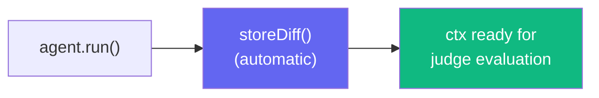

# TestContext

The context object injected into every test function. Acts as a black box to store diffs, command outputs, and logs.

## Lifecycle


```mermaid
flowchart LR
    A["agent.run()"] --> B["storeDiff()<br/>(automatic)"]
    B --> C["ctx ready for<br/>judge evaluation"]

    style B fill:#6366f1,color:#fff
    style C fill:#10b981,color:#fff
```

::: tip Auto-capture
`storeDiff()` is called **automatically** after `agent.run()`. You only need to call it manually if you want to capture a diff at a specific point outside the normal flow.
:::

## Interface

```ts
interface TestContext {
  // Capture methods
  storeDiff(): void;
  storeDiffAsync(): Promise<void>;
  runCommand(name: string, command: string): Promise<CommandResult>;
  addTask(task: TaskDefinition): void;
  exec(command: string): Promise<CommandResult>;

  // Runner enrichment (called automatically by the runner)
  setInstruction(instruction: string): void;
  setRunnerInfo(info: { name: string; model: string }): void;
  setAgentOutput(output: string): void;
  setAgentTokenUsage(usage: TokenUsage): void;

  // Build execution summary
  buildExecutionData(taskResults: TaskResult[], timing: TimingData): ExecutionData;

  // Read-only properties
  readonly diff: string | null;
  readonly commands: CommandResult[];
  readonly tasks: readonly TaskDefinition[];
  readonly logs: string;
}
```

::: tip Runner enrichment
The `set*` methods and `buildExecutionData()` are called **automatically by the runner** during test execution. You don't need to call them in your test code — they exist to populate the `ExecutionData` that the judge uses for evaluation.
:::

## Methods

### `storeDiff()`

Captures the current git diff (staged + unstaged) into the context. **Called automatically** after `agent.run()`. Works synchronously with `LocalEnvironment`.

### `storeDiffAsync()`

Async version of `storeDiff()`. Used internally by the runner for environments that return promises (e.g., `DockerEnvironment`, SSH-based environments). You generally don't need to call this directly.

### `runCommand(name, command)`

Runs a shell command via the configured [environment plugin](/guide/plugins-environments) and stores the result. Each command has a **120-second timeout**.

```ts
interface CommandResult {
  name: string;
  command: string;
  stdout: string;
  stderr: string;
  exitCode: number;
  durationMs: number;
}
```

::: info
For commands that should run after every agent execution, use `beforeEach` with `ctx.addTask()` in your config instead of calling `runCommand()` in every test file.
:::

### `addTask(task)`

Registers a verification task for the [declarative pipeline](/guide/declarative-pipeline). Only used with `agent.instruct()`.

```ts
interface TaskDefinition {
  name: string; // Task identifier
  action: () => TaskActionResult | Promise<TaskActionResult>; // Task execution
  criteria: string; // Judge evaluation criteria
  weight?: number; // Scoring weight (default: 1)
}

interface TaskActionResult {
  stdout: string; // Command output (required)
  exitCode: number; // Exit code (required)
  stderr?: string; // Error output (optional)
  name?: string; // Auto-filled by runner
  command?: string; // Auto-filled by runner
  durationMs?: number; // Auto-filled by runner
}
```

::: tip Lenient return type
Task actions only need to return `{ stdout, exitCode }`. The runner automatically enriches the result with `name` (from `task.name`), `command`, `stderr`, and `durationMs`.
:::

**Validation rules:**

- `name` must be a non-empty string
- `action` must be a function
- `criteria` must be a non-empty string
- `weight` (if provided) must be a non-negative number

```ts
ctx.addTask({
  name: "Build",
  action: () => ctx.exec("pnpm build"),
  criteria: "Build succeeds with zero errors",
  weight: 2,
});
```

### `exec(command)`

Convenience method that executes a shell command and returns a `CommandResult`. Shorthand for `runCommand()` that auto-generates the task name from the command.

```ts
const result = await ctx.exec("pnpm build");
// result: { name: "pnpm build", command: "pnpm build", stdout, stderr, exitCode, durationMs }
```

## Properties

| Property   | Type                        | Description                                |
| ---------- | --------------------------- | ------------------------------------------ |
| `diff`     | `string \| null`            | Captured git diff (auto-populated)         |
| `commands` | `CommandResult[]`           | All command results (manual + task)        |
| `tasks`    | `readonly TaskDefinition[]` | Registered tasks (declarative mode)        |
| `logs`     | `string`                    | Formatted log string (diff + all commands) |

The `logs` property combines the diff and all command outputs into a single formatted string, which is used internally by the judge prompt builder.
