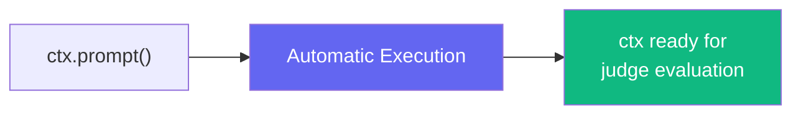

# TestContext

The context object injected into every test function. Acts as a black box to store the mission (prompt), diffs, command outputs, and logs.

## Lifecycle


```mermaid
flowchart LR
    A["ctx.prompt()"] --> B["Automatic Execution"]
    B --> C["ctx ready for<br/>judge evaluation"]

    style B fill:#6366f1,color:#fff
    style C fill:#10b981,color:#fff
```

## Interface

```ts
interface TestContext {
  // Mission definition
  prompt(text: string): void;

  // Capture methods
  storeDiff(): void;
  addTask(task: TaskDefinition): void;
  runCommand(name: string, command: string): Promise<CommandResult>;

  // Internal enrichment (called automatically by the runner)
  setInstruction(instruction: string): void;
  setRunnerInfo(info: { id: string; model: string }): void;
  setAgentOutput(output: string): void;
  setAgentTokenUsage(usage: TokenUsage): void;

  // Read-only properties
  readonly diff: string | null;
  readonly commands: CommandResult[];
  readonly tasks: ReadonlyArray<TaskDefinition>;
  readonly logs: string;
}
```

::: tip Mission Required
Every test must call `ctx.prompt()` to define what the agent should do. The framework executes this mission automatically after the test function returns.
:::

## Methods

### `prompt(text)`

Defines the base mission sent to the AI agent. This is mandatory for every test. Using backticks (template literals) allows for clear, multi-line prompts.

```ts
test("Refactor", async ({ ctx }) => {
  ctx.prompt(`
    Refactor the following code to use a more functional approach.
    Avoid mutations and use map/filter/reduce.
  `);
});
```

### `storeDiff()`

Captures the current git diff into the context. **Called automatically** after the agent execution. You only need to call it manually if you want to capture a diff at a specific point during a task.

### `addTask(task)`

Registers a verification task. These tasks are executed **after** the mission is completed but **before** the judge evaluates the results.

```ts
ctx.addTask({
  name: "Build",
  action: ({ exec }) => exec("pnpm build"),
  criteria: "Build succeeds with zero errors",
  weight: 2,
});
```

### `runCommand(name, command)`

Runs a shell command and stores the result. **Prefer `addTask()`** for common verification steps as they provide structured evidence to the judge.

## Properties

| Property   | Type                        | Description                                |
| ---------- | --------------------------- | ------------------------------------------ |
| `diff`     | `string \| null`            | Captured git diff                          |
| `commands` | `CommandResult[]`           | All command results                        |
| `tasks`    | `readonly TaskDefinition[]` | Registered tasks                           |
| `logs`     | `string`                    | Formatted log string (diff + all commands) |
