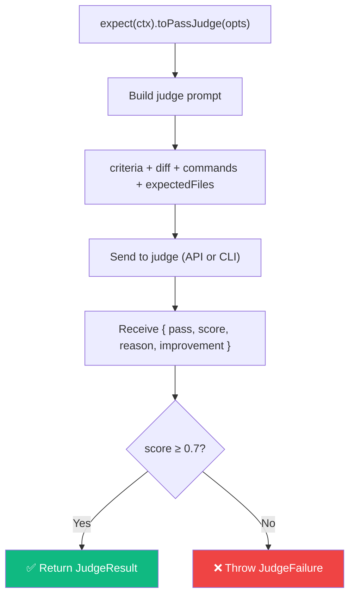

# expect()

Create a fluent assertion chain for LLM-as-a-Judge evaluation.

## Signature

```ts
function expect(ctx: TestContext): ExpectChain;
```

## Methods

### `.toPassJudge(options)`

```ts
interface JudgeOptions {
  criteria: string; // Markdown evaluation criteria
  model?: string; // Optional model override
  expectedFiles?: string[]; // Files that should be changed
}
```

Returns a `Promise<JudgeResult>`:

```ts
interface JudgeResult {
  pass: boolean; // true if score >= 0.7
  score: number; // 0.0 to 1.0
  reason: string; // Markdown explanation
  improvement: string; // Suggestions for improvement
}
```

## Options

| Option          | Type       | Required | Description                                          |
| --------------- | ---------- | -------- | ---------------------------------------------------- |
| `criteria`      | `string`   | ✅       | Markdown criteria for evaluation                     |
| `model`         | `string`   | —        | Override judge model for this call                   |
| `expectedFiles` | `string[]` | —        | Files that should have been changed (scope analysis) |

## Usage

```ts
import { test, expect } from "agent-eval";

test("Example", async ({ agent, ctx }) => {
  await agent.run("Add feature X");
  // storeDiff() is automatic — no need to call it

  const result = await expect(ctx).toPassJudge({
    criteria: "Feature X is properly implemented",
    expectedFiles: ["src/feature-x.ts", "src/feature-x.test.ts"],
  });

  // result.score, result.reason, result.improvement are available
});
```

## Behavior



- **Passes** if the judge returns `score >= 0.7`
- **Throws** a `JudgeFailure` error if the score is below 0.7
- The result is automatically recorded in the ledger (score, reason, improvement, diff, commands)
- The `improvement` field contains the judge's suggestions for achieving a higher score
