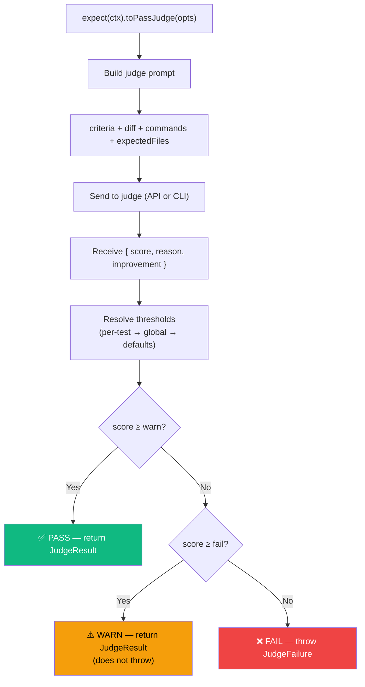

# expect()

Create a fluent assertion chain for LLM-as-a-Judge evaluation.

::: danger Mandatory in all test modes
Every test (imperative or declarative) **must** call `expect(ctx).toPassJudge()`.  
`agent.run()` / `agent.instruct()` define the implementation request; `toPassJudge()` defines scoring criteria and file scope for the judge.  
If a test completes without `toPassJudge()`, AgentEval throws an error.
:::

## Signature

```ts
function expect(ctx: TestContext): ExpectChain;
```

## Methods

### `.toPassJudge(options)`

```ts
interface JudgeOptions {
  criteria: string; // Markdown evaluation criteria
  model?: string; // Optional model override
  expectedFiles?: string[]; // Files that should be changed
  thresholds?: { warn: number; fail: number }; // Per-test thresholds
}
```

Returns a `Promise<JudgeResult>`:

```ts
type TestStatus = "PASS" | "WARN" | "FAIL";

interface JudgeResult {
  pass: boolean; // true if status is PASS or WARN
  status?: TestStatus; // PASS, WARN, or FAIL (set by runner)
  score: number; // 0.0 to 1.0
  reason: string; // Markdown explanation
  improvement: string; // Suggestions for improvement
}
```

## Options

| Option          | Type                             | Required | Description                                                                                                          |
| --------------- | -------------------------------- | -------- | -------------------------------------------------------------------------------------------------------------------- |
| `criteria`      | `string`                         | ✅       | Markdown criteria for evaluation — defines what the judge should evaluate and how to score                           |
| `model`         | `string`                         | —        | Override judge model for this call                                                                                   |
| `expectedFiles` | `string[]`                       | —        | Minimum files that should be changed. Extra changes are evaluated by the judge for relevance (scope creep detection) |
| `thresholds`    | `{ warn: number; fail: number }` | —        | Per-test scoring thresholds (overrides global)                                                                       |

## Usage

```ts
import { test, expect } from "agent-eval";

test("Example", async ({ agent, ctx }) => {
  await agent.run("Add feature X");
  // storeDiff() is automatic — no need to call it

  const result = await expect(ctx).toPassJudge({
    criteria: "Feature X is properly implemented",
    expectedFiles: ["src/feature-x.ts", "src/feature-x.test.ts"],
    thresholds: { warn: 0.85, fail: 0.6 }, // optional per-test thresholds
  });

  // result.score, result.status, result.reason, result.improvement
});
```

In **declarative** tests, call `expect(ctx).toPassJudge(...)` after `agent.instruct(...)`.  
The runner uses these options later (after agent execution) to run the final judge step, optionally enriched by `ctx.addTask()` results.

## Behavior



- **PASS**: score ≥ warn threshold (default 0.8) — test passes
- **WARN**: score ≥ fail threshold but < warn — test passes but is flagged
- **FAIL**: score < fail threshold (default 0.5) — throws `JudgeFailure`
- The result is automatically recorded in the ledger with status, thresholds, score, reason, improvement, diff, and commands
