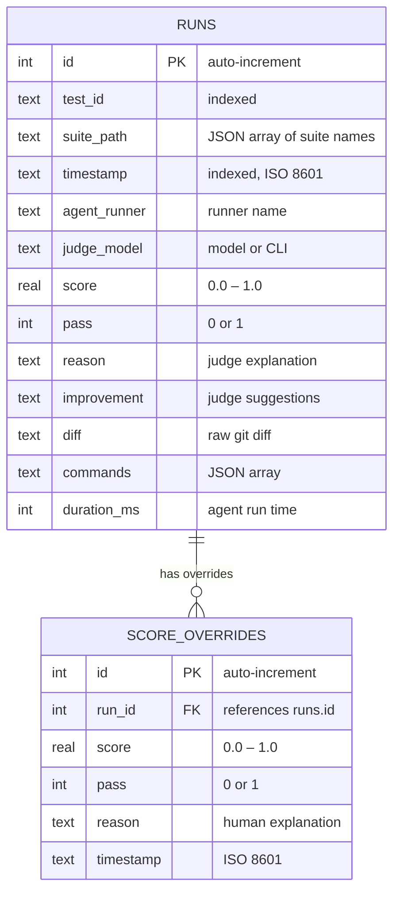
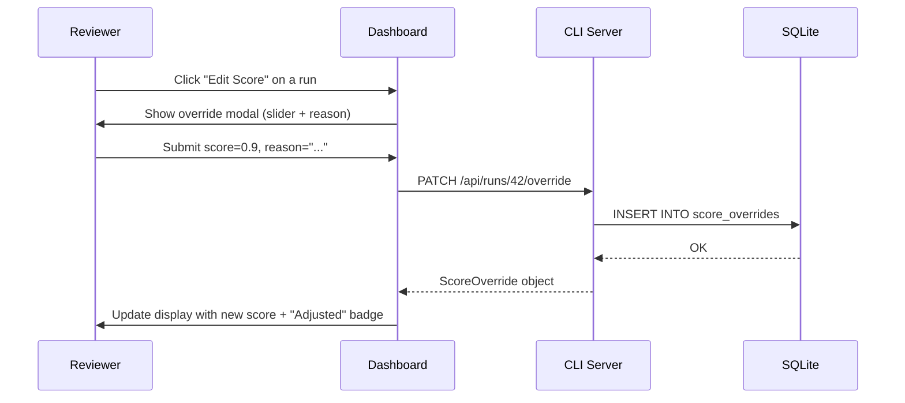

# Ledger

The ledger stores all evaluation results in `.agenteval/ledger.sqlite` (SQLite via Node 22's `node:sqlite`).

## Storage

Results are persisted in a `runs` SQLite table. The database location is configurable:

| Priority | Method              | Example                            |
| -------- | ------------------- | ---------------------------------- |
| 1        | CLI `--output` flag | `agenteval ledger -o ./my-results` |
| 2        | Config `outputDir`  | `outputDir: "./custom-output"`     |
| 3        | Default             | `.agenteval/ledger.sqlite`         |

## Entry Schema

Each ledger entry contains:

```json
{
  "testId": "Add a Close button to the Banner",
  "suitePath": ["UI Components", "Banner"],
  "timestamp": "2025-03-15T10:30:00.000Z",
  "agentRunner": "copilot",
  "agentModel": "claude-sonnet-4-20250514",
  "judgeModel": "claude-sonnet-4-20250514",
  "score": 0.85,
  "pass": true,
  "reason": "The agent correctly added a close button with proper aria-label...",
  "improvement": "Consider adding keyboard event handling for Escape key",
  "context": {
    "diff": "diff --git a/...",
    "commands": [
      { "name": "test", "stdout": "...", "exitCode": 0, "durationMs": 3200 },
      { "name": "typecheck", "stdout": "...", "exitCode": 0, "durationMs": 1500 }
    ]
  },
  "durationMs": 45000
}
```

## Reading the Ledger

### CLI

```bash
# Summary view (last 20 entries)
agenteval ledger

# Full JSON export
agenteval ledger --json

# Read from a specific directory
agenteval ledger -o ./my-results
```

### Dashboard API

Launch the dashboard server to explore results via HTTP:

```bash
agenteval view           # default port 4747
agenteval ui -p 8080     # custom port
```

| Endpoint                  | Method  | Description                             |
| ------------------------- | ------- | --------------------------------------- |
| `/api/runs`               | `GET`   | All runs (filter with `?testId=...`)    |
| `/api/tests`              | `GET`   | List of unique test IDs                 |
| `/api/tree`               | `GET`   | Hierarchical test tree (suites + tests) |
| `/api/stats`              | `GET`   | Aggregate stats per runner per test     |
| `/api/runs/:id/override`  | `PATCH` | Override a run's score (HITL)           |
| `/api/runs/:id/overrides` | `GET`   | Audit trail of overrides for a run      |

See the [Dashboard guide](/guide/dashboard) for details on the web UI.

### Programmatic

```ts
import {
  readLedger,
  readLedgerByTestId,
  getLatestEntries,
  getRunnerStats,
  getAllRunnerStats,
} from "agent-eval/ledger";

const allEntries = readLedger(".agenteval");
const bannerEntries = readLedgerByTestId(".agenteval", "Add Close button");
const latest = getLatestEntries(".agenteval");
const stats = getRunnerStats(".agenteval", "Add Close button");
const allStats = getAllRunnerStats(".agenteval");
```

## SQLite Schema



| Column         | Type      | Description                                   |
| -------------- | --------- | --------------------------------------------- |
| `id`           | `INTEGER` | Auto-increment primary key                    |
| `test_id`      | `TEXT`    | Test title (indexed)                          |
| `suite_path`   | `TEXT`    | JSON array of suite names (from `describe()`) |
| `timestamp`    | `TEXT`    | ISO 8601 timestamp (indexed)                  |
| `agent_runner` | `TEXT`    | Runner name                                   |
| `judge_model`  | `TEXT`    | Judge model used                              |
| `score`        | `REAL`    | 0.0 to 1.0                                    |
| `pass`         | `INTEGER` | 1 = passed, 0 = failed                        |
| `reason`       | `TEXT`    | Judge's markdown explanation                  |
| `improvement`  | `TEXT`    | Judge's improvement suggestions               |
| `diff`         | `TEXT`    | Raw git diff                                  |
| `commands`     | `TEXT`    | JSON-encoded CommandResult[]                  |
| `duration_ms`  | `INTEGER` | Total duration in ms                          |

Indexes on `test_id` and `timestamp` for fast queries.

### `score_overrides` Table

| Column      | Type      | Description                        |
| ----------- | --------- | ---------------------------------- |
| `id`        | `INTEGER` | Auto-increment primary key         |
| `run_id`    | `INTEGER` | Foreign key → `runs.id` (indexed)  |
| `score`     | `REAL`    | Manually assigned score (0.0–1.0)  |
| `pass`      | `INTEGER` | 1 = pass, 0 = fail (score ≥ 0.5)   |
| `reason`    | `TEXT`    | Human-provided justification       |
| `timestamp` | `TEXT`    | ISO 8601 timestamp of the override |

Multiple overrides per run are supported (audit trail). Aggregation queries automatically use the **latest** override via `COALESCE`.

## Score Overrides (HITL)

Human-in-the-loop score overrides allow reviewers to manually adjust scores when the LLM judge's assessment needs correction.



### Override API

**Create an override:**

```bash
curl -X PATCH http://localhost:4747/api/runs/42/override \
  -H "Content-Type: application/json" \
  -d '{"score": 0.9, "reason": "Re-evaluated after manual review"}'
```

**Get override history:**

```bash
curl http://localhost:4747/api/runs/42/overrides
```

### Programmatic

```ts
import { overrideRunScore, getRunOverrides } from "agent-eval/ledger";

// Override a run's score
const override = overrideRunScore(".agenteval", 42, 0.9, "Better than expected");

// Get audit trail
const history = getRunOverrides(".agenteval", 42);
```

## Query Functions

| Function             | Description                                    |
| -------------------- | ---------------------------------------------- |
| `readLedger(dir)`    | Read all entries (with latest override if any) |
| `readLedgerByTestId` | Filter entries by test ID (with overrides)     |
| `getLatestEntries`   | Get latest N entries (default: 20)             |
| `getRunnerStats`     | Get aggregate stats per runner for a test      |
| `getAllRunnerStats`  | Get aggregate stats for all tests and runners  |
| `overrideRunScore`   | Add a human score override to a run            |
| `getRunOverrides`    | Get all overrides for a run (audit trail)      |
