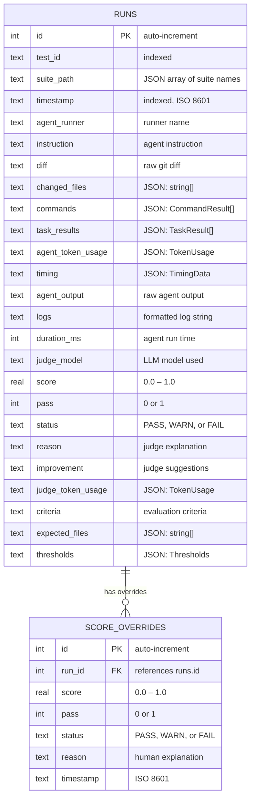
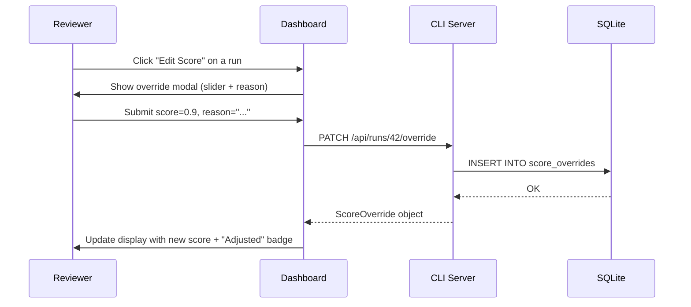

# Ledger

The ledger stores all evaluation results in `.agenteval/ledger.sqlite` (SQLite via Node 22's `node:sqlite`).

## Storage

Results are persisted in a `runs` SQLite table. The database location is configurable:

| Priority | Method              | Example                            |
| -------- | ------------------- | ---------------------------------- |
| 1        | CLI `--output` flag | `agenteval ledger -o ./my-results` |
| 2        | Config `outputDir`  | `outputDir: "./custom-output"`     |
| 3        | Default             | `.agenteval/ledger.sqlite`         |

## Entry Schema

Each ledger entry captures the complete lifecycle of a test run — **execution data** (what the agent did) and **judgment data** (how the judge evaluated):

```json
{
  "id": 1,
  "testId": "Add a Close button to the Banner",
  "suitePath": ["UI Components", "Banner"],
  "timestamp": "2025-03-15T10:30:00.000Z",
  "agentRunner": "copilot",

  "instruction": "Add a close button to the Banner component",
  "diff": "diff --git a/...",
  "changedFiles": ["src/components/Banner.tsx"],
  "commands": [
    {
      "name": "test",
      "command": "pnpm test",
      "stdout": "...",
      "stderr": "",
      "exitCode": 0,
      "durationMs": 3200
    },
    {
      "name": "typecheck",
      "command": "pnpm build",
      "stdout": "...",
      "stderr": "",
      "exitCode": 0,
      "durationMs": 1500
    }
  ],
  "taskResults": [
    {
      "task": { "name": "Build", "criteria": "Build succeeds", "weight": 2 },
      "result": {
        "name": "Build",
        "command": "pnpm build",
        "stdout": "...",
        "stderr": "",
        "exitCode": 0,
        "durationMs": 1500
      }
    }
  ],
  "agentTokenUsage": { "inputTokens": 1200, "outputTokens": 800, "totalTokens": 2000 },
  "timing": {
    "totalMs": 45000,
    "setupMs": 200,
    "agentMs": 40000,
    "tasksMs": 1500,
    "judgeMs": 3200
  },
  "agentOutput": "I'll add a close button...",
  "logs": "## Diff\n...\n## Commands\n...",
  "durationMs": 45000,

  "judgeModel": "claude-sonnet-4-20250514",
  "score": 0.85,
  "pass": true,
  "status": "PASS",
  "reason": "The agent correctly added a close button with proper aria-label...",
  "improvement": "Consider adding keyboard event handling for Escape key",
  "judgeTokenUsage": { "inputTokens": 2500, "outputTokens": 600, "totalTokens": 3100 },
  "criteria": "Close button with aria-label, click handler, no TS errors",
  "expectedFiles": ["src/components/Banner.tsx"],
  "thresholds": { "warn": 0.8, "fail": 0.5 }
}
```

## Reading the Ledger

### CLI

```bash
# Summary view (last 20 entries)
agenteval ledger

# Full JSON export
agenteval ledger --json

# Read from a specific directory
agenteval ledger -o ./my-results
```

### Dashboard API

Launch the dashboard server to explore results via HTTP:

```bash
agenteval view           # default port 4747
agenteval ui -p 8080     # custom port
```

| Endpoint                  | Method  | Description                             |
| ------------------------- | ------- | --------------------------------------- |
| `/api/runs`               | `GET`   | All runs (filter with `?testId=...`)    |
| `/api/tests`              | `GET`   | List of unique test IDs                 |
| `/api/tree`               | `GET`   | Hierarchical test tree (suites + tests) |
| `/api/stats`              | `GET`   | Aggregate stats per runner per test     |
| `/api/runs/:id/override`  | `PATCH` | Override a run's score (HITL)           |
| `/api/runs/:id/overrides` | `GET`   | Audit trail of overrides for a run      |

See the [Dashboard guide](/guide/dashboard) for details on the web UI.

### Programmatic

```ts
import {
  readLedger,
  readLedgerByTestId,
  getLatestEntries,
  getRunnerStats,
  getAllRunnerStats,
} from "agent-eval/ledger";

const allEntries = readLedger(".agenteval");
const bannerEntries = readLedgerByTestId(".agenteval", "Add Close button");
const latest = getLatestEntries(".agenteval");
const stats = getRunnerStats(".agenteval", "Add Close button");
const allStats = getAllRunnerStats(".agenteval");
```

## SQLite Schema


```mermaid
erDiagram
    RUNS {
        int id PK "auto-increment"
        text test_id "indexed"
        text suite_path "JSON array of suite names"
        text timestamp "indexed, ISO 8601"
        text agent_runner "runner name"
        text instruction "agent instruction"
        text diff "raw git diff"
        text changed_files "JSON: string[]"
        text commands "JSON: CommandResult[]"
        text task_results "JSON: TaskResult[]"
        text agent_token_usage "JSON: TokenUsage"
        text timing "JSON: TimingData"
        text agent_output "raw agent output"
        text logs "formatted log string"
        int duration_ms "agent run time"
        text judge_model "LLM model used"
        real score "0.0 – 1.0"
        int pass "0 or 1"
        text status "PASS, WARN, or FAIL"
        text reason "judge explanation"
        text improvement "judge suggestions"
        text judge_token_usage "JSON: TokenUsage"
        text criteria "evaluation criteria"
        text expected_files "JSON: string[]"
        text thresholds "JSON: Thresholds"
    }
    SCORE_OVERRIDES {
        int id PK "auto-increment"
        int run_id FK "references runs.id"
        real score "0.0 – 1.0"
        int pass "0 or 1"
        text status "PASS, WARN, or FAIL"
        text reason "human explanation"
        text timestamp "ISO 8601"
    }
    RUNS ||--o{ SCORE_OVERRIDES : "has overrides"
```

### `runs` Table — Execution Data

| Column              | Type      | Description                                     |
| ------------------- | --------- | ----------------------------------------------- |
| `id`                | `INTEGER` | Auto-increment primary key                      |
| `test_id`           | `TEXT`    | Test title (indexed)                            |
| `suite_path`        | `TEXT`    | JSON array of suite names (from `describe()`)   |
| `timestamp`         | `TEXT`    | ISO 8601 timestamp (indexed)                    |
| `agent_runner`      | `TEXT`    | Runner name                                     |
| `instruction`       | `TEXT`    | Instruction given to the agent                  |
| `diff`              | `TEXT`    | Raw git diff                                    |
| `changed_files`     | `TEXT`    | JSON-encoded string array of changed file paths |
| `commands`          | `TEXT`    | JSON-encoded `CommandResult[]`                  |
| `task_results`      | `TEXT`    | JSON-encoded `TaskResult[]`                     |
| `agent_token_usage` | `TEXT`    | JSON-encoded `TokenUsage` (agent LLM usage)     |
| `timing`            | `TEXT`    | JSON-encoded `TimingData` (per-phase breakdown) |
| `agent_output`      | `TEXT`    | Raw agent output text                           |
| `logs`              | `TEXT`    | Formatted log string (diff + commands)          |
| `duration_ms`       | `INTEGER` | Total duration in ms                            |

### `runs` Table — Judgment Data

| Column              | Type      | Description                                       |
| ------------------- | --------- | ------------------------------------------------- |
| `judge_model`       | `TEXT`    | Judge model used                                  |
| `score`             | `REAL`    | 0.0 to 1.0                                        |
| `pass`              | `INTEGER` | 1 = passed, 0 = failed                            |
| `status`            | `TEXT`    | `PASS`, `WARN`, or `FAIL`                         |
| `reason`            | `TEXT`    | Judge's markdown explanation                      |
| `improvement`       | `TEXT`    | Judge's improvement suggestions                   |
| `judge_token_usage` | `TEXT`    | JSON-encoded `TokenUsage` (judge LLM usage)       |
| `criteria`          | `TEXT`    | Evaluation criteria used                          |
| `expected_files`    | `TEXT`    | JSON-encoded expected file list                   |
| `thresholds`        | `TEXT`    | JSON-encoded thresholds `{ warn, fail }` snapshot |

Indexes on `test_id` and `timestamp` for fast queries.

### `score_overrides` Table

| Column      | Type      | Description                        |
| ----------- | --------- | ---------------------------------- |
| `id`        | `INTEGER` | Auto-increment primary key         |
| `run_id`    | `INTEGER` | Foreign key → `runs.id` (indexed)  |
| `score`     | `REAL`    | Manually assigned score (0.0–1.0)  |
| `pass`      | `INTEGER` | 1 = pass, 0 = fail                 |
| `status`    | `TEXT`    | `PASS`, `WARN`, or `FAIL`          |
| `reason`    | `TEXT`    | Human-provided justification       |
| `timestamp` | `TEXT`    | ISO 8601 timestamp of the override |

Multiple overrides per run are supported (audit trail). Aggregation queries automatically use the **latest** override via `COALESCE`.

## Score Overrides (HITL)

Human-in-the-loop score overrides allow reviewers to manually adjust scores when the LLM judge's assessment needs correction.


```mermaid
sequenceDiagram
    participant R as Reviewer
    participant UI as Dashboard
    participant API as CLI Server
    participant DB as SQLite

    R->>UI: Click "Edit Score" on a run
    UI->>R: Show override modal (slider + reason)
    R->>UI: Submit score=0.9, reason="..."
    UI->>API: PATCH /api/runs/42/override
    API->>DB: INSERT INTO score_overrides
    DB-->>API: OK
    API-->>UI: ScoreOverride object
    UI->>R: Update display with new score + "Adjusted" badge
```

### Override API

**Create an override:**

```bash
curl -X PATCH http://localhost:4747/api/runs/42/override \
  -H "Content-Type: application/json" \
  -d '{"score": 0.9, "reason": "Re-evaluated after manual review"}'
```

**Get override history:**

```bash
curl http://localhost:4747/api/runs/42/overrides
```

### Programmatic

```ts
import { overrideRunScore, getRunOverrides } from "agent-eval/ledger";

// Override a run's score
const override = overrideRunScore(".agenteval", 42, 0.9, "Better than expected");

// Get audit trail
const history = getRunOverrides(".agenteval", 42);
```

## Query Functions

| Function             | Description                                    |
| -------------------- | ---------------------------------------------- |
| `readLedger(dir)`    | Read all entries (with latest override if any) |
| `readLedgerByTestId` | Filter entries by test ID (with overrides)     |
| `getLatestEntries`   | Get latest N entries (default: 20)             |
| `getRunnerStats`     | Get aggregate stats per runner for a test      |
| `getAllRunnerStats`  | Get aggregate stats for all tests and runners  |
| `overrideRunScore`   | Add a human score override to a run            |
| `getRunOverrides`    | Get all overrides for a run (audit trail)      |
