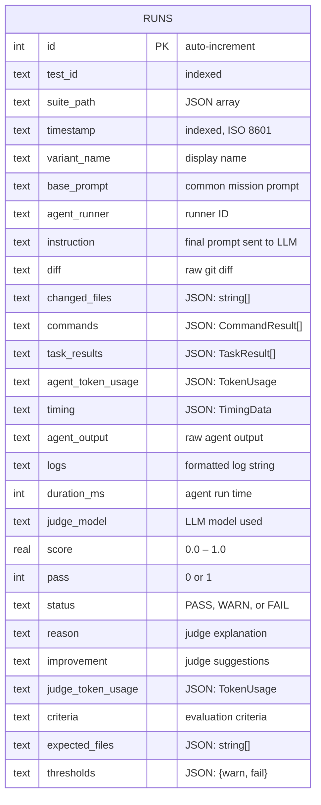

# Ledger

The ledger stores all evaluation results in `.agenteval/ledger.sqlite` (SQLite via Node 22's `node:sqlite`).

## Entry Schema

Each ledger entry captures the complete lifecycle of a test run — **execution data** (what the agent did) and **judgment data** (how the judge evaluated):

```json
{
  "id": 1,
  "testId": "Add a Close button to the Banner",
  "suitePath": ["UI Components", "Banner"],
  "timestamp": "2025-03-15T10:30:00.000Z",
  "variantName": "GPT-4o with UI Skills",
  "basePrompt": "Add a close button to the Banner component",
  "agentRunner": "gpt4o",

  "instruction": "Acting as a senior dev... Add a close button...",
  "diff": "diff --git a/...",
  "changedFiles": ["src/components/Banner.tsx"],
  "commands": [
    {
      "name": "test",
      "command": "pnpm test",
      "stdout": "...",
      "stderr": "",
      "exitCode": 0,
      "durationMs": 3200
    }
  ],
  "taskResults": [
    {
      "task": { "name": "Build", "criteria": "Build succeeds", "weight": 2 },
      "result": {
        "name": "Build",
        "command": "pnpm build",
        "stdout": "...",
        "stderr": "",
        "exitCode": 0,
        "durationMs": 1500
      }
    }
  ],
  "agentTokenUsage": { "inputTokens": 1200, "outputTokens": 800, "totalTokens": 2000 },
  "timing": {
    "totalMs": 45000,
    "setupMs": 200,
    "agentMs": 40000,
    "tasksMs": 1500,
    "judgeMs": 3200
  },
  "agentOutput": "I'll add a close button...",
  "logs": "## Diff\n...\n## Commands\n...",
  "durationMs": 45000,

  "judgeModel": "claude-sonnet-4-20250514",
  "score": 0.85,
  "pass": true,
  "status": "PASS",
  "reason": "The agent correctly added a close button with proper aria-label...",
  "improvement": "Consider adding keyboard event handling for Escape key",
  "judgeTokenUsage": { "inputTokens": 2500, "outputTokens": 600, "totalTokens": 3100 },
  "criteria": "Close button with aria-label, click handler, no TS errors",
  "expectedFiles": ["src/components/Banner.tsx"],
  "thresholds": { "warn": 0.8, "fail": 0.5 }
}
```

## SQLite Schema


```mermaid
erDiagram
    RUNS {
        int id PK "auto-increment"
        text test_id "indexed"
        text suite_path "JSON array"
        text timestamp "indexed, ISO 8601"
        text variant_name "display name"
        text base_prompt "common mission prompt"
        text agent_runner "runner ID"
        text instruction "final prompt sent to LLM"
        text diff "raw git diff"
        text changed_files "JSON: string[]"
        text commands "JSON: CommandResult[]"
        text task_results "JSON: TaskResult[]"
        text agent_token_usage "JSON: TokenUsage"
        text timing "JSON: TimingData"
        text agent_output "raw agent output"
        text logs "formatted log string"
        int duration_ms "agent run time"
        text judge_model "LLM model used"
        real score "0.0 – 1.0"
        int pass "0 or 1"
        text status "PASS, WARN, or FAIL"
        text reason "judge explanation"
        text improvement "judge suggestions"
        text judge_token_usage "JSON: TokenUsage"
        text criteria "evaluation criteria"
        text expected_files "JSON: string[]"
        text thresholds "JSON: {warn, fail}"
    }
```

### `runs` Table — Identity & Experiment

| Column         | Type   | Description                                   |
| -------------- | ------ | --------------------------------------------- |
| `id`           | `INT`  | Auto-increment primary key                    |
| `test_id`      | `TEXT` | Test title (indexed)                          |
| `suite_path`   | `TEXT` | JSON array of suite names                     |
| `timestamp`    | `TEXT` | ISO 8601 timestamp (indexed)                  |
| `variant_name` | `TEXT` | Human-readable variant name                   |
| `base_prompt`  | `TEXT` | The original mission prompt (before template) |
| `agent_runner` | `TEXT` | Global Runner ID used                         |
