# Ledger

The ledger stores all evaluation results in `.agenteval/ledger.sqlite` (SQLite via Node 22's `node:sqlite`).

## Storage

Results are persisted in a `runs` SQLite table. The database location is configurable:

| Priority | Method              | Example                            |
| -------- | ------------------- | ---------------------------------- |
| 1        | CLI `--output` flag | `agenteval ledger -o ./my-results` |
| 2        | Config `outputDir`  | `outputDir: "./custom-output"`     |
| 3        | Default             | `.agenteval/ledger.sqlite`         |

## Entry Schema

Each ledger entry contains:

```json
{
  "testId": "Add a Close button to the Banner",
  "suitePath": ["UI Components", "Banner"],
  "timestamp": "2025-03-15T10:30:00.000Z",
  "agentRunner": "copilot",
  "agentModel": "claude-sonnet-4-20250514",
  "judgeModel": "claude-sonnet-4-20250514",
  "score": 0.85,
  "pass": true,
  "reason": "The agent correctly added a close button with proper aria-label...",
  "improvement": "Consider adding keyboard event handling for Escape key",
  "context": {
    "diff": "diff --git a/...",
    "commands": [
      { "name": "test", "stdout": "...", "exitCode": 0, "durationMs": 3200 },
      { "name": "typecheck", "stdout": "...", "exitCode": 0, "durationMs": 1500 }
    ]
  },
  "durationMs": 45000
}
```

## Reading the Ledger

### CLI

```bash
# Summary view (last 20 entries)
agenteval ledger

# Full JSON export
agenteval ledger --json

# Read from a specific directory
agenteval ledger -o ./my-results
```

### Dashboard API

Launch the dashboard server to explore results via HTTP:

```bash
agenteval view           # default port 4747
agenteval ui -p 8080     # custom port
```

| Endpoint         | Description                             |
| ---------------- | --------------------------------------- |
| `GET /api/runs`  | All runs (filter with `?testId=...`)    |
| `GET /api/tests` | List of unique test IDs                 |
| `GET /api/tree`  | Hierarchical test tree (suites + tests) |
| `GET /api/stats` | Aggregate stats per runner per test     |

See the [Dashboard guide](/guide/dashboard) for details on the web UI.

### Programmatic

```ts
import {
  readLedger,
  readLedgerByTestId,
  getLatestEntries,
  getRunnerStats,
  getAllRunnerStats,
} from "agent-eval/ledger";

const allEntries = readLedger(".agenteval");
const bannerEntries = readLedgerByTestId(".agenteval", "Add Close button");
const latest = getLatestEntries(".agenteval");
const stats = getRunnerStats(".agenteval", "Add Close button");
const allStats = getAllRunnerStats(".agenteval");
```

## SQLite Schema

```mermaid
erDiagram
    RUNS {
        int id PK "auto-increment"
        text test_id "indexed"
        text suite_path "JSON array of suite names"
        text timestamp "indexed, ISO 8601"
        text agent_runner "runner name"
        text judge_model "model or CLI"
        real score "0.0 – 1.0"
        int pass "0 or 1"
        text reason "judge explanation"
        text improvement "judge suggestions"
        text diff "raw git diff"
        text commands "JSON array"
        int duration_ms "agent run time"
    }
```



| Column         | Type      | Description                                   |
| -------------- | --------- | --------------------------------------------- |
| `id`           | `INTEGER` | Auto-increment primary key                    |
| `test_id`      | `TEXT`    | Test title (indexed)                          |
| `suite_path`   | `TEXT`    | JSON array of suite names (from `describe()`) |
| `timestamp`    | `TEXT`    | ISO 8601 timestamp (indexed)                  |
| `agent_runner` | `TEXT`    | Runner name                                   |
| `judge_model`  | `TEXT`    | Judge model used                              |
| `score`        | `REAL`    | 0.0 to 1.0                                    |
| `pass`         | `INTEGER` | 1 = passed, 0 = failed                        |
| `reason`       | `TEXT`    | Judge's markdown explanation                  |
| `improvement`  | `TEXT`    | Judge's improvement suggestions               |
| `diff`         | `TEXT`    | Raw git diff                                  |
| `commands`     | `TEXT`    | JSON-encoded CommandResult[]                  |
| `duration_ms`  | `INTEGER` | Total duration in ms                          |

Indexes on `test_id` and `timestamp` for fast queries.

## Query Functions

| Function             | Description                                   |
| -------------------- | --------------------------------------------- |
| `readLedger(dir)`    | Read all entries                              |
| `readLedgerByTestId` | Filter entries by test ID                     |
| `getLatestEntries`   | Get latest N entries (default: 20)            |
| `getRunnerStats`     | Get aggregate stats per runner for a test     |
| `getAllRunnerStats`  | Get aggregate stats for all tests and runners |
