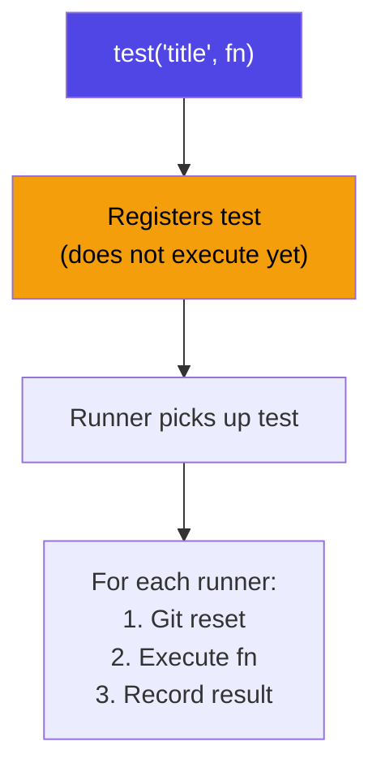

# test()

Register an evaluation test.

## Signature

```ts
function test(title: string, fn: TestFn): void;
```

## Parameters

| Param   | Type     | Description                                      |
| ------- | -------- | ------------------------------------------------ |
| `title` | `string` | Test title (used as the test ID in the ledger)   |
| `fn`    | `TestFn` | Async function receiving `{ agent, ctx, judge }` |

The `fn` callback receives:

| Parameter | Type          | Description                     |
| --------- | ------------- | ------------------------------- |
| `agent`   | `AgentHandle` | Handle to trigger the agent     |
| `ctx`     | `TestContext` | Context for diffs and commands  |
| `judge`   | `JudgeConfig` | Judge configuration (read-only) |

## Execution Flow



::: info Registration vs Execution
`test()` only **registers** the test function. It does not execute immediately. The runner engine picks up all registered tests and executes them sequentially during `agenteval run`.
:::

## Usage

```ts
import { test, expect } from "agent-eval";

test("My evaluation", async ({ agent, ctx }) => {
  await agent.run("Do something");
  // storeDiff() is automatic — no need to call it
  await expect(ctx).toPassJudge({ criteria: "..." });
});
```

## Variants

### `test.tagged(tags, title, fn)`

Register a test with tags for filtering via `agenteval run -t <tag>`.

```ts
test.tagged(["ui", "banner"], "Banner test", async ({ agent, ctx }) => {
  // ...
});
```

### `test.skip(title, fn)`

Skip a test (it won't be executed but will appear in the test list).

```ts
test.skip("WIP test", async ({ agent, ctx }) => {
  // This test is registered but skipped during execution
});
```
