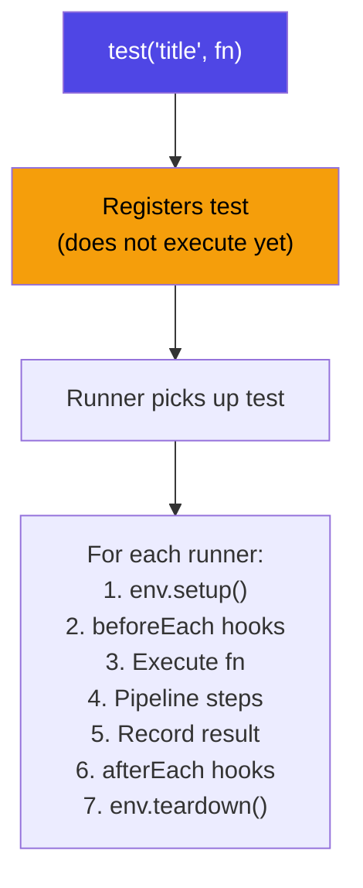
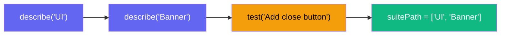

# test()

Register an evaluation test.

## Signature

```ts
function test(title: string, fn: TestFn): void;
```

## Parameters

| Param   | Type     | Description                                                                                  |
| ------- | -------- | -------------------------------------------------------------------------------------------- |
| `title` | `string` | Test title (used as the test ID in the ledger)                                               |
| `fn`    | `TestFn` | Function receiving `{ agent, ctx, judge }`. Can be async (imperative) or sync (declarative). |

The `fn` callback receives:

| Parameter | Type          | Description                     |
| --------- | ------------- | ------------------------------- |
| `agent`   | `AgentHandle` | Handle to trigger the agent     |
| `ctx`     | `TestContext` | Context for diffs and commands  |
| `judge`   | `JudgeConfig` | Judge configuration (read-only) |

## Execution Flow



::: info Registration vs Execution
`test()` only **registers** the test function. It does not execute immediately. The runner engine picks up all registered tests and executes them sequentially during `agenteval run`.
:::

## Usage

```ts
import { test, expect } from "agent-eval";

test("My evaluation", async ({ agent, ctx }) => {
  await agent.run("Do something");
  // storeDiff() is automatic — no need to call it
  await expect(ctx).toPassJudge({ criteria: "..." });
});
```

## Variants

### `test.tagged(tags, title, fn)`

Register a test with tags for filtering via `agenteval run -t <tag>`.

```ts
test.tagged(["ui", "banner"], "Banner test", async ({ agent, ctx }) => {
  // ...
});
```

### `test.skip(title, fn)`

Skip a test (it won't be executed but will appear in the test list).

```ts
test.skip("WIP test", async ({ agent, ctx }) => {
  // This test is registered but skipped during execution
});
```

## describe()

Group tests into named suites. Supports nesting.

### Signature

```ts
function describe(name: string, fn: () => void): void;
```

### Parameters

| Param  | Type         | Description                                            |
| ------ | ------------ | ------------------------------------------------------ |
| `name` | `string`     | Suite name (part of the hierarchy path)                |
| `fn`   | `() => void` | Synchronous function that registers tests inside scope |

### Suite Path

Tests registered inside `describe()` blocks automatically get a `suitePath` array:



### Usage

```ts
import { test, describe, expect } from "agent-eval";

describe("UI Components", () => {
  describe("Banner", () => {
    test("Add close button", async ({ agent, ctx }) => {
      await agent.run("Add a close button to the Banner component");
      await expect(ctx).toPassJudge({ criteria: "Close button works" });
    });

    test("Add animation", async ({ agent, ctx }) => {
      await agent.run("Add fade-in animation to Banner");
      await expect(ctx).toPassJudge({ criteria: "Animation is smooth" });
    });
  });

  describe("Search", () => {
    test("Add debounce", async ({ agent, ctx }) => {
      await agent.run("Implement search with debounce");
      await expect(ctx).toPassJudge({ criteria: "Debounce works correctly" });
    });
  });
});

// Top-level tests (no suite) are also supported
test("Standalone test", async ({ agent, ctx }) => {
  await agent.run("Do something");
  await expect(ctx).toPassJudge({ criteria: "..." });
});
```

### How It Works

1. `describe()` pushes the suite name onto a scope stack
2. Tests registered inside the callback capture the current stack as `suitePath`
3. After the callback, the suite name is popped from the stack
4. If the callback throws, the stack is still cleaned up (try/finally)
5. The `suitePath` is stored in the ledger as a JSON array in the `suite_path` column

## beforeEach() / afterEach()

Register lifecycle hooks that run around each test. Follows Vitest-style scoping.

### Signature

```ts
function beforeEach(fn: HookFn): void;
function afterEach(fn: HookFn): void;

type HookFn = (args: HookContext) => void | Promise<void>;

interface HookContext {
  ctx: TestContext;
}
```

### Hook Scoping

- **Top-level hooks** run for every test
- **Hooks inside `describe()`** run only for tests in that suite and nested suites
- `afterEach` hooks run even when the test fails

```ts
import { test, describe, beforeEach, afterEach } from "agent-eval";

beforeEach(({ ctx }) => {
  // Runs before ALL tests — add common verification tasks
  ctx.addTask({
    name: "Tests",
    action: () => ctx.exec("pnpm test"),
    criteria: "All tests must pass",
    weight: 3,
  });
});

describe("UI", () => {
  beforeEach(({ ctx }) => {
    // Runs before UI tests only
    ctx.addTask({
      name: "Lint",
      action: () => ctx.exec("pnpm lint"),
      criteria: "No lint errors",
    });
  });

  afterEach(async ({ ctx }) => {
    // Runs after UI tests, even on failure
    await ctx.exec("pnpm clean");
  });

  test("task", ({ agent, ctx }) => {
    agent.instruct("do something");
    ctx.addTask({ name: "verify", action: () => ctx.exec("echo ok"), criteria: "pass" });
  });
});
```

## AgentHandle

The `agent` parameter exposes two mutually exclusive execution modes:

| Method                   | Mode        | Description                                                                |
| ------------------------ | ----------- | -------------------------------------------------------------------------- |
| `agent.run(prompt)`      | Imperative  | Execute agent and return. **Must** be followed by `expect().toPassJudge()` |
| `agent.instruct(prompt)` | Declarative | Declare instruction. Runner auto-executes and judges                       |

### Single-Instruct Policy

- `agent.instruct()` can only be called **once** per test
- You cannot mix `run()` and `instruct()` in the same test

See [Declarative Pipeline](/guide/declarative-pipeline) for details.
