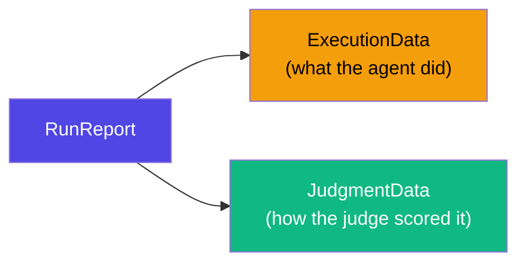
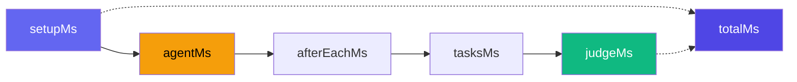

# Types Reference

All core types exported from `agent-eval`. Import them as needed:

```ts
import type {
  TokenUsage,
  TaskActionResult,
  TaskResult,
  TimingData,
  ExecutionData,
  JudgmentData,
  RunReport,
  CommandResult,
  LedgerEntry,
  TaskDefinition,
  TestStatus,
  Thresholds,
} from "agent-eval";
```

## RunReport

The unified report for a single test × runner evaluation. Combines execution and judgment data.

```ts
interface RunReport {
  execution: ExecutionData;
  judgment: JudgmentData;
}
```



## ExecutionData

Everything captured during agent execution — instruction, code changes, command outputs, task results, timing, and token usage.

```ts
interface ExecutionData {
  instruction: string; // Instruction given to the agent
  runner: { name: string; model: string }; // Runner metadata
  diff: string | null; // Git diff after execution
  changedFiles: string[]; // Files changed (extracted from diff)
  commands: CommandResult[]; // All command results (afterEach + manual)
  taskResults: TaskResult[]; // Task definitions + their results
  tokenUsage?: TokenUsage; // Agent's LLM token usage (API runners only)
  timing: TimingData; // Per-phase timing breakdown
  agentOutput?: string; // Raw agent output text
  logs: string; // Formatted log string (diff + commands)
}
```

## JudgmentData

The judge's evaluation of the agent's output — score, status, reasoning, and its own token usage.

```ts
interface JudgmentData {
  model: string; // Judge model identifier
  score: number; // Score 0.0–1.0
  pass: boolean; // true if status is PASS or WARN
  status: TestStatus; // "PASS" | "WARN" | "FAIL"
  reason: string; // Markdown evaluation explanation
  improvement: string; // Markdown improvement suggestions
  tokenUsage?: TokenUsage; // Judge's LLM token usage
  criteria: string; // Evaluation criteria used
  expectedFiles?: string[]; // Expected changed files (if specified)
  thresholds: Thresholds; // Scoring thresholds used
}
```

## TokenUsage

LLM token consumption for a single API call (agent or judge).

```ts
interface TokenUsage {
  inputTokens: number; // Input/prompt tokens consumed
  outputTokens: number; // Output/completion tokens generated
  totalTokens: number; // Total (input + output)
}
```

## TimingData

Per-phase timing breakdown of a test execution.

```ts
interface TimingData {
  totalMs: number; // Total wall-clock time (ms)
  setupMs?: number; // Environment setup (git reset, docker create)
  agentMs?: number; // Agent execution time
  afterEachMs?: number; // Post-execution commands time
  tasksMs?: number; // Task execution time
  judgeMs?: number; // Judge evaluation time
}
```



## TaskResult

A task definition paired with its execution result.

```ts
interface TaskResult {
  task: TaskDefinition; // The task that was executed
  result: CommandResult; // The execution result
}
```

## TaskDefinition

A verification task registered via `ctx.addTask()` in the [declarative pipeline](/guide/declarative-pipeline).

```ts
interface TaskDefinition {
  name: string; // Human-readable task name
  action: () => TaskActionResult | Promise<TaskActionResult>; // Task execution function
  criteria: string; // Judge evaluation criteria
  weight?: number; // Scoring weight (default: 1)
}
```

## TaskActionResult

The return type of `TaskDefinition.action`. Only `stdout` and `exitCode` are required — the runner fills in the rest.

```ts
interface TaskActionResult {
  stdout: string; // Command output (required)
  exitCode: number; // Exit code (required)
  stderr?: string; // Error output (optional, default: "")
  name?: string; // Auto-filled from task.name
  command?: string; // Auto-filled (default: "")
  durationMs?: number; // Auto-filled (default: 0)
}
```

::: tip Lenient by design
You can return just `{ stdout, exitCode }` from task actions:

```ts
ctx.addTask({
  name: "Build",
  action: async () => {
    const result = await ctx.exec("pnpm build");
    return { stdout: result.stdout, exitCode: result.exitCode };
  },
  criteria: "Build succeeds",
});
```

Or simply use `ctx.exec()` which returns a full `CommandResult` (which satisfies `TaskActionResult`):

```ts
ctx.addTask({
  name: "Build",
  action: () => ctx.exec("pnpm build"),
  criteria: "Build succeeds",
});
```

:::

## CommandResult

The full result of a shell command execution.

```ts
interface CommandResult {
  name: string; // Command label
  command: string; // Shell command string
  stdout: string; // Standard output
  stderr: string; // Standard error
  exitCode: number; // Exit code (0 = success)
  durationMs: number; // Execution duration (ms)
}
```

## LedgerEntry

A complete record stored in the ledger for one test × runner evaluation. Contains all execution and judgment data.

```ts
interface LedgerEntry {
  // Identity
  id?: number;
  testId: string;
  suitePath: string[];
  timestamp: string;
  agentRunner: string;

  // Execution data
  instruction?: string;
  diff: string | null;
  changedFiles: string[];
  commands: CommandResult[];
  taskResults: TaskResult[];
  agentTokenUsage?: TokenUsage;
  timing: TimingData;
  agentOutput?: string;
  logs: string;
  durationMs: number;

  // Judgment data
  judgeModel: string;
  score: number;
  pass: boolean;
  status: TestStatus;
  reason: string;
  improvement: string;
  judgeTokenUsage?: TokenUsage;
  criteria: string;
  expectedFiles?: string[];
  thresholds: Thresholds;

  // HITL override
  override?: ScoreOverride;
}
```

## TestStatus

```ts
type TestStatus = "PASS" | "WARN" | "FAIL";
```

## Thresholds

```ts
interface Thresholds {
  warn: number; // Score ≥ warn → PASS (default: 0.8)
  fail: number; // Score ≥ fail → WARN (default: 0.5)
}
```

## JudgeResult

Returned by the judge after evaluation.

```ts
interface JudgeResult {
  pass: boolean;
  status?: TestStatus;
  score: number;
  reason: string;
  improvement: string;
}
```

## JudgeConfig

```ts
interface JudgeConfig {
  llm?: IModelPlugin; // LLM plugin for evaluation
  maxRetries?: number; // Retry attempts on failure (default: 2)
}
```

## Plugin Interfaces

See [Plugins](/guide/plugins) for full documentation. Quick reference:

| Interface            | Key Methods                                        | Import              |
| -------------------- | -------------------------------------------------- | ------------------- |
| `IModelPlugin`       | `createModel()`, `name`, `modelId`                 | `from "agent-eval"` |
| `IRunnerPlugin`      | `execute(prompt, context)`, `name`, `model`        | `from "agent-eval"` |
| `ILedgerPlugin`      | `recordRun()`, `getRuns()`, `getStats()`, etc.     | `from "agent-eval"` |
| `IJudgePlugin`       | `judge(ctx, criteria, config)`, `name`             | `from "agent-eval"` |
| `IEnvironmentPlugin` | `setup()`, `execute()`, `getDiff()`, `teardown?()` | `from "agent-eval"` |
