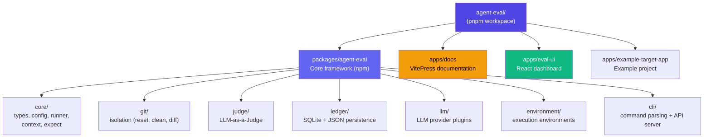
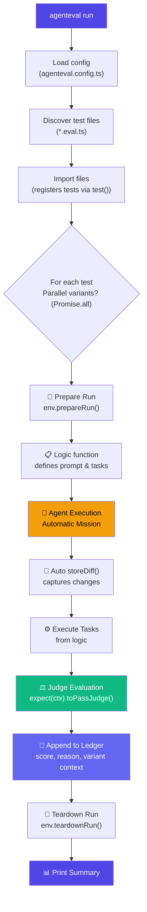

# Architecture

AgentEval follows **SOLID principles** to stay modular, testable, and extensible.

## Monorepo Layout


```mermaid
flowchart TD
    ROOT["agent-eval/<br/>(pnpm workspace)"]
    ROOT --> PKG["packages/agent-eval<br/>Core framework (npm)"]
    ROOT --> DOCS["apps/docs<br/>VitePress documentation"]
    ROOT --> UI["apps/eval-ui<br/>React dashboard"]
    ROOT --> EXAMPLE["apps/example-target-app<br/>Example project"]

    PKG --> CORE["core/<br/>types, config, runner,<br/>context, expect"]
    PKG --> GIT["git/<br/>isolation (reset, clean, diff)"]
    PKG --> JUDGE["judge/<br/>LLM-as-a-Judge"]
    PKG --> LEDGER["ledger/<br/>SQLite + JSON persistence"]
    PKG --> LLM["llm/<br/>LLM provider plugins"]
    PKG --> ENV["environment/<br/>execution environments"]
    PKG --> CLI["cli/<br/>command parsing + API server"]

    style ROOT fill:#4f46e5,color:#fff
    style PKG fill:#6366f1,color:#fff
    style UI fill:#10b981,color:#fff
    style DOCS fill:#f59e0b,color:#000
```

## Module Map

```
packages/agent-eval/src/
├── core/           SRP: Each file = one concern
│   ├── types.ts        All TypeScript interfaces
│   ├── config.ts       Config file loading & defaults
│   ├── context.ts      TestContext (prompt, storeDiff, runCommand)
│   ├── runner.ts       Execution engine (parallel or sequential)
│   └── expect.ts       Fluent assertion API
├── git/
│   └── git.ts          Git utils (diff collection)
├── environment/
│   ├── local.ts        Legacy: host + git reset
│   ├── docker.ts       Modern: sandboxed container (Parallel)
│   └── sandbox-exec.ts Modern: macOS seatbelt (Parallel)
├── judge/
│   └── judge.ts        LLM-as-a-Judge evaluation
├── ledger/
│   └── ledger.ts       SQLite persistence & queries
├── cli/
│   └── cli.ts          CLI command parsing + API server
└── index.ts            Public API surface
```

## SOLID in Practice

### Single Responsibility (SRP)

Each module has **one reason to change**. The runner orchestrates the mission but doesn't know how Docker works. The judge evaluates diffs but doesn't know how they were produced.

### Open/Closed (OCP)

Adding a new LLM provider means implementing `IModelPlugin` — the runner engine and judge never change.

### Liskov Substitution (LSP)

All environment plugins are interchangeable. The engine prepares the run regardless of whether it's a Docker container or a local tmp dir.

### Interface Segregation (ISP)

Interfaces are small and focused. Test functions receive only what they need to define missions and quality checks.

### Dependency Inversion (DIP)

High-level modules (runner, judge) depend on **abstractions** (`IModelPlugin`, `ILedgerPlugin`, `IEnvironmentPlugin`), not concrete implementations.

## Isolated Parallel Execution

Tests can run **in parallel** if the environment plugin supports it (e.g. Docker). This is achieved through **spatial isolation**: providing a unique, ephemeral workspace for each variant. See [ADR-010](#architecture-decisions).

## Data Flow

### High-Level Pipeline


```mermaid
flowchart TB
    A["agenteval run"] --> B["Load config<br/>(agenteval.config.ts)"]
    B --> C["Discover test files<br/>(*.eval.ts)"]
    C --> D["Import files<br/>(registers tests via test())"]
    D --> E{"For each test<br/>Parallel variants? (Promise.all)"}

    E --> F["🔧 Prepare Run<br/>env.prepareRun()"]
    F --> G["📋 Logic function<br/>defines prompt & tasks"]
    G --> H["🤖 Agent Execution<br/>Automatic Mission"]
    H --> I["📸 Auto storeDiff()<br/>captures changes"]
    I --> J["⚙️ Execute Tasks<br/>from logic"]
    J --> K["⚖️ Judge Evaluation<br/>expect(ctx).toPassJudge()"]
    K --> L["💾 Append to Ledger<br/>score, reason, variant context"]
    L --> M["🧹 Teardown Run<br/>env.teardownRun()"]
    M --> N["📊 Print Summary"]

    style A fill:#4f46e5,color:#fff
    style H fill:#f59e0b,color:#000
    style K fill:#10b981,color:#fff
    style L fill:#6366f1,color:#fff
    style N fill:#4f46e5,color:#fff
```

## Architecture Decisions

| ADR                                                                | Decision                                                   |
| :----------------------------------------------------------------- | :--------------------------------------------------------- |
| [ADR-001](./001-why-custom-framework.md)                           | Why a custom framework (not Vitest / Promptfoo / Langfuse) |
| [ADR-002](./002-sqlite-over-jsonl.md)                              | SQLite over JSONL for the ledger                           |
| [ADR-003](./003-sequential-execution.md)                           | **Superseded by ADR-010**                                  |
| [ADR-004](./004-llm-as-judge.md)                                   | LLM-as-a-Judge with Vercel AI SDK                          |
| [ADR-005](./005-monorepo-layout.md)                                | Monorepo layout (apps/ + packages/)                        |
| [ADR-006](./006-code-quality-gates.md)                             | Code quality gates (ESLint + Prettier + Husky)             |
| [ADR-007](./007-solid-architecture.md)                             | SOLID architecture principles                              |
| [ADR-008](./008-experimentation-and-unified-test-format.md)        | Unified mission-based testing and A/B Experiments          |
| [ADR-009](./009-explicit-runner-selection-and-unified-variants.md) | Mandatory variants and Zero-Magic philosophy               |
| [ADR-010](./010-isolated-parallel-execution.md)                    | Isolated parallel execution via Docker/Tmp dirs            |
