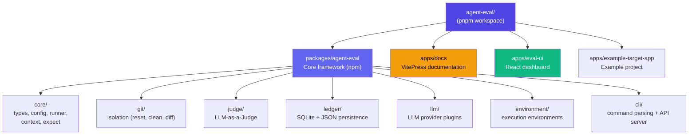
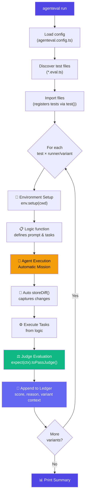
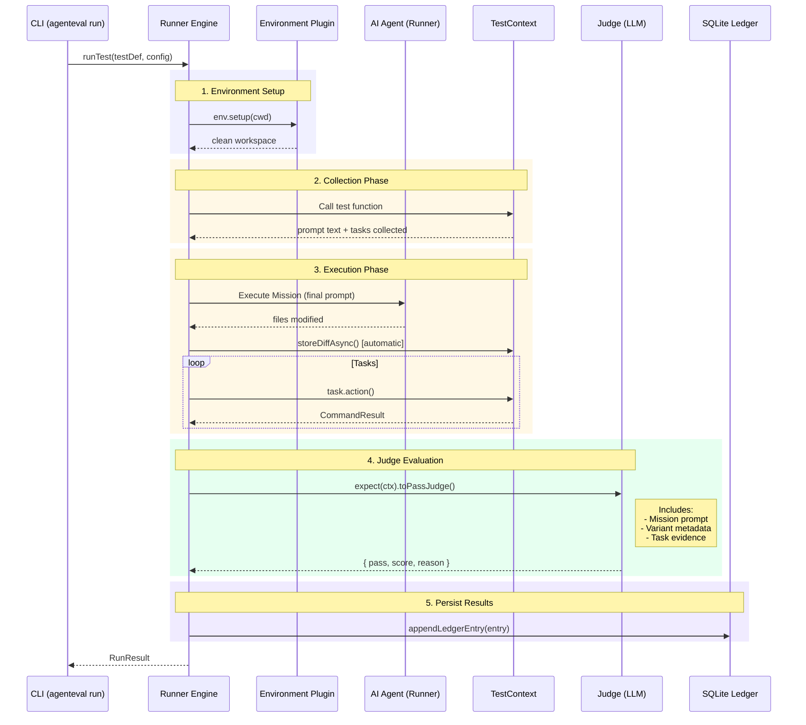

# Architecture

AgentEval follows **SOLID principles** to stay modular, testable, and extensible.

## Monorepo Layout


```mermaid
flowchart TD
    ROOT["agent-eval/<br/>(pnpm workspace)"]
    ROOT --> PKG["packages/agent-eval<br/>Core framework (npm)"]
    ROOT --> DOCS["apps/docs<br/>VitePress documentation"]
    ROOT --> UI["apps/eval-ui<br/>React dashboard"]
    ROOT --> EXAMPLE["apps/example-target-app<br/>Example project"]

    PKG --> CORE["core/<br/>types, config, runner,<br/>context, expect"]
    PKG --> GIT["git/<br/>isolation (reset, clean, diff)"]
    PKG --> JUDGE["judge/<br/>LLM-as-a-Judge"]
    PKG --> LEDGER["ledger/<br/>SQLite + JSON persistence"]
    PKG --> LLM["llm/<br/>LLM provider plugins"]
    PKG --> ENV["environment/<br/>execution environments"]
    PKG --> CLI["cli/<br/>command parsing + API server"]

    style ROOT fill:#4f46e5,color:#fff
    style PKG fill:#6366f1,color:#fff
    style UI fill:#10b981,color:#fff
    style DOCS fill:#f59e0b,color:#000
```

## Module Map

```
packages/agent-eval/src/
├── core/           SRP: Each file = one concern
│   ├── types.ts        All TypeScript interfaces
│   ├── config.ts       Config file loading & defaults
│   ├── context.ts      TestContext (prompt, storeDiff, runCommand)
│   ├── runner.ts       Automatic test execution engine
│   └── expect.ts       Fluent assertion API
├── git/
│   └── git.ts          Git isolation (reset, clean, diff)
├── environment/
│   ├── local-environment.ts   Default: host + git
│   └── docker-environment.ts  Sandboxed: Docker container
├── judge/
│   └── judge.ts        LLM-as-a-Judge evaluation
├── ledger/
│   └── ledger.ts       SQLite persistence & queries
├── cli/
│   └── cli.ts          CLI command parsing + API server
└── index.ts            Public API surface

apps/eval-ui/src/
├── components/         Reusable UI components
│   ├── Sidebar.tsx         Navigation + connectivity
│   ├── DiffViewer.tsx      GitHub-style diff rendering
│   └── RunDetailPanel.tsx  Detailed run view
├── pages/              Route pages
│   ├── Overview.tsx        Stats + charts
│   ├── Runs.tsx            Filterable runs table
│   └── EvalDetail.tsx      Per-evaluation breakdown
├── lib/
│   └── api.ts          Fetch functions for /api/*
└── App.tsx             Router + layout
```

## SOLID in Practice

### Single Responsibility (SRP)

Each module has **one reason to change**. The runner orchestrates the mission but doesn't know how Git works. The judge evaluates diffs but doesn't know how they were produced.

### Open/Closed (OCP)

Adding a new LLM provider means implementing `IModelPlugin` — the runner engine and judge never change. Runners are defined in a central registry.

### Liskov Substitution (LSP)

All runners are interchangeable technical resources. The engine executes the mission regardless of whether it's a CLI tool or an API model.

### Interface Segregation (ISP)

Interfaces are small and focused. Test functions receive only what they need to define missions and quality checks.

### Dependency Inversion (DIP)

High-level modules (runner, judge) depend on **abstractions** (`IModelPlugin`, `ILedgerPlugin`, `IEnvironmentPlugin`), not concrete implementations.

## Sequential Execution

All tests run **sequentially** (no concurrency). This is intentional — agents mutate the filesystem and Git state. See [ADR-003](#architecture-decisions).

## Workspace Isolation

Before each test iteration, the **environment plugin** prepares a clean workspace. This logic is encapsulated in `IEnvironmentPlugin.setup()`.

## Data Flow

### High-Level Pipeline


```mermaid
flowchart TB
    A["agenteval run"] --> B["Load config<br/>(agenteval.config.ts)"]
    B --> C["Discover test files<br/>(*.eval.ts)"]
    C --> D["Import files<br/>(registers tests via test())"]
    D --> E{"For each<br/>test × runner/variant"}

    E --> F["🔧 Environment Setup<br/>env.setup(cwd)"]
    F --> G["📋 Logic function<br/>defines prompt & tasks"]
    G --> H["🤖 Agent Execution<br/>Automatic Mission"]
    H --> I["📸 Auto storeDiff()<br/>captures changes"]
    I --> J["⚙️ Execute Tasks<br/>from logic"]
    J --> K["⚖️ Judge Evaluation<br/>expect(ctx).toPassJudge()"]
    K --> L["💾 Append to Ledger<br/>score, reason, variant context"]
    L --> M{"More<br/>variants?"}
    M -- Yes --> E
    M -- No --> N["📊 Print Summary"]

    style A fill:#4f46e5,color:#fff
    style H fill:#f59e0b,color:#000
    style K fill:#10b981,color:#fff
    style L fill:#6366f1,color:#fff
    style N fill:#4f46e5,color:#fff
```

### Test Execution Detail


```mermaid
sequenceDiagram
    participant CLI as CLI (agenteval run)
    participant Runner as Runner Engine
    participant Git as Environment Plugin
    participant Agent as AI Agent (Runner)
    participant Ctx as TestContext
    participant Judge as Judge (LLM)
    participant Ledger as SQLite Ledger

    CLI->>Runner: runTest(testDef, config)

    rect rgb(240, 240, 255)
        Note over Runner,Git: 1. Environment Setup
        Runner->>Git: env.setup(cwd)
        Git-->>Runner: clean workspace
    end

    rect rgb(255, 248, 230)
        Note over Runner,Ctx: 2. Collection Phase
        Runner->>Ctx: Call test function
        Ctx-->>Runner: prompt text + tasks collected
    end

    rect rgb(255, 248, 230)
        Note over Runner,Ctx: 3. Execution Phase
        Runner->>Agent: Execute Mission (final prompt)
        Agent-->>Runner: files modified
        Runner->>Ctx: storeDiffAsync() [automatic]

        loop Tasks
            Runner->>Ctx: task.action()
            Ctx-->>Runner: CommandResult
        end
    end

    rect rgb(230, 255, 240)
        Note over Runner,Judge: 4. Judge Evaluation
        Runner->>Judge: expect(ctx).toPassJudge()
        Note right of Judge: Includes:<br/>- Mission prompt<br/>- Variant metadata<br/>- Task evidence
        Judge-->>Runner: { pass, score, reason }
    end

    rect rgb(240, 235, 255)
        Note over Runner,Ledger: 5. Persist Results
        Runner->>Ledger: appendLedgerEntry(entry)
    end

    Runner-->>CLI: RunResult
```

## Architecture Decisions

| ADR                                                         | Decision                                                   |
| :---------------------------------------------------------- | :--------------------------------------------------------- |
| [ADR-001](./001-why-custom-framework.md)                    | Why a custom framework (not Vitest / Promptfoo / Langfuse) |
| [ADR-002](./002-sqlite-over-jsonl.md)                       | SQLite over JSONL for the ledger                           |
| [ADR-003](./003-sequential-execution.md)                    | Sequential execution (no parallelism)                      |
| [ADR-004](./004-llm-as-judge.md)                            | LLM-as-a-Judge with Vercel AI SDK                          |
| [ADR-005](./005-monorepo-layout.md)                         | Monorepo layout (apps/ + packages/)                        |
| [ADR-006](./006-code-quality-gates.md)                      | Code quality gates (ESLint + Prettier + Husky)             |
| [ADR-007](./007-solid-architecture.md)                      | SOLID architecture principles                              |
| [ADR-008](./008-experimentation-and-unified-test-format.md) | Unified mission-based testing and A/B Experiments          |
