# Architecture

AgentEval follows **SOLID principles** to stay modular, testable, and extensible.

## Module Map

```
packages/agent-eval/src/
├── core/           SRP: Each file = one concern
│   ├── types.ts        All TypeScript interfaces
│   ├── config.ts       Config file loading & defaults
│   ├── context.ts      TestContext (storeDiff, runCommand)
│   ├── runner.ts       Sequential test execution engine
│   └── expect.ts       Fluent assertion API
├── git/
│   └── git.ts          Git isolation (reset, clean, diff)
├── judge/
│   └── judge.ts        LLM-as-a-Judge evaluation
├── ledger/
│   └── ledger.ts       SQLite persistence & queries
├── cli/
│   └── cli.ts          CLI command parsing
└── index.ts            Public API surface
```

## SOLID in Practice

### Single Responsibility (SRP)

Each module has **one reason to change**. The runner orchestrates tests but doesn't know how Git works. The judge evaluates diffs but doesn't know how they were produced.

**Rule of thumb:** If a file exceeds ~200 lines or handles two concerns, split it.

### Open/Closed (OCP)

Adding a new runner provider means adding a `case` in `resolveRunnerModel()` — the runner engine itself never changes. Same for judges via `resolveModel()`.

```typescript
// To add a new provider, add one case — nothing else changes
case "mistral":
  return createMistral({ apiKey })(model);
```

### Liskov Substitution (LSP)

All runners implement the `AgentHandle` interface. The engine calls `agent.run(prompt)` regardless of whether it's a CLI spawn or an API call:

```typescript
interface AgentHandle {
  run(prompt: string): Promise<void>;
  readonly name: string;
  readonly model: string;
}
```

### Interface Segregation (ISP)

Interfaces are small and focused. Test functions receive only what they need:

| Interface      | Methods/Props                                     | Consumer                 |
| -------------- | ------------------------------------------------- | ------------------------ |
| `AgentHandle`  | `run()`, `name`, `model`                          | Test functions           |
| `TestContext`  | `storeDiff()`, `runCommand()`, `diff`, `commands` | Test functions           |
| `JudgeOptions` | `criteria`, `model?`                              | `expect().toPassJudge()` |

### Dependency Inversion (DIP)

High-level modules (runner, judge) depend on **abstractions** (`AgentEvalConfig`, `JudgeConfig`), not concrete SDK implementations. Provider SDKs are **dynamically imported** at runtime:

```typescript
// No static import — loaded only when needed
const { createAnthropic } = await import("@ai-sdk/anthropic");
```

This keeps the bundle small and avoids forcing users to install SDKs they don't use.

## Sequential Execution

All tests run **sequentially** (no concurrency). This is intentional — agents mutate the filesystem and Git state. See ADR-003 (`docs/adrs/003-sequential-execution.md`) for details.

## Git Isolation

Before each test iteration: `git reset --hard HEAD && git clean -fd`. This guarantees a pristine working directory. Never skip this step.

## Data Flow

### High-Level Pipeline

```mermaid
flowchart TB
    A["agenteval run"] --> B["Load config\n(agenteval.config.ts)"]
    B --> C["Discover test files\n(*.eval.ts, *.agent-eval.ts)"]
    C --> D["Import files\n(registers tests via test())"]
    D --> E{"For each\ntest × runner"}

    E --> F["🔄 Git Reset\ngit reset --hard\ngit clean -fd"]
    F --> G["🤖 Agent Execution\nagent.run(prompt)"]
    G --> H["📸 Auto storeDiff()\ncaptures git diff"]
    H --> I["⚙️ afterEach Commands\npnpm test, tsc, lint..."]
    I --> J["⚖️ Judge Evaluation\nexpect(ctx).toPassJudge()"]
    J --> K["💾 Append to SQLite Ledger\nscore, reason, improvement, diff, commands"]
    K --> L{"More\nrunners?"}
    L -- Yes --> E
    L -- No --> M["📊 Print Summary"]

    style A fill:#4f46e5,color:#fff
    style G fill:#f59e0b,color:#000
    style J fill:#10b981,color:#fff
    style K fill:#6366f1,color:#fff
    style M fill:#4f46e5,color:#fff
```



### Test Execution Detail

This is the detailed flow of a **single test iteration** for one runner:


### Judge Decision Flow

```mermaid
flowchart LR
    A["Build Prompt"] --> B{"Judge Type?"}
    B -- API --> C["generateObject()\nVercel AI SDK\n+ Zod schema"]
    B -- CLI --> D["execSync(command)\nparse JSON output"]
    D --> E{"Valid JSON?"}
    E -- No --> F{"Retries\nleft?"}
    F -- Yes --> D
    F -- No --> G["❌ Throw Error"]
    E -- Yes --> H["Zod Validation"]
    C --> H
    H --> I{"score ≥ 0.7?"}
    I -- Yes --> J["✅ PASS"]
    I -- No --> K["❌ FAIL"]
    J --> L["Return\n{ pass, score,\nreason, improvement }"]
    K --> L

    style J fill:#10b981,color:#fff
    style K fill:#ef4444,color:#fff
    style G fill:#ef4444,color:#fff
```



### Ledger Data Model


## Extending the Framework

| What                | Where              | How                                                  |
| ------------------- | ------------------ | ---------------------------------------------------- |
| New runner provider | `core/runner.ts`   | Add a `case` in `resolveRunnerModel()`               |
| New judge provider  | `judge/judge.ts`   | Add a `case` in `resolveModel()`                     |
| New CLI command     | `cli/cli.ts`       | Add `program.command()`                              |
| New context method  | `core/context.ts`  | Add to `TestContext` interface + `EvalContext` class |
| New ledger query    | `ledger/ledger.ts` | Add a new exported function                          |

See ADR-007 (`docs/adrs/007-solid-architecture.md`) for the full decision record.
