# Architecture

AgentEval follows **SOLID principles** to stay modular, testable, and extensible.

## Monorepo Layout


## Module Map

```
packages/agent-eval/src/
├── core/           SRP: Each file = one concern
│   ├── types.ts        All TypeScript interfaces
│   ├── config.ts       Config file loading & defaults
│   ├── context.ts      TestContext (storeDiff, runCommand)
│   ├── runner.ts       Sequential test execution engine
│   └── expect.ts       Fluent assertion API
├── git/
│   └── git.ts          Git isolation (reset, clean, diff)
├── environment/
│   ├── local-environment.ts   Default: host + git
│   └── docker-environment.ts  Sandboxed: Docker container
├── judge/
│   └── judge.ts        LLM-as-a-Judge evaluation
├── ledger/
│   └── ledger.ts       SQLite persistence & queries
├── cli/
│   └── cli.ts          CLI command parsing + API server
└── index.ts            Public API surface

apps/eval-ui/src/
├── components/         Reusable UI components
│   ├── Sidebar.tsx         Navigation + connectivity
│   ├── DiffViewer.tsx      GitHub-style diff rendering
│   └── RunDetailPanel.tsx  Detailed run view
├── pages/              Route pages
│   ├── Overview.tsx        Stats + charts
│   ├── Runs.tsx            Filterable runs table
│   └── EvalDetail.tsx      Per-evaluation breakdown
├── lib/
│   └── api.ts          Fetch functions for /api/*
└── App.tsx             Router + layout
```

## SOLID in Practice

### Single Responsibility (SRP)

Each module has **one reason to change**. The runner orchestrates tests but doesn't know how Git works. The judge evaluates diffs but doesn't know how they were produced.

**Rule of thumb:** If a file exceeds ~200 lines or handles two concerns, split it.

### Open/Closed (OCP)

Adding a new runner provider means adding a `case` in `resolveRunnerModel()` — the runner engine itself never changes. Same for judges via `resolveModel()`.

```typescript
// To add a new provider, add one case — nothing else changes
case "mistral":
  return createMistral({ apiKey })(model);
```

### Liskov Substitution (LSP)

All runners implement the `AgentHandle` interface. The engine calls `agent.run(prompt)` regardless of whether it's a CLI spawn or an API call:

```typescript
interface AgentHandle {
  run(prompt: string): Promise<void>;
  readonly name: string;
  readonly model: string;
}
```

### Interface Segregation (ISP)

Interfaces are small and focused. Test functions receive only what they need:

| Interface      | Methods/Props                                     | Consumer                 |
| -------------- | ------------------------------------------------- | ------------------------ |
| `AgentHandle`  | `run()`, `name`, `model`                          | Test functions           |
| `TestContext`  | `storeDiff()`, `runCommand()`, `diff`, `commands` | Test functions           |
| `JudgeOptions` | `criteria`, `model?`, `expectedFiles?`            | `expect().toPassJudge()` |

### Dependency Inversion (DIP)

High-level modules (runner, judge) depend on **abstractions** (`AgentEvalConfig`, `JudgeConfig`), not concrete SDK implementations. Provider SDKs are **dynamically imported** at runtime:

```typescript
// No static import — loaded only when needed
const { createAnthropic } = await import("@ai-sdk/anthropic");
```

This keeps the bundle small and avoids forcing users to install SDKs they don't use.

## Sequential Execution

All tests run **sequentially** (no concurrency). This is intentional — agents mutate the filesystem and Git state. See ADR-003 (`docs/adrs/003-sequential-execution.md`) for details.

## Workspace Isolation

Before each test iteration, the **environment plugin** prepares a clean workspace. This logic is encapsulated in `IEnvironmentPlugin.setup()`:

- **`LocalEnvironment`** (default): runs `git reset --hard HEAD && git clean -fd` on the host
- **`DockerEnvironment`**: creates a fresh container with the project files
- **Custom environments**: implement `IEnvironmentPlugin` for your own setup logic (cloud VMs, remote agents, etc.)

After the test completes, `env.teardown()` is called to clean up resources (no-op for local, container removal for Docker). See the [Environments guide](/guide/environments).

## Data Flow

### High-Level Pipeline


### Test Execution Detail

This is the detailed flow of a **single test iteration** for one runner:


### Judge Decision Flow

```mermaid
flowchart LR
    A["Build Prompt"] --> B{"Judge Type?"}
    B -- API --> C["generateObject()\nVercel AI SDK\n+ Zod schema"]
    B -- CLI --> D["execSync(command)\nparse JSON output"]
    D --> E{"Valid JSON?"}
    E -- No --> F{"Retries\nleft?"}
    F -- Yes --> D
    F -- No --> G["❌ Throw Error"]
    E -- Yes --> H["Zod Validation"]
    C --> H
    H --> I{"score ≥ 0.7?"}
    I -- Yes --> J["✅ PASS"]
    I -- No --> K["❌ FAIL"]
    J --> L["Return\n{ pass, score,\nreason, improvement }"]
    K --> L

    style J fill:#10b981,color:#fff
    style K fill:#ef4444,color:#fff
    style G fill:#ef4444,color:#fff
```



### Ledger Data Model

```mermaid
erDiagram
    RUNS {
        int id PK "auto-increment"
        text test_id "test title"
        text suite_path "JSON array of suite names"
        text timestamp "ISO 8601"
        text agent_runner "runner name"
        text agent_model "runner model"
        text judge_model "model or CLI command"
        real score "0.0 – 1.0"
        int pass "0 or 1"
        text reason "judge explanation"
        text improvement "judge suggestions"
        text diff "raw git diff"
        text commands "JSON: CommandResult[]"
        int duration_ms "agent run time"
    }

    SCORE_OVERRIDES {
        int id PK "auto-increment"
        int run_id FK "references runs.id"
        real score "0.0 – 1.0 (manually set)"
        int pass "0 or 1"
        text reason "human justification"
        text timestamp "ISO 8601"
    }

    RUNS ||--o{ SCORE_OVERRIDES : "has overrides"
    RUNS ||--o{ COMMANDS : "stored as JSON"
    COMMANDS {
        text name "command label"
        text stdout "captured stdout"
        text stderr "captured stderr"
        int exitCode "0 = success"
        int durationMs "execution time"
    }
```



## Extending the Framework

With the plugin architecture, extending AgentEval no longer requires modifying core code:

| What                 | How                                                  |
| -------------------- | ---------------------------------------------------- |
| New storage backend  | Implement `ILedgerPlugin` interface                  |
| New LLM provider     | Extend `BaseLLMPlugin` or implement `ILLMPlugin`     |
| New judge type       | Implement `IJudgePlugin` interface                   |
| New exec environment | Implement `IEnvironmentPlugin` interface             |
| New CLI command      | Add `program.command()` in `cli/cli.ts`              |
| New context method   | Add to `TestContext` interface + `EvalContext` class |

See the [Plugin Architecture](/guide/plugin-architecture) guide for full details.

See ADR-007 (`docs/adrs/007-solid-architecture.md`) for the full decision record.
