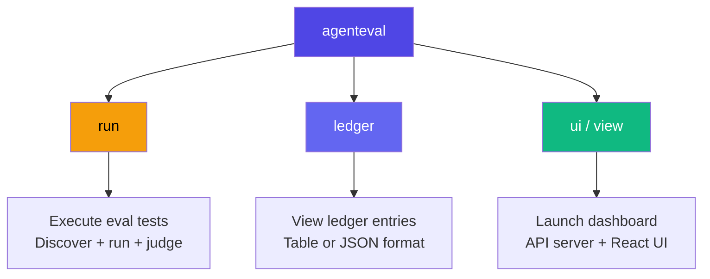
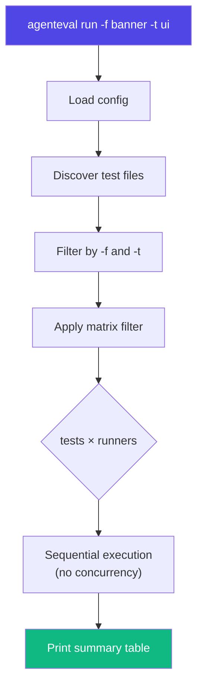

# CLI Reference

## Command Overview



## `agenteval run`

Execute evaluation tests. Discovers `*.eval.ts` and `*.agent-eval.ts` files by default.

```bash
agenteval run [options]
```

**Shorthand:** `agenteval .` is equivalent to `agenteval run`.

### Options

| Flag                     | Description                                       |
| ------------------------ | ------------------------------------------------- |
| `-c, --config <path>`    | Path to config file                               |
| `-f, --filter <pattern>` | Filter tests by title (substring match)           |
| `-t, --tag <tag>`        | Filter tests by tag                               |
| `-o, --output <dir>`     | Override output directory for the ledger database |

### Examples

```bash
# Run all tests
agenteval run

# Shorthand
agenteval .

# Run tests matching "Banner"
agenteval run -f banner

# Run tests tagged "ui"
agenteval run -t ui

# Use a specific config file
agenteval run -c configs/copilot-eval.config.ts

# Combine filters: run only "ui" tagged tests matching "close"
agenteval run -t ui -f close

# Save results to a custom directory
agenteval run -o ./my-results
```

### Execution Flow



## `agenteval ledger`

View evaluation results from the SQLite ledger.

```bash
agenteval ledger [options]
```

### Options

| Flag                 | Description               |
| -------------------- | ------------------------- |
| `--json`             | Output full JSON          |
| `-o, --output <dir>` | Override ledger directory |

### Examples

```bash
# View latest 20 entries
agenteval ledger

# Export as JSON
agenteval ledger --json > results.json

# Read from a specific directory
agenteval ledger -o ./my-results
```

## `agenteval ui` / `agenteval view`

Launch the evaluation dashboard. Starts a local API server that reads the SQLite ledger and exposes JSON endpoints, and opens the React dashboard.

```bash
agenteval ui [options]
agenteval view [options]   # alias
```

### Options

| Flag                 | Description                      |
| -------------------- | -------------------------------- |
| `-p, --port <port>`  | Port to serve on (default: 4747) |
| `-o, --output <dir>` | Override ledger directory        |

### API Endpoints

| Endpoint         | Description                          |
| ---------------- | ------------------------------------ |
| `GET /api/runs`  | All runs (filter with `?testId=...`) |
| `GET /api/tests` | List of unique test IDs              |
| `GET /api/stats` | Aggregate stats per runner per test  |

### Examples

```bash
# Launch dashboard
agenteval ui

# Launch on custom port
agenteval view -p 8080

# Point to specific ledger
agenteval ui -o ./my-results
```

See the [Dashboard guide](/guide/dashboard) for details on the web UI.

## Environment Variables

The CLI respects these environment variables:

| Variable            | Description                            |
| ------------------- | -------------------------------------- |
| `ANTHROPIC_API_KEY` | API key for Anthropic (runner + judge) |
| `OPENAI_API_KEY`    | API key for OpenAI (runner + judge)    |

Set them before running:

```bash
export ANTHROPIC_API_KEY=sk-ant-...
agenteval run
```

## Database Location

By default, AgentEval stores its SQLite ledger in `.agenteval/ledger.sqlite` relative to your project root. You can override this:

1. **In config:** Set `outputDir` in `agenteval.config.ts`
2. **Via CLI:** Use the `-o, --output` flag on any command
3. **Default:** `.agenteval/` directory

```typescript
// agenteval.config.ts
export default defineConfig({
  outputDir: "./custom-output", // ledger.sqlite will be here
  // ...
});
```

## Troubleshooting

| Issue                   | Solution                                            |
| ----------------------- | --------------------------------------------------- |
| "Config file not found" | Ensure `agenteval.config.ts` exists in project root |
| "No tests discovered"   | Check file patterns: `*.eval.ts`, `*.agent-eval.ts` |
| "API key missing"       | Set `ANTHROPIC_API_KEY` or `OPENAI_API_KEY` env var |
| "Port already in use"   | Use `-p <port>` to pick a different port for the UI |
| "Ledger not found"      | Run `agenteval run` first to create the database    |
