# CLI Reference

## Command Overview


## `agenteval run`

Execute evaluation tests. Discovers `*.eval.ts` and `*.agent-eval.ts` files by default.

```bash
agenteval run [options]
```

**Shorthand:** `agenteval .` is equivalent to `agenteval run`.

### Options

| Flag                     | Description                                       |
| ------------------------ | ------------------------------------------------- |
| `-c, --config <path>`    | Path to config file                               |
| `-f, --filter <pattern>` | Filter tests by title (substring match)           |
| `-t, --tag <tag>`        | Filter tests by tag                               |
| `-o, --output <dir>`     | Override output directory for the ledger database |
| `--dry-run`              | Preview execution plan without running agents     |
| `-s, --silent`           | Suppress all output except errors (for CI)        |
| `-v, --verbose`          | Show detailed output including judge reasoning    |

### Examples

```bash
# Run all tests
agenteval run

# Shorthand
agenteval .

# Run tests matching "Banner"
agenteval run -f banner

# Run tests tagged "ui"
agenteval run -t ui

# Use a specific config file
agenteval run -c configs/copilot-eval.config.ts

# Combine filters: run only "ui" tagged tests matching "close"
agenteval run -t ui -f close

# Save results to a custom directory
agenteval run -o ./my-results

# Silent mode (CI-friendly, no terminal output)
agenteval run --silent

# Verbose mode (includes judge reasoning and improvement suggestions)
agenteval run --verbose

# Dry-run mode (preview execution plan without running agents)
agenteval run --dry-run

# Combine: verbose output filtered to a specific tag
agenteval run -v -t ui
```

### Reporter Modes

AgentEval uses a **Reporter** system for CLI output. Four built-in reporters are available, including automatic CI detection:

```mermaid
flowchart LR
    subgraph Default["Default (default)"]
        D1["Pipeline steps with ✓/✗/●"]
        D2["Progress counter [N/M]"]
        D3["Summary table"]
    end

    subgraph Silent["Silent (--silent)"]
        S1["No output"]
        S2["Exit code only"]
    end

    subgraph Verbose["Verbose (--verbose)"]
        V1["Full pipeline steps"]
        V2["Judge reasoning"]
        V3["Improvement suggestions"]
        V4["Summary table"]
    end

    subgraph CI["CI (auto-detected)"]
        C1["Plain text, no colors"]
        C2["Static log lines"]
        C3["Machine-readable summary"]
    end

    style Default fill:#6366f1,color:#fff
    style Silent fill:#f59e0b,color:#000
    style Verbose fill:#10b981,color:#fff
    style CI fill:#ef4444,color:#fff
```



::: tip CI Auto-Detection
When AgentEval detects a CI environment (via `CI`, `GITHUB_ACTIONS`, `GITLAB_CI`, `JENKINS_URL`, `CIRCLECI`, `BUILDKITE`, `TF_BUILD`, `CODEBUILD_BUILD_ID` env vars, or when stdout is not a TTY), it automatically switches to the **CIReporter** — plain text, no colors, no animations.
:::

#### Default Output (Non-TUI)

The default reporter uses a **non-TUI approach**: every line is printed sequentially and stays in your terminal scrollback. No terminal clearing, no cursor manipulation.

```
🧪 AgentEval — 2 test(s) × 2 runner(s)

📄 evals/banner.eval.ts

  [1/4] Add close button [copilot]
    ✓ Environment setup
    ● Agent execution...
    ✓ Agent execution
    ✓ Diff capture
    ✓ Task verification — lint check
    ✓ Task verification — build check
    ✓ Judge evaluation
  ✓ PASS 0.85 12.3s

  [2/4] Add close button [claude-code]
    ✓ Environment setup
    ✓ Agent execution
    ✓ Diff capture
    ✗ Task verification — lint check
    ✓ Judge evaluation
  ⚠ WARN 0.65 8.1s

─── Results ───

  Test              Runner        Score   Status  Duration
  ──────────────────────────────────────────────────────────
  Add close button  copilot       0.85    PASS    12.3s
  Add close button  claude-code   0.65    WARN    8.1s

─── Summary ───
  ✓ 1 passed
  ⚠ 1 warnings
  ⏱ 20.4s total
```

**Pipeline step symbols:**

- `✓` — Step completed successfully (green)
- `●` — Step currently running (cyan)
- `✗` — Step failed (red)

#### Verbose Output

```
🧪 AgentEval — 2 test(s) × 1 runner(s)

📄 evals/banner.eval.ts

  [1/2] Add close button [copilot-cli]
    ✓ Environment setup
    ✓ Agent execution
    ✓ Diff capture
    ✓ Task verification — lint check
    ✓ Judge evaluation
  ✓ PASS 0.85 1.2s
    Reason: Close button implemented correctly with proper event handling
```

#### CI Output

```
AgentEval: 2 test(s) x 1 runner(s)

File: evals/banner.eval.ts
[1/2] Add close button [copilot-cli]
  [ok] Environment setup
  [ok] Agent execution
  [ok] Diff capture
  [ok] Task verification — lint check
  [ok] Judge evaluation
  PASS score=0.85 1.2s
[2/2] Add animation [copilot-cli]
  [ok] Environment setup
  [err] Agent execution
  FAIL score=0.35 2.1s
  reason: Animation not implemented

Summary: 1 passed, 0 warnings, 1 failed (3.3s)
```

### Execution Flow


## `agenteval ledger`

View evaluation results from the SQLite ledger.

```bash
agenteval ledger [options]
```

### Options

| Flag                 | Description               |
| -------------------- | ------------------------- |
| `--json`             | Output full JSON          |
| `-o, --output <dir>` | Override ledger directory |

### Examples

```bash
# View latest 20 entries
agenteval ledger

# Export as JSON
agenteval ledger --json > results.json

# Read from a specific directory
agenteval ledger -o ./my-results
```

## `agenteval ui` / `agenteval view`

Launch the evaluation dashboard. Starts a local server that serves both the bundled React dashboard and a JSON API reading the SQLite ledger.

When the UI is bundled (production/npm install), the dashboard is served at the root URL. In development mode (UI not bundled), only the API endpoints are available — run the eval-ui dev server separately.

```bash
agenteval ui [options]
agenteval view [options]   # alias
```

### Options

| Flag                 | Description                      |
| -------------------- | -------------------------------- |
| `-p, --port <port>`  | Port to serve on (default: 4747) |
| `-o, --output <dir>` | Override ledger directory        |

### API Endpoints

| Endpoint                  | Method  | Description                             |
| ------------------------- | ------- | --------------------------------------- |
| `/api/runs`               | `GET`   | All runs (filter with `?testId=...`)    |
| `/api/tests`              | `GET`   | List of unique test IDs                 |
| `/api/tree`               | `GET`   | Hierarchical test tree (suites + tests) |
| `/api/stats`              | `GET`   | Aggregate stats per runner per test     |
| `/api/runs/:id/override`  | `PATCH` | Override a run's score (HITL)           |
| `/api/runs/:id/overrides` | `GET`   | Audit trail of score overrides          |

### Examples

```bash
# Launch dashboard
agenteval ui

# Launch on custom port
agenteval view -p 8080

# Point to specific ledger
agenteval ui -o ./my-results
```

See the [Dashboard guide](/guide/dashboard) for details on the web UI.

## Environment Variables

The CLI respects these environment variables:

| Variable            | Description                            |
| ------------------- | -------------------------------------- |
| `ANTHROPIC_API_KEY` | API key for Anthropic (runner + judge) |
| `OPENAI_API_KEY`    | API key for OpenAI (runner + judge)    |

Set them before running:

```bash
export ANTHROPIC_API_KEY=sk-ant-...
agenteval run
```

## Database Location

By default, AgentEval stores its SQLite ledger in `.agenteval/ledger.sqlite` relative to your project root. You can override this:

1. **In config:** Set `outputDir` in `agenteval.config.ts`
2. **Via CLI:** Use the `-o, --output` flag on any command
3. **Default:** `.agenteval/` directory

```typescript
// agenteval.config.ts
export default defineConfig({
  outputDir: "./custom-output", // ledger.sqlite will be here
  // ...
});
```

## Troubleshooting

| Issue                   | Solution                                            |
| ----------------------- | --------------------------------------------------- |
| "Config file not found" | Ensure `agenteval.config.ts` exists in project root |
| "No tests discovered"   | Check file patterns: `*.eval.ts`, `*.agent-eval.ts` |
| "API key missing"       | Set `ANTHROPIC_API_KEY` or `OPENAI_API_KEY` env var |
| "Port already in use"   | Use `-p <port>` to pick a different port for the UI |
| "Ledger not found"      | Run `agenteval run` first to create the database    |

## Custom Reporters

You can create your own reporter by implementing the `Reporter` interface:

```typescript
import type { Reporter, TestEvent, TestResultEvent, PipelineStep, StepStatus } from "agent-eval";

class MyReporter implements Reporter {
  onRunStart(totalTests: number, totalRunners: number): void {
    /* ... */
  }
  onFileStart(filePath: string): void {
    /* ... */
  }
  onTestStart(event: TestEvent): void {
    /* ... */
  }
  onGitReset(event: TestEvent): void {
    /* ... */
  }
  onFileWrite(event: TestEvent, filePath: string): void {
    /* ... */
  }
  onPipelineStep(event: TestEvent, step: PipelineStep, status: StepStatus, detail?: string): void {
    // step: 'setup' | 'agent' | 'diff' | 'afterEach' | 'task' | 'judge'
    // status: 'running' | 'done' | 'error'
  }
  onTestPass(event: TestResultEvent): void {
    /* ... */
  }
  onTestWarn(event: TestResultEvent): void {
    /* ... */
  }
  onTestFail(event: TestResultEvent): void {
    /* ... */
  }
  onTestError(event: TestEvent, error: string): void {
    /* ... */
  }
  onRunEnd(results: TestResultEvent[], durationMs: number): void {
    /* ... */
  }
}
```

### Built-in Reporters

| Reporter          | Import                       | Description                            |
| ----------------- | ---------------------------- | -------------------------------------- |
| `DefaultReporter` | `import { DefaultReporter }` | Non-TUI with pipeline steps & progress |
| `VerboseReporter` | `import { VerboseReporter }` | Detailed output with judge reasoning   |
| `SilentReporter`  | `import { SilentReporter }`  | No output (programmatic use)           |
| `CIReporter`      | `import { CIReporter }`      | Plain text for CI environments         |

### `isCI()` Helper

The `isCI()` function detects CI environments:

```typescript
import { isCI } from "agent-eval";

if (isCI()) {
  // Running in CI — disable interactive features
}
```

Detected environments: GitHub Actions, GitLab CI, Jenkins, CircleCI, Buildkite, Azure Pipelines, AWS CodeBuild, and any non-TTY terminal.

## Terminal UX Philosophy

AgentEval uses a **strict non-TUI approach**:

- **No terminal clearing** — all output stays in scrollback history
- **No cursor manipulation** — every line is printed sequentially
- **Lightweight styling** — uses `picocolors` (14x faster than chalk, 0 dependencies)
- **CI-friendly** — auto-detects CI environments and strips ANSI codes
- **Pipeline visualization** — each test step is shown as a checklist item

This ensures that raw logs and test output remain accessible in CI artifacts, log aggregators, and after terminal session ends.
