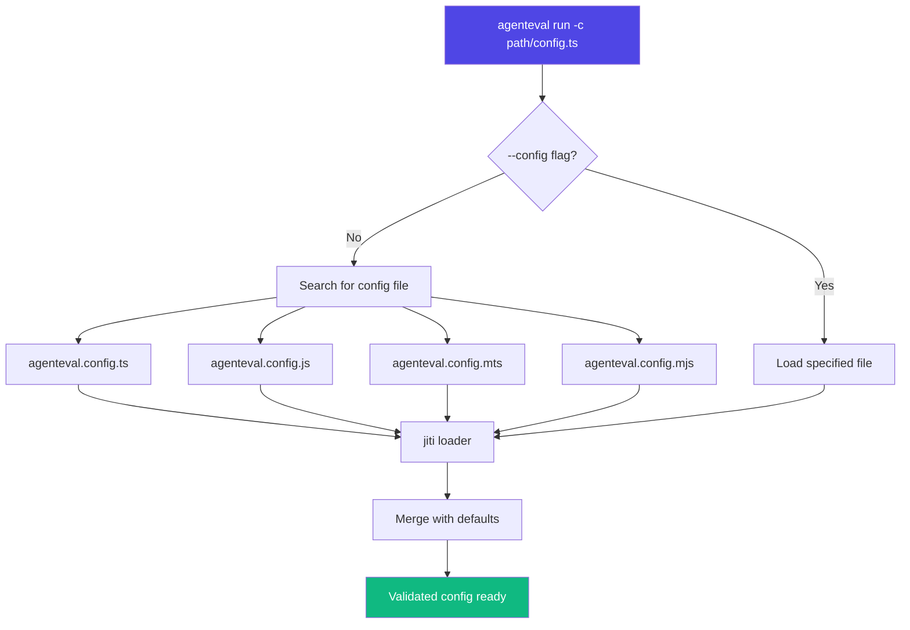

# Configuration

AgentEval is configured via `agenteval.config.ts` at the root of your project.

## Config Resolution


```mermaid
flowchart TD
    A["agenteval run -c path/config.ts"] --> B{"--config flag?"}
    B -- Yes --> C["Load specified file"]
    B -- No --> D["Search for config file"]
    D --> E["agenteval.config.ts"]
    D --> F["agenteval.config.js"]
    D --> G["agenteval.config.mts"]
    D --> H["agenteval.config.mjs"]
    E & F & G & H --> I["jiti loader"]
    C --> I
    I --> J["Merge with defaults"]
    J --> K["Validated config ready"]

    style A fill:#4f46e5,color:#fff
    style K fill:#10b981,color:#fff
```

## Minimal Example

```ts
// agenteval.config.ts
import { defineConfig } from "@tlahey/agent-eval";
import { AnthropicModel } from "@tlahey/agent-eval/llm";

export default defineConfig({
  runners: [{ id: "sonnet", model: new AnthropicModel({ model: "claude-3-5-sonnet-20241022" }) }],
  judge: {
    model: new AnthropicModel({ model: "claude-3-5-sonnet-20241022" }),
  },
});
```

## Full Example (with registry and plugins)

```ts
import { defineConfig } from "@tlahey/agent-eval";
import { AnthropicModel, CliModel, OpenAIModel } from "@tlahey/agent-eval/llm";
import { SqliteLedger } from "@tlahey/agent-eval/ledger";
import { DockerEnvironment } from "@tlahey/agent-eval/environment";

export default defineConfig({
  // --- Registry of technical resources ---
  runners: [
    { id: "sonnet", model: new AnthropicModel({ model: "claude-3-5-sonnet-20241022" }) },
    { id: "gpt4", model: new OpenAIModel({ model: "gpt-4o" }) },
    { id: "aider", model: new CliModel({ command: 'aider --message "{{prompt}}" --yes' }) },
  ],

  judge: {
    model: new OpenAIModel({ model: "gpt-4o" }),
  },

  ledger: new SqliteLedger({ outputDir: ".agenteval" }),

  environment: new DockerEnvironment({ image: "node:22" }),

  beforeEach: ({ ctx }) => {
    ctx.addTask({
      name: "Lint",
      action: ({ exec }) => exec("pnpm lint"),
      criteria: "Code follows linting rules",
    });
  },

  testFiles: "evals/**/*.eval.ts",
  timeout: 300_000,
  thresholds: { warn: 0.8, fail: 0.5 },
});
```

## Options Reference

| Option        | Type                 | Default                     | Description                                          |
| :------------ | :------------------- | :-------------------------- | :--------------------------------------------------- |
| `runners`     | `RunnerConfig[]`     | _required_                  | Registry of available AI agents.                     |
| `judge`       | `JudgeConfig`        | _required_                  | LLM-as-a-Judge configuration.                        |
| `testFiles`   | `string \| string[]` | `**/*.{eval,agent-eval}.ts` | Glob pattern(s) for test discovery.                  |
| `rootDir`     | `string`             | `process.cwd()`             | Project root directory.                              |
| `outputDir`   | `string`             | `.agenteval`                | Ledger output directory.                             |
| `timeout`     | `number`             | `300000`                    | Max duration for agent mission (ms).                 |
| `thresholds`  | `Thresholds`         | `{ warn: 0.8, fail: 0.5 }`  | Global scoring thresholds.                           |
| `ledger`      | `ILedgerPlugin`      | `SqliteLedger`              | Custom storage plugin.                               |
| `environment` | `IEnvironmentPlugin` | `LocalEnvironment`          | Custom execution environment (supports parallelism). |

## Zero Magic Philosophy

AgentEval avoids automatic behavior. You must explicitly define which runner to use for every test via variants.

```ts
test("My Mission", [{ name: "Claude Baseline", runner: "sonnet" }], async ({ ctx }) => {
  // ...
});
```

## Scoring Thresholds

AgentEval uses a three-level scoring system: **PASS**, **WARN**, and **FAIL**.

| Threshold | Default | Meaning                                                         |
| :-------- | :------ | :-------------------------------------------------------------- |
| `warn`    | `0.8`   | Scores ≥ 0.8 are **PASS**.                                      |
| `fail`    | `0.5`   | Scores ≥ 0.5 but < 0.8 are **WARN**. Scores < 0.5 are **FAIL**. |

::: tip
Only **FAIL** results throw errors and break CI. **WARN** results are recorded but considered passing.
:::
