```mermaid
flowchart LR
    A["agent.run(prompt)"] --> B["📸 storeDiff()<br/>(automatic)"]
    B --> C["⚙️ afterEach[0]<br/>pnpm test"]
    C --> D["⚙️ afterEach[1]<br/>pnpm build"]
    D --> E["Ready for<br/>judge evaluation"]

    style A fill:#f59e0b,color:#000
    style B fill:#6366f1,color:#fff
    style E fill:#10b981,color:#fff
```

# Configuration

AgentEval is configured via `agenteval.config.ts` at the root of your project.

## Config Resolution


## Full Example

```ts
import { defineConfig } from "agent-eval";

export default defineConfig({
  // Where test files are located
  testFiles: "**/*.{eval,agent-eval}.{ts,js}",

  // Agent runners to evaluate
  runners: [
    // CLI runner: any tool that accepts a prompt via command line
    {
      name: "copilot",
      type: "cli",
      command: 'gh copilot suggest -t shell "{{prompt}}"',
    },
    {
      name: "claude-code",
      type: "cli",
      command: 'claude -p "{{prompt}}" --allowedTools "Edit,Write,Bash"',
    },
    {
      name: "aider-sonnet",
      type: "cli",
      command:
        'aider --model anthropic/claude-sonnet-4-20250514 --message "{{prompt}}" --yes --no-auto-commits',
    },
    // API runner: calls an LLM directly
    {
      name: "gpt-4o-api",
      type: "api",
      api: {
        provider: "openai",
        model: "gpt-4o",
      },
    },
  ],

  // Judge configuration — use a strong, capable model
  // API judge (default):
  judge: {
    provider: "anthropic",
    model: "claude-sonnet-4-20250514",
  },

  // Or use a CLI judge:
  // judge: {
  //   type: "cli",
  //   command: 'claude -p "$(cat {{prompt_file}})" --output-format json',
  //   maxRetries: 3, // Retry on invalid JSON (default: 2)
  // },

  // Commands to run automatically after each agent execution.
  // storeDiff() is always called automatically — no need to add it here.
  afterEach: [
    { name: "test", command: "pnpm test" },
    { name: "typecheck", command: "pnpm build" },
  ],

  // Model matrix (optional): only run specific runners
  matrix: {
    runners: ["copilot", "claude-code"],
  },

  // Output directory for the ledger
  outputDir: ".agenteval",

  // Timeout per agent run (ms)
  timeout: 300_000,

  // Global scoring thresholds (optional)
  // score >= warn → PASS, score >= fail → WARN, score < fail → FAIL
  thresholds: {
    warn: 0.8, // default
    fail: 0.5, // default
  },
});
```

## Options Reference

| Option       | Type                             | Default                                  | Description                                             |
| ------------ | -------------------------------- | ---------------------------------------- | ------------------------------------------------------- |
| `rootDir`    | `string`                         | `process.cwd()`                          | Project root directory                                  |
| `testFiles`  | `string \| string[]`             | `**/*.{eval,agent-eval}.{ts,js,mts,mjs}` | Glob pattern(s) for test discovery                      |
| `runners`    | `AgentRunnerConfig[]`            | _required_                               | Agent runners to evaluate                               |
| `judge`      | `JudgeConfig`                    | _required_                               | LLM judge configuration                                 |
| `afterEach`  | `AfterEachCommand[]`             | —                                        | Commands to run after each agent (auto storeDiff first) |
| `matrix`     | `{ runners?: string[] }`         | —                                        | Filter which runners to execute                         |
| `outputDir`  | `string`                         | `.agenteval`                             | Ledger output directory                                 |
| `timeout`    | `number`                         | `300000`                                 | Agent run timeout (ms)                                  |
| `thresholds` | `{ warn: number; fail: number }` | `{ warn: 0.8, fail: 0.5 }`               | Global scoring thresholds for PASS / WARN / FAIL        |

## Environment Variables

AgentEval reads these environment variables automatically:

| Variable            | Used by                | Description               |
| ------------------- | ---------------------- | ------------------------- |
| `ANTHROPIC_API_KEY` | Anthropic runner/judge | API key for Claude models |
| `OPENAI_API_KEY`    | OpenAI runner/judge    | API key for GPT models    |

You can set them in your shell or use a `.env` file:

```bash
export ANTHROPIC_API_KEY=sk-ant-...
export OPENAI_API_KEY=sk-...
```

::: tip
Since `agenteval.config.ts` is a TypeScript file, you can use `process.env` directly or import `dotenv` for `.env` file support.
:::

## Automatic Post-Agent Hooks



After each `agent.run()` call, AgentEval automatically:

1. **Captures the git diff** — `storeDiff()` is called automatically, no need to call it manually
2. **Runs `afterEach` commands** — any commands defined in config are executed sequentially

This means your test files stay clean and focused on the prompt + criteria:

```ts
// agenteval.config.ts
export default defineConfig({
  runners: [{ name: "claude", type: "cli", command: 'claude -p "{{prompt}}"' }],
  judge: { provider: "anthropic", model: "claude-sonnet-4-20250514" },
  afterEach: [
    { name: "test", command: "pnpm test" },
    { name: "typecheck", command: "pnpm build" },
  ],
});

// my-feature.eval.ts — no boilerplate needed
test("Add close button", async ({ agent, ctx }) => {
  await agent.run("Add a close button to Banner.tsx");
  // ✅ storeDiff + pnpm test + pnpm build already ran automatically
  await expect(ctx).toPassJudge({ criteria: "Close button works..." });
});
```

You can still call `ctx.runCommand()` manually for test-specific commands that aren't in the global config.

## Runner Configuration

AgentEval supports two runner types. See the dedicated [Runners guide](/guide/runners) for full details and examples.

### CLI Runner

Spawns a shell command. Use `{{prompt}}` as the placeholder for the test instruction. Most CLI coding agents accept a model flag to choose which LLM to use.

```ts
// GitHub Copilot
{
  name: "copilot",
  type: "cli",
  command: 'gh copilot suggest -t shell "{{prompt}}"',
}

// Claude Code with specific tools
{
  name: "claude-code",
  type: "cli",
  command: 'claude -p "{{prompt}}" --allowedTools "Edit,Write,Bash"',
}

// Aider with model selection
{
  name: "aider-sonnet",
  type: "cli",
  command: 'aider --model anthropic/claude-sonnet-4-20250514 --message "{{prompt}}" --yes --no-auto-commits',
}

// OpenAI Codex CLI
{
  name: "codex",
  type: "cli",
  command: 'codex "{{prompt}}" --approval-mode full-auto',
}
```

### API Runner

Calls an LLM directly via the Vercel AI SDK. The model returns structured file operations.

```ts
{
  name: "claude-api",
  type: "api",
  api: {
    provider: "anthropic",
    model: "claude-sonnet-4-20250514",
    // apiKey: "sk-ant-...",   // or use ANTHROPIC_API_KEY env var
    // baseURL: "https://...", // optional custom endpoint
  },
}
```

## Judge Configuration

The judge evaluates agent output using an LLM. See the [Judges guide](/guide/judges) for scoring, per-test overrides, and provider details.

::: warning Choose a strong model
The judge must understand code, parse diffs, and interpret test output. Always use a frontier-class model (`claude-sonnet-4`, `gpt-4o`, `claude-opus-4`). Avoid small or local models — they produce unreliable evaluations.
:::

### API Judge (default)

```ts
judge: {
  provider: "anthropic",
  model: "claude-sonnet-4-20250514",
}
```

| Provider    | Package                              | Recommended Model           | Auth                |
| ----------- | ------------------------------------ | --------------------------- | ------------------- |
| `anthropic` | `@ai-sdk/anthropic`                  | `claude-sonnet-4-20250514`  | `ANTHROPIC_API_KEY` |
| `openai`    | `@ai-sdk/openai`                     | `gpt-4o`                    | `OPENAI_API_KEY`    |
| `ollama`    | `@ai-sdk/openai` (OpenAI-compatible) | ⚠️ Not recommended as judge | None (local)        |

### CLI Judge

Use any CLI tool as a judge. The command must return JSON `{ pass, score, reason }` on stdout.

```ts
// Claude CLI as judge
judge: {
  type: "cli",
  command: 'claude -p "$(cat {{prompt_file}})" --output-format json',
}

// Custom evaluation script
judge: {
  type: "cli",
  command: "python evaluate.py --prompt-file {{prompt_file}}",
}
```

Use `{{prompt_file}}` to pass the (potentially very long) prompt via a temp file, or `{{prompt}}` for inline replacement.

## Scoring Thresholds

AgentEval uses a three-level scoring system: **PASS**, **WARN**, and **FAIL**. The status is derived from the judge's numeric score and configurable thresholds.



### Default Thresholds

```mermaid
flowchart LR
    S["Score"] --> C{"score ≥ warn?"}
    C -- Yes --> P["✅ PASS"]
    C -- No --> D{"score ≥ fail?"}
    D -- Yes --> W["⚠️ WARN"]
    D -- No --> F["❌ FAIL"]

    style P fill:#10b981,color:#fff
    style W fill:#f59e0b,color:#000
    style F fill:#ef4444,color:#fff
```

| Threshold | Default | Meaning                             |
| --------- | ------- | ----------------------------------- |
| `warn`    | `0.8`   | Scores ≥ 0.8 are **PASS**           |
| `fail`    | `0.5`   | Scores ≥ 0.5 but < 0.8 are **WARN** |
|           |         | Scores < 0.5 are **FAIL**           |

::: tip WARN doesn't break CI
Only **FAIL** throws an error and fails the test. **WARN** results are flagged but still count as passing — they won't break your pipeline.
:::

### Global Thresholds

Set thresholds in your config file to apply to all tests:

```ts
export default defineConfig({
  // ...
  thresholds: {
    warn: 0.85, // Higher bar for PASS
    fail: 0.6, // Higher bar before FAIL
  },
});
```

### Per-Test Thresholds

Override globally for individual tests via `JudgeOptions.thresholds`:

```ts
test("critical feature", async ({ agent, ctx }) => {
  await agent.run("Implement authentication");
  await expect(ctx).toPassJudge({
    criteria: "Secure auth implementation",
    thresholds: { warn: 0.9, fail: 0.7 }, // Stricter for this test
  });
});
```

### Threshold Precedence


