# Configuration

AgentEval is configured via `agenteval.config.ts` at the root of your project (or per eval suite).

## Config Resolution


## Minimal Example

```ts
// agenteval.config.ts
import { defineConfig } from "agent-eval";

export default defineConfig({
  runners: [
    {
      name: "claude-code",
      type: "cli",
      command: 'claude -p "{{prompt}}" --allowedTools "Edit,Write,Bash"',
    },
  ],
  judge: {
    provider: "anthropic",
    model: "claude-sonnet-4-20250514",
  },
});
```

## Full Example (with plugins)

```ts
import { defineConfig, AnthropicLLM, SqliteLedger, LocalEnvironment } from "agent-eval";

export default defineConfig({
  // ── Plugins ────────────────────────────────────
  llm: new AnthropicLLM({ defaultModel: "claude-sonnet-4-20250514" }),
  ledger: new SqliteLedger({ outputDir: ".agenteval" }),
  environment: new LocalEnvironment(),

  // ── Runners ────────────────────────────────────
  runners: [
    {
      name: "claude-code",
      type: "cli",
      command: 'claude -p "{{prompt}}" --allowedTools "Edit,Write,Bash"',
    },
    {
      name: "gpt-4o-api",
      type: "api",
      api: { provider: "openai", model: "gpt-4o" },
    },
  ],

  // ── Judge ──────────────────────────────────────
  judge: {
    provider: "anthropic",
    model: "claude-sonnet-4-20250514",
  },

  // ── Lifecycle hooks ────────────────────────────
  beforeEach: ({ ctx }) => {
    ctx.addTask({
      name: "Tests",
      action: () => ctx.exec("pnpm test"),
      criteria: "All existing and new tests must pass",
      weight: 3,
    });
    ctx.addTask({
      name: "Build",
      action: () => ctx.exec("pnpm build"),
      criteria: "Build succeeds with zero errors",
      weight: 2,
    });
  },

  // ── Options ────────────────────────────────────
  testFiles: "**/*.eval.ts",
  outputDir: ".agenteval",
  timeout: 300_000,
  thresholds: { warn: 0.8, fail: 0.5 },
});
```

## Options Reference

| Option        | Type                             | Default                                  | Description                                           |
| ------------- | -------------------------------- | ---------------------------------------- | ----------------------------------------------------- |
| `runners`     | `AgentRunnerConfig[]`            | _required_                               | Agent runners to evaluate                             |
| `judge`       | `JudgeConfig`                    | _required_                               | LLM judge configuration                               |
| `testFiles`   | `string \| string[]`             | `**/*.{eval,agent-eval}.{ts,js,mts,mjs}` | Glob pattern(s) for test discovery                    |
| `rootDir`     | `string`                         | `process.cwd()`                          | Project root directory                                |
| `outputDir`   | `string`                         | `.agenteval`                             | Ledger output directory                               |
| `timeout`     | `number`                         | `300000`                                 | Agent run timeout (ms)                                |
| `thresholds`  | `{ warn: number; fail: number }` | `{ warn: 0.8, fail: 0.5 }`               | Global scoring thresholds for PASS / WARN / FAIL      |
| `beforeEach`  | `HookFn`                         | —                                        | Config-level hook called before each test             |
| `afterEach`   | `AfterEachCommand[]`             | —                                        | Commands to run after each agent execution            |
| `matrix`      | `{ runners?: string[] }`         | —                                        | Filter which runners to execute                       |
| `ledger`      | `ILedgerPlugin`                  | Built-in SQLite                          | Custom ledger plugin — see [Plugins](/guide/plugins)  |
| `llm`         | `ILLMPlugin`                     | Built-in Vercel AI SDK                   | Custom LLM plugin — see [Plugins](/guide/plugins)     |
| `environment` | `IEnvironmentPlugin`             | `LocalEnvironment`                       | Execution environment — see [Plugins](/guide/plugins) |

## Plugins

AgentEval is extensible via three plugin axes: **LLM** (models), **Ledger** (storage), and **Environment** (execution). When no plugins are configured, sensible defaults are used.

```ts
import {
  defineConfig,
  // LLM plugins
  AnthropicLLM,
  OpenAILLM,
  OllamaLLM,
  // Ledger plugins
  SqliteLedger,
  JsonLedger,
  // Environment plugins
  LocalEnvironment,
  DockerEnvironment,
} from "agent-eval";

export default defineConfig({
  // Pick one LLM plugin — or omit to use the built-in Vercel AI SDK
  llm: new AnthropicLLM({ defaultModel: "claude-sonnet-4-20250514" }),

  // Pick one ledger plugin — or omit for SqliteLedger
  ledger: new SqliteLedger({ outputDir: ".agenteval" }),

  // Pick one environment plugin — or omit for LocalEnvironment
  environment: new LocalEnvironment(),

  // ...runners, judge, etc.
});
```

| Plugin Axis     | Built-in Options                         | Default            |
| --------------- | ---------------------------------------- | ------------------ |
| **LLM**         | `AnthropicLLM`, `OpenAILLM`, `OllamaLLM` | Vercel AI SDK      |
| **Ledger**      | `SqliteLedger`, `JsonLedger`             | `SqliteLedger`     |
| **Environment** | `LocalEnvironment`, `DockerEnvironment`  | `LocalEnvironment` |

::: tip Learn more
See the dedicated [Plugins guide](/guide/plugins) for interfaces, custom plugins, and detailed configuration for each.
:::

## Lifecycle Hooks

### beforeEach (Config-level)

Register common verification tasks that apply to **all tests** using this config. This is the recommended place for shared tasks like test, build, and lint:

```ts
export default defineConfig({
  beforeEach: ({ ctx }) => {
    ctx.addTask({
      name: "Tests",
      action: () => ctx.exec("pnpm test"),
      criteria: "All tests must pass",
      weight: 3,
    });
    ctx.addTask({
      name: "Build",
      action: () => ctx.exec("pnpm build"),
      criteria: "Build succeeds",
      weight: 2,
    });
  },
  // ...
});
```

`beforeEach` can also be defined at file-level and describe-level in eval files. See [Writing Tests — beforeEach](/guide/writing-tests#beforeeach-3-levels-of-scoping) for the full scoping model.

### afterEach (Auto commands)

Commands run **automatically** after each agent execution, before the judge evaluates. `storeDiff()` always runs first.


```ts
export default defineConfig({
  afterEach: [
    { name: "test", command: "pnpm test" },
    { name: "typecheck", command: "pnpm build" },
  ],
  // ...
});
```

::: tip beforeEach vs afterEach

- **`beforeEach`** is a function that receives `{ ctx }` — use it to register `ctx.addTask()` verification tasks for the declarative pipeline
- **`afterEach`** is an array of shell commands that run automatically after the agent — their output is available to the judge
  :::

## Environment Variables

AgentEval reads these environment variables automatically:

| Variable            | Used by                | Description               |
| ------------------- | ---------------------- | ------------------------- |
| `ANTHROPIC_API_KEY` | Anthropic runner/judge | API key for Claude models |
| `OPENAI_API_KEY`    | OpenAI runner/judge    | API key for GPT models    |

```bash
export ANTHROPIC_API_KEY=sk-ant-...
export OPENAI_API_KEY=sk-...
```

::: tip
Since `agenteval.config.ts` is a TypeScript file, you can use `process.env` directly or import `dotenv` for `.env` file support.
:::

## Runner Configuration

AgentEval supports two runner types: **CLI** (shell commands) and **API** (direct LLM calls).

### CLI Runner

Spawns a shell command. Use `{{prompt}}` as the placeholder for the test instruction.

```ts
runners: [
  {
    name: "claude-code",
    type: "cli",
    command: 'claude -p "{{prompt}}" --allowedTools "Edit,Write,Bash"',
  },
  { name: "aider", type: "cli", command: 'aider --message "{{prompt}}" --yes --no-auto-commits' },
  { name: "codex", type: "cli", command: 'codex "{{prompt}}" --approval-mode full-auto' },
];
```

### API Runner

Calls an LLM directly. The model returns structured file operations that AgentEval writes to disk.

```ts
runners: [
  {
    name: "claude-api",
    type: "api",
    api: { provider: "anthropic", model: "claude-sonnet-4-20250514" },
  },
  { name: "gpt-4o", type: "api", api: { provider: "openai", model: "gpt-4o" } },
];
```

See the dedicated [Runners guide](/guide/runners) for all supported agents and detailed examples.

## Judge Configuration

The judge evaluates agent output using an LLM. See the [Judges guide](/guide/judges) for full details.

```ts
// API judge (default) — recommended
judge: {
  provider: "anthropic",
  model: "claude-sonnet-4-20250514",
}

// CLI judge — use any CLI tool
judge: {
  type: "cli",
  command: 'claude -p "$(cat {{prompt_file}})" --output-format json',
}
```

::: warning Choose a strong model
Always use a frontier-class model as judge (`claude-sonnet-4`, `gpt-4o`, `claude-opus-4`). Small or local models produce unreliable evaluations.
:::

## Scoring Thresholds

AgentEval uses a three-level scoring system: **PASS**, **WARN**, and **FAIL**.

```mermaid
flowchart LR
    S["Score"] --> C{"score ≥ warn?"}
    C -- Yes --> P["✅ PASS"]
    C -- No --> D{"score ≥ fail?"}
    D -- Yes --> W["⚠️ WARN"]
    D -- No --> F["❌ FAIL"]

    style P fill:#10b981,color:#fff
    style W fill:#f59e0b,color:#000
    style F fill:#ef4444,color:#fff
```



| Threshold | Default | Meaning                             |
| --------- | ------- | ----------------------------------- |
| `warn`    | `0.8`   | Scores ≥ 0.8 are **PASS**           |
| `fail`    | `0.5`   | Scores ≥ 0.5 but < 0.8 are **WARN** |
|           |         | Scores < 0.5 are **FAIL**           |

::: tip WARN doesn't break CI
Only **FAIL** throws an error. **WARN** results are flagged but still count as passing.
:::

### Threshold Precedence


```ts
// Global thresholds (in config)
thresholds: { warn: 0.85, fail: 0.6 }

// Per-test override (in toPassJudge)
await expect(ctx).toPassJudge({
  criteria: "...",
  thresholds: { warn: 0.9, fail: 0.7 }, // overrides global
});
```
