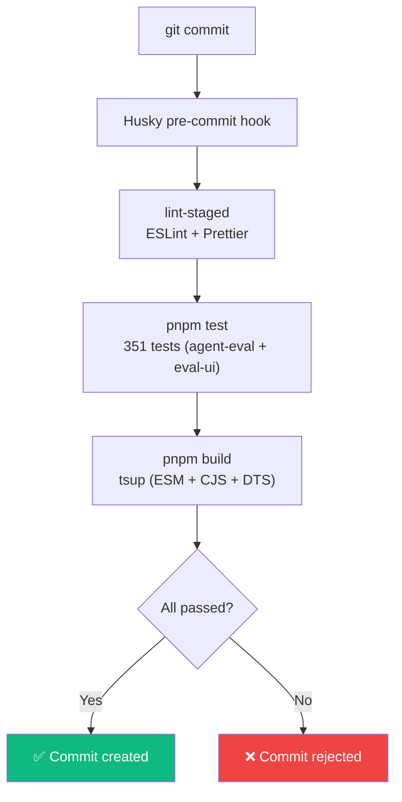

# Contributing

## Prerequisites

- **Node.js 22+** (required for `node:sqlite`)
- **pnpm** (workspace manager)

```bash
pnpm install
```

## Code Quality Gates

Every commit is guarded by **four automated checks** via a Husky pre-commit hook. All must pass or the commit is rejected.



::: warning
Never use `git commit --no-verify` to bypass the hook. This is a hard rule.
:::

## Workflow

### 1. Lint & Format

```bash
pnpm lint:fix   # ESLint auto-fix
pnpm format     # Prettier auto-format
```

### 2. Test

```bash
pnpm test       # Runs both agent-eval (223 tests) and eval-ui (128 tests)
```

### 3. Build

```bash
pnpm build
```

### 4. Commit

```bash
git add -A
git commit -m "feat(scope): description"
```

The pre-commit hook will run all gates automatically. If everything passes, the commit goes through.

## Available Scripts

| Command             | Description                          |
| ------------------- | ------------------------------------ |
| `pnpm test`         | Run all tests (agent-eval + eval-ui) |
| `pnpm build`        | Build the core package with tsup     |
| `pnpm lint`         | Run ESLint on the entire codebase    |
| `pnpm lint:fix`     | ESLint with auto-fix                 |
| `pnpm format`       | Format all files with Prettier       |
| `pnpm format:check` | Check formatting without writing     |
| `pnpm dev`          | Start VitePress docs locally         |

## Commit Convention

Use [Conventional Commits](https://www.conventionalcommits.org/):

| Type       | When                                    |
| ---------- | --------------------------------------- |
| `feat`     | New feature or capability               |
| `fix`      | Bug fix                                 |
| `test`     | Adding or updating tests                |
| `refactor` | Code change that neither fixes nor adds |
| `docs`     | Documentation only                      |
| `chore`    | Build config, deps, tooling             |

## Testing Guidelines

### Core Package (`packages/agent-eval`)

- Tests are **colocated** next to their source file: `git/git.ts` → `git/git.test.ts`
- Use `describe` / `it` with clear descriptions
- Mock external dependencies — no real API calls in unit tests
- The E2E integration tests in `src/e2e/` validate the full pipeline using temp git repos
- **223 tests** covering types, config, context, runner, expect, git, ledger, plugins, environment

### Dashboard (`apps/eval-ui`)

- Tests use **Vitest + React Testing Library** (colocated next to source)
- Components: `DiffViewer.test.tsx`, `Sidebar.test.tsx`, `RunDetailPanel.test.tsx`
- Pages: `Overview.test.tsx`, `Runs.test.tsx`, `EvalDetail.test.tsx`
- API: `api.test.ts`
- Use `renderPage()` from `src/test/render.tsx` for page components (provides `useOutletContext`)
- Mock `fetch` via `vi.fn()` — never make real API calls
- Mock `ResponsiveContainer` from Recharts (jsdom can't measure SVG)
- **128 tests** covering all components, pages, and API functions

::: tip CSS text-transform gotcha
CSS `text-transform: uppercase` changes visual appearance but **not** DOM `textContent`. Test against the original source text (e.g., "Navigation" not "NAVIGATION").
:::

## Local Development

### Core package

```bash
cd packages/agent-eval
pnpm test         # Run unit tests
pnpm build        # Build with tsup
```

### Dashboard

```bash
cd apps/eval-ui
npx tsx src/seed.ts  # Generate seed data
pnpm dev             # Start dev server
pnpm test            # Run component tests
```

### Documentation

```bash
cd apps/docs
pnpm dev          # Start VitePress dev server
```

## Architecture

The framework follows [SOLID principles](/guide/architecture) for modularity and extensibility. Each module has a single responsibility, providers are dynamically imported, and all runners implement the `AgentHandle` interface.

## Architecture Decisions

All major technical decisions are documented as ADRs in [`docs/adrs/`](https://github.com/dkt/agent-eval/tree/main/docs/adrs):

| ADR                                                                                      | Decision                                               |
| ---------------------------------------------------------------------------------------- | ------------------------------------------------------ |
| [001](https://github.com/dkt/agent-eval/tree/main/docs/adrs/001-why-custom-framework.md) | Why a custom framework (not Vitest/Promptfoo/Langfuse) |
| [002](https://github.com/dkt/agent-eval/tree/main/docs/adrs/002-sqlite-over-jsonl.md)    | SQLite over JSONL for the ledger                       |
| [003](https://github.com/dkt/agent-eval/tree/main/docs/adrs/003-sequential-execution.md) | Sequential execution (no parallelism)                  |
| [004](https://github.com/dkt/agent-eval/tree/main/docs/adrs/004-llm-as-judge.md)         | LLM-as-a-Judge with Vercel AI SDK                      |
| [005](https://github.com/dkt/agent-eval/tree/main/docs/adrs/005-monorepo-layout.md)      | Monorepo layout (apps/ + packages/)                    |
| [006](https://github.com/dkt/agent-eval/tree/main/docs/adrs/006-code-quality-gates.md)   | Code quality gates (ESLint + Prettier + Husky)         |
| [007](https://github.com/dkt/agent-eval/tree/main/docs/adrs/007-solid-architecture.md)   | SOLID architecture principles                          |
