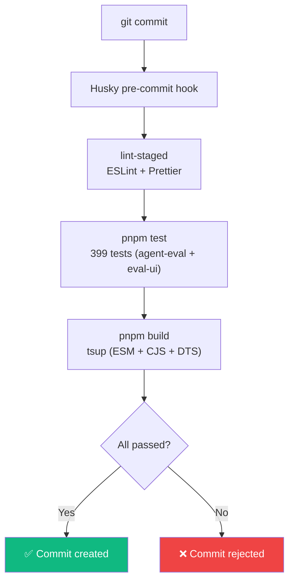

# Contributing

## Prerequisites

- **Node.js 22+** (required for `node:sqlite`)
- **pnpm** (workspace manager)

```bash
pnpm install
```

## Code Quality Gates

Every commit is guarded by **four automated checks** via a Husky pre-commit hook. All must pass or the commit is rejected.


```mermaid
flowchart TD
    A["git commit"] --> B["Husky pre-commit hook"]
    B --> C["lint-staged<br/>ESLint + Prettier"]
    C --> D["pnpm test<br/>399 tests (agent-eval + eval-ui)"]
    D --> E["pnpm build<br/>tsup (ESM + CJS + DTS)"]
    E --> F{"All passed?"}
    F -- Yes --> G["✅ Commit created"]
    F -- No --> H["❌ Commit rejected"]

    style G fill:#10b981,color:#fff
    style H fill:#ef4444,color:#fff
```

::: warning
Never use `git commit --no-verify` to bypass the hook. This is a hard rule.
:::

## Workflow

### 1. Lint & Format

```bash
pnpm lint:fix   # ESLint auto-fix
pnpm format     # Prettier auto-format
```

### 2. Test

```bash
pnpm test       # Runs both agent-eval and eval-ui tests
```

### 3. Build

```bash
pnpm build
```

### 4. Commit

```bash
git add -A
git commit -m "feat(scope): description"
```

## Available Scripts

| Command         | Description                           |
| :-------------- | :------------------------------------ |
| `pnpm test`     | Run all tests (agent-eval + eval-ui). |
| `pnpm build`    | Build the entire monorepo.            |
| `pnpm lint`     | Run ESLint.                           |
| `pnpm format`   | Format with Prettier.                 |
| `pnpm dev:docs` | Start VitePress docs locally.         |
| `pnpm dev:ui`   | Start the UI dashboard locally.       |

## Commit Convention

Use [Conventional Commits](https://www.conventionalcommits.org/): `feat`, `fix`, `test`, `refactor`, `docs`, `chore`.

## Testing Guidelines

### Framework (`packages/agent-eval`)

- Tests are **colocated**: `src/git/git.ts` → `src/git/git.test.ts`.
- Mock external dependencies (LLM APIs, Git).
- Every source file must have a corresponding test file.

### Dashboard (`apps/eval-ui`)

- Tests use **Vitest + React Testing Library**.
- **Design Standards**: Use semantic theme variables (e.g., `text-primary`, `bg-surface-1`). Hardcoded Tailwind color classes are forbidden.
- Use `.glass-card` for panels.

## Local Development

```bash
# Framework
cd packages/agent-eval
pnpm test
pnpm build

# Dashboard
cd apps/eval-ui
pnpm dev
pnpm test
```

## Global Install

```bash
# Link local package globally
cd packages/agent-eval
pnpm link --global

# Now use it anywhere
agenteval run
```

## Architecture Decisions

All major technical decisions are documented as ADRs in `docs/adrs/`:

| ADR                                             | Decision                                          |
| :---------------------------------------------- | :------------------------------------------------ |
| [001](./architecture.md#architecture-decisions) | Why a custom framework (not Vitest / Promptfoo)   |
| [002](./architecture.md#architecture-decisions) | SQLite over JSONL for the ledger                  |
| [003](./architecture.md#architecture-decisions) | Sequential execution (no parallelism)             |
| [004](./architecture.md#architecture-decisions) | LLM-as-a-Judge with Vercel AI SDK                 |
| [005](./architecture.md#architecture-decisions) | Monorepo layout (apps/ + packages/)               |
| [006](./architecture.md#architecture-decisions) | Code quality gates (ESLint + Prettier + Husky)    |
| [007](./architecture.md#architecture-decisions) | SOLID architecture principles                     |
| [008](./architecture.md#architecture-decisions) | Unified mission-based testing and A/B Experiments |

> 💡 Links above point to the Architecture summary. Full ADR files are available in the repository at `/docs/adrs/`.
