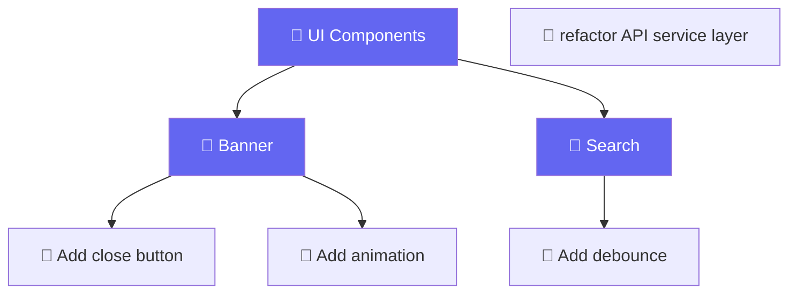
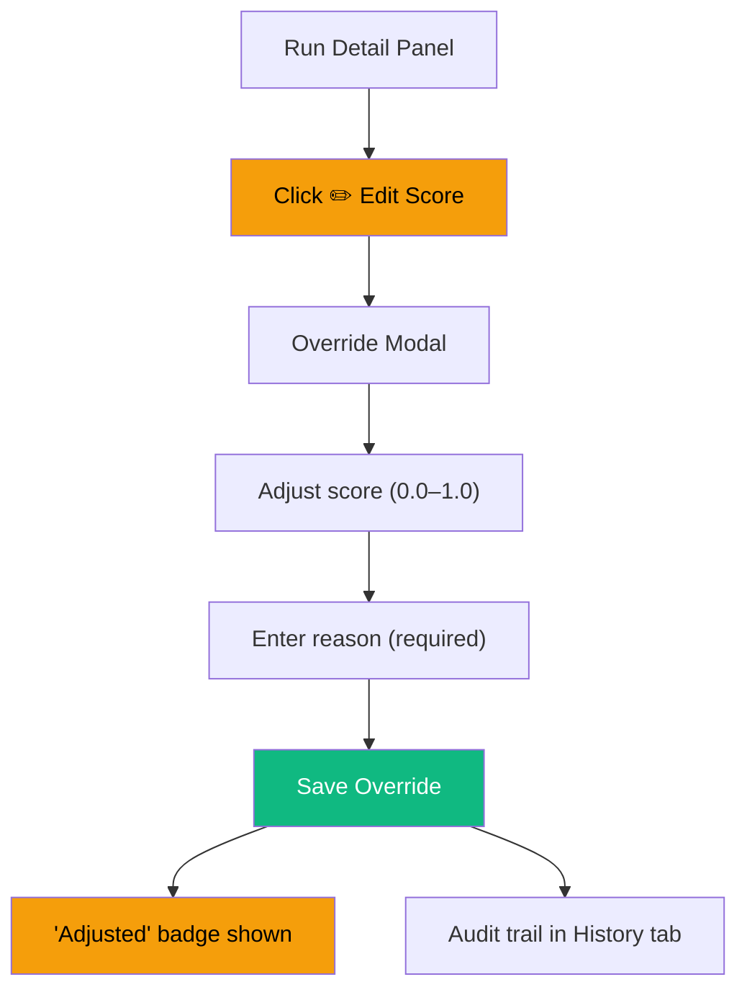
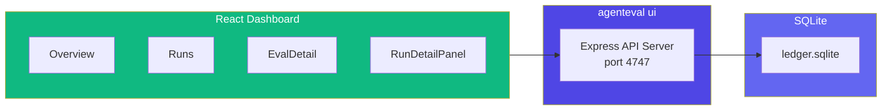

# Dashboard

AgentEval includes a **React dashboard** (`apps/eval-ui`) for exploring evaluation results visually. It reads from the SQLite ledger and provides charts, diff viewers, and per-evaluation breakdowns.

## Quick Start

```bash
# Launch the dashboard (API server + opens browser)
agenteval ui

# Custom port
agenteval ui -p 8080

# Point to a specific ledger
agenteval ui -o ./my-results
```

The dashboard is available at `http://localhost:4747` by default.

## Features

### Overview Page

The overview page shows aggregate statistics across all evaluations:

- **8 KPI cards** in a 4-column grid: Total Runs, Avg Score, Pass Rate, Fail Rate, Total Tokens, Avg Tokens/Run, Avg Duration, Warn Rate
- **Score distribution chart** (Recharts bar chart)
- **Recent runs** with quick status indicators

### Runs Page

Browse and filter all evaluation runs:

- **Filter by evaluation** (test ID)
- **Sort by** score, date, or runner
- **Click a run** to open the detail panel

### Evaluation Detail Page

Drill into a specific evaluation to see:

- **Suite path breadcrumbs** showing the full `describe()` hierarchy
- **Score over time** chart per runner
- **Runner breakdown** cards showing averages
- **All runs** for that evaluation in a sortable table

### Suite Tree Navigation

When tests are organized with `describe()`, the sidebar displays a **collapsible tree view**:


```mermaid
flowchart TD
    UI["📁 UI Components"] --> BANNER["📁 Banner"]
    UI --> SEARCH["📁 Search"]
    BANNER --> T1["🧪 Add close button"]
    BANNER --> T2["🧪 Add animation"]
    SEARCH --> T3["🧪 Add debounce"]
    TOP["🧪 refactor API service layer"]

    style UI fill:#6366f1,color:#fff
    style BANNER fill:#6366f1,color:#fff
    style SEARCH fill:#6366f1,color:#fff
```

Suite nodes can be collapsed/expanded. Tests without a `describe()` wrapper appear at the top level.

### Run Detail Panel

Click any run to see the full details in a **7-tab panel**:

- **Reason** — Judge reasoning (full markdown)
- **Improve** — Improvement suggestions from the judge
- **Diff** — GitHub-style diff viewer with syntax highlighting
- **Cmds** — Command outputs (test results, build logs, exit codes)
- **Tasks** — Task results with pass/fail status per task
- **Metrics** — Token usage breakdown (agent + judge tokens) and **TimingBar** visualization (stacked horizontal bar showing Setup → Agent → Tasks → AfterEach → Judge phases)
- **History** — All score overrides (audit trail)

Additional features:

- **Score and pass/fail status** (uses override score if present)
- **Token count badge** in the panel header
- **Override score** button (pencil icon) to manually adjust the score

::: tip Token metrics
The Metrics tab shows token usage for both the agent and the judge. For CLI models without `parseOutput`, agent tokens display as "N/A". API models always report full token data.
:::

### Human-in-the-Loop (HITL) Score Overrides

Sometimes the LLM judge's score doesn't match your assessment. The dashboard allows manual score overrides:


```mermaid
flowchart TD
    RUN["Run Detail Panel"] --> PENCIL["Click ✏️ Edit Score"]
    PENCIL --> MODAL["Override Modal"]
    MODAL --> SLIDER["Adjust score (0.0–1.0)"]
    SLIDER --> REASON["Enter reason (required)"]
    REASON --> SAVE["Save Override"]
    SAVE --> BADGE["'Adjusted' badge shown"]
    SAVE --> HISTORY["Audit trail in History tab"]

    style PENCIL fill:#f59e0b,color:#000
    style BADGE fill:#f59e0b,color:#000
    style SAVE fill:#10b981,color:#fff
```

**Key behaviors:**

- Original score is **never modified** — overrides are stored separately
- Multiple overrides per run are supported (full audit trail)
- **Aggregation queries** (avg score, pass rate) automatically use the latest override
- Runs with overrides show an **"Adjusted" badge** in both the runs table and detail panel

## Architecture


```mermaid
flowchart LR
    subgraph CLI["agenteval ui"]
        API["Express API Server<br/>port 4747"]
    end

    subgraph DB["SQLite"]
        LEDGER["ledger.sqlite"]
    end

    subgraph UI["React Dashboard"]
        OVERVIEW["Overview"]
        RUNS["Runs"]
        EVAL["EvalDetail"]
        DETAIL["RunDetailPanel"]
    end

    API --> LEDGER
    UI --> API

    style CLI fill:#4f46e5,color:#fff
    style UI fill:#10b981,color:#fff
    style DB fill:#6366f1,color:#fff
```

### API Endpoints

| Endpoint                       | Description                             |
| ------------------------------ | --------------------------------------- |
| `GET /api/runs`                | All runs                                |
| `GET /api/runs?testId=X`       | Runs filtered by evaluation             |
| `GET /api/tests`               | List of unique test IDs                 |
| `GET /api/tree`                | Hierarchical test tree (suites + tests) |
| `GET /api/stats`               | Aggregate stats per runner per test     |
| `GET /api/health`              | Health check                            |
| `PATCH /api/runs/:id/override` | Override a run score (HITL)             |
| `GET /api/runs/:id/overrides`  | Audit trail for score overrides         |

### Tech Stack

| Layer     | Technology               |
| --------- | ------------------------ |
| Framework | React 19 + TypeScript    |
| Routing   | React Router v7          |
| Charts    | Recharts                 |
| Styling   | Tailwind CSS             |
| Build     | Vite                     |
| Testing   | Vitest + Testing Library |

## Diff Viewer

The dashboard includes a **GitHub-style diff viewer** that renders git diffs with:

- Color-coded additions (green) and deletions (red)
- Line numbers for old and new files
- Collapsible file sections
- File count summary

## Seed Data (Development)

For local development and testing, the dashboard includes a seed script that generates realistic evaluation data:

```bash
cd apps/eval-ui
npx tsx src/seed.ts
```

This creates a `ledger.sqlite` with sample runs across multiple evaluations and runners, useful for developing and testing the dashboard UI.
