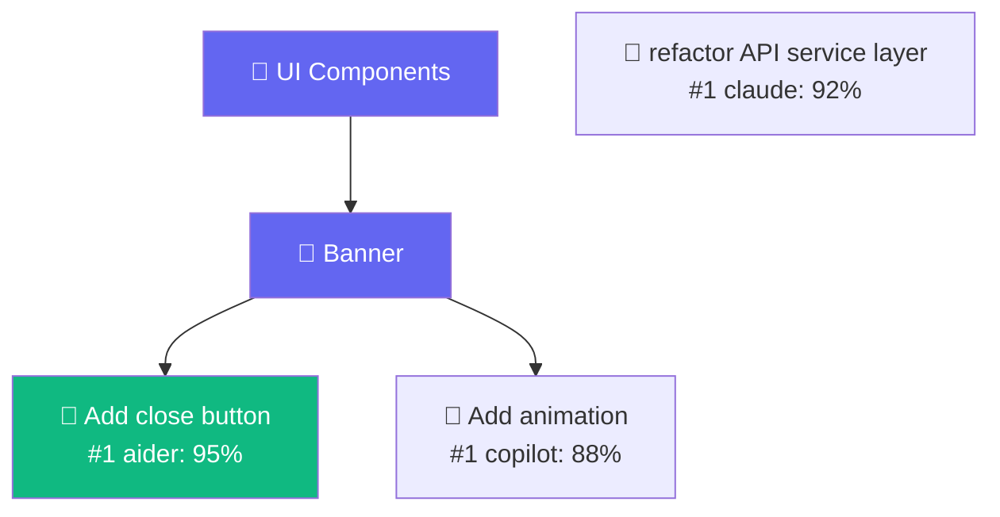

# Dashboard

AgentEval includes a **React dashboard** (`apps/eval-ui`) for exploring evaluation results visually. It reads from the SQLite ledger and provides charts, diff viewers, and per-evaluation breakdowns.

## Quick Start

```bash
# Launch the dashboard (API server + opens browser)
agenteval ui

# Custom port
agenteval ui -p 8080

# Point to a specific ledger
agenteval ui -o ./my-results
```

The dashboard is available at `http://localhost:4747` by default.

## Features

### Overview Page

The overview page shows aggregate statistics across all evaluations:

- **8 KPI cards** in a 4-column grid: Total Runs, Avg Score, Pass Rate, Fail Rate, Total Tokens, Avg Tokens/Run, Avg Duration, Warn Rate.
- **Score Trends**: Interactive line charts comparing runner performance over time.
- **Resource Telemetry**: Token consumption analysis and identifies "Most Intensive Tests".
- **Performance Ranking**: Global leaderboard of agents based on their average scores.
- **Recent Activity**: Live feed of the latest evaluation executions.

### Evaluations (Explorer)

The Evaluations page features a **hierarchical tree view** to navigate your test repository:

- **Analytical Metrics**: Each test displays its global rank, total runs volume, and agent diversity.
- **Top Agent #1**: A visual highlight of the best performing agent for each test, featuring a compact `ScoreRing` (circular progress) and their average score.
- **Recursive Navigation**: Folders (suites) can be expanded or collapsed. Filters for search and tags are available.
- **Dynamic Top 3**: Detailed breakdown of the 3 best agents for every test.


```mermaid
flowchart TD
    UI["📁 UI Components"] --> BANNER["📁 Banner"]
    BANNER --> T1["🧪 Add close button<br/>#1 aider: 95%"]
    BANNER --> T2["🧪 Add animation<br/>#1 copilot: 88%"]
    TOP["🧪 refactor API service layer<br/>#1 claude: 92%"]

    style UI fill:#6366f1,color:#fff
    style BANNER fill:#6366f1,color:#fff
    style T1 fill:#10b981,color:#fff
```

### 9 Custom Themes

The dashboard supports **9 premium themes**, ranging from high-tech dark modes to accessible light modes:

- **Nebula Midnight** (Default): Vibrant purple/pink dark mode.
- **Nord Frost**: Soothing arctic blue palette.
- **Clean Blue**: Professional, high-contrast light mode.
- **Pure Light**: Minimalist white theme inspired by VS Code.
- **High Contrast**: Maximum accessibility dark mode (Black/Yellow/Cyan).
- **Solarized Light**: Classic eye-strain reduction palette.
- **Cyber Neon**: Futuristic "WoW" theme with glassmorphism and glows.
- **Terra Earth**: Natural earthy tones (Beige/Forest Green/Terra Cotta).
- **Admiral Navy**: Sophisticated corporate palette (Navy/Burgundy).

::: tip Persistence
Themes are saved in `localStorage` and applied instantly via a **zero-flicker** initialization script in `index.html`.
:::

### Run Detail Panel

Click any run to see the full details in a **7-tab panel**:

- **Reason** — Judge reasoning (full markdown).
- **Improve** — Actionable improvement suggestions from the judge.
- **Diff** — **GitHub-style diff viewer** with green/red background highlights and neutral text color for maximum readability.
- **Cmds** — Command outputs (test results, build logs, exit codes).
- **Tasks** — Detailed task results with pass/fail status and weights.
- **Metrics** — Token usage breakdown and stacked **TimingBar** visualization (Setup → Agent → Tasks → Judge).
- **History** — Audit trail of all score overrides.

## Tech Stack

| Layer     | Technology               |
| --------- | ------------------------ |
| Framework | React 19 + TypeScript    |
| Routing   | React Router v7          |
| Charts    | Recharts                 |
| Styling   | Tailwind CSS (Semantic)  |
| Build     | Vite                     |
| Testing   | Vitest + Testing Library |

## Design Standards

To ensure consistency across all 9 themes, developers **must** use semantic theme variables instead of hardcoded colors:

- **Text**: `text-txt-base`, `text-txt-muted`, `text-txt-onprimary`.
- **Backgrounds**: `bg-surface-0` to `bg-surface-4`, `bg-primary`, `bg-accent`.
- **Containers**: Use `.glass-card` for translucent, theme-aware panels.
- **Borders**: Use `border-line` or the default `border` class (which defaults to `line/20`).
