# Dashboard

AgentEval includes a **React dashboard** (`apps/eval-ui`) for exploring evaluation results visually. It reads from the SQLite ledger and provides charts, diff viewers, and per-evaluation breakdowns.

## Quick Start

```bash
# Launch the dashboard (API server + opens browser)
agenteval ui

# Custom port
agenteval ui -p 8080

# Point to a specific ledger
agenteval ui -o ./my-results
```

The dashboard is available at `http://localhost:4747` by default.

## Features

### Overview Page

The overview page shows aggregate statistics across all evaluations:

- **Total runs**, **average score**, **pass rate**
- **Score distribution chart** (Recharts bar chart)
- **Recent runs** with quick status indicators

### Runs Page

Browse and filter all evaluation runs:

- **Filter by evaluation** (test ID)
- **Sort by** score, date, or runner
- **Click a run** to open the detail panel

### Evaluation Detail Page

Drill into a specific evaluation to see:

- **Suite path breadcrumbs** showing the full `describe()` hierarchy
- **Score over time** chart per runner
- **Runner breakdown** cards showing averages
- **All runs** for that evaluation in a sortable table

### Suite Tree Navigation

When tests are organized with `describe()`, the sidebar displays a **collapsible tree view**:

```mermaid
flowchart TD
    UI["📁 UI Components"] --> BANNER["📁 Banner"]
    UI --> SEARCH["📁 Search"]
    BANNER --> T1["🧪 Add close button"]
    BANNER --> T2["🧪 Add animation"]
    SEARCH --> T3["🧪 Add debounce"]
    TOP["🧪 refactor API service layer"]

    style UI fill:#6366f1,color:#fff
    style BANNER fill:#6366f1,color:#fff
    style SEARCH fill:#6366f1,color:#fff
```



Suite nodes can be collapsed/expanded. Tests without a `describe()` wrapper appear at the top level.

### Run Detail Panel

Click any run to see the full details:

- **Score and pass/fail status**
- **Judge reasoning** (full markdown)
- **Improvement suggestions** from the judge
- **GitHub-style diff viewer** with syntax highlighting
- **Command outputs** (test results, build logs, exit codes)

## Architecture


### API Endpoints

| Endpoint                 | Description                             |
| ------------------------ | --------------------------------------- |
| `GET /api/runs`          | All runs                                |
| `GET /api/runs?testId=X` | Runs filtered by evaluation             |
| `GET /api/tests`         | List of unique test IDs                 |
| `GET /api/tree`          | Hierarchical test tree (suites + tests) |
| `GET /api/stats`         | Aggregate stats per runner per test     |

### Tech Stack

| Layer     | Technology               |
| --------- | ------------------------ |
| Framework | React 19 + TypeScript    |
| Routing   | React Router v7          |
| Charts    | Recharts                 |
| Styling   | Tailwind CSS             |
| Build     | Vite                     |
| Testing   | Vitest + Testing Library |

## Diff Viewer

The dashboard includes a **GitHub-style diff viewer** that renders git diffs with:

- Color-coded additions (green) and deletions (red)
- Line numbers for old and new files
- Collapsible file sections
- File count summary

## Seed Data (Development)

For local development and testing, the dashboard includes a seed script that generates realistic evaluation data:

```bash
cd apps/eval-ui
npx tsx src/seed.ts
```

This creates a `ledger.sqlite` with sample runs across multiple evaluations and runners, useful for developing and testing the dashboard UI.
