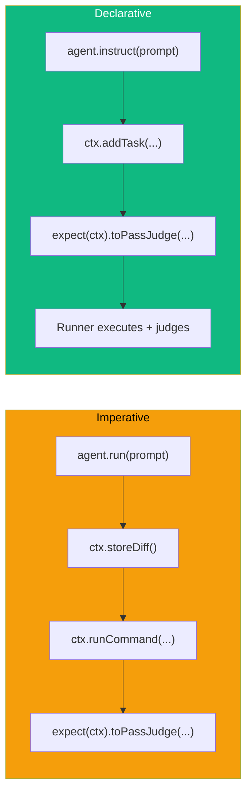
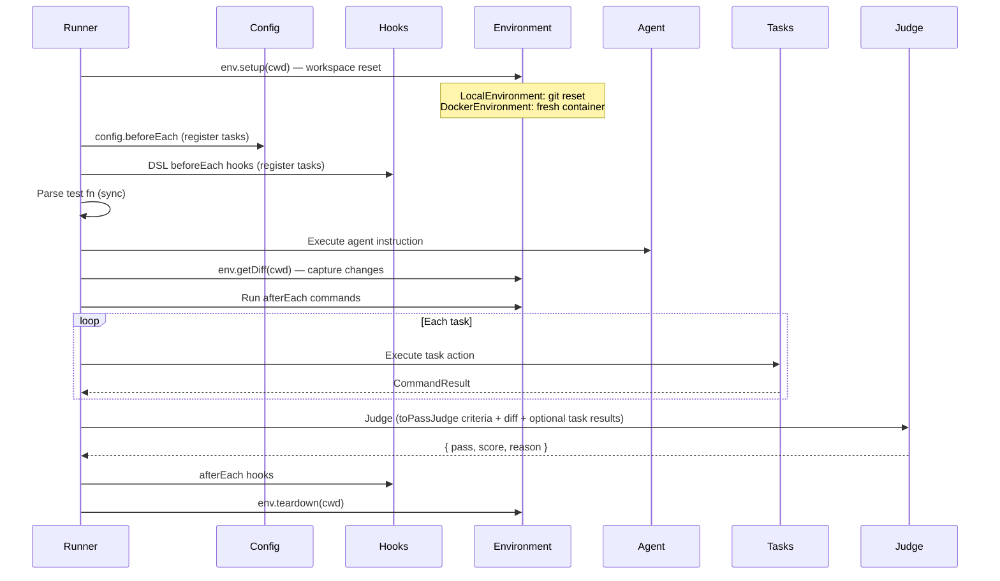
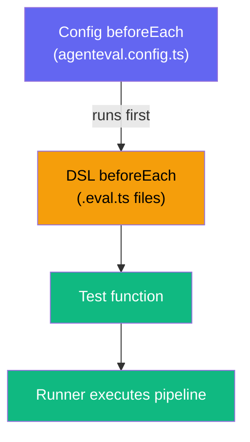

# Declarative Pipeline

The **declarative pipeline** is an alternative to the imperative `agent.run()` approach. You declare what the agent should do with `agent.instruct()`, optionally add verification tasks with `ctx.addTask()`, and finish with `expect(ctx).toPassJudge()` to define final judge criteria and scope.

## Why Declarative?



| Feature           | Imperative                      | Declarative                                                |
| ----------------- | ------------------------------- | ---------------------------------------------------------- |
| Agent execution   | Manual `agent.run()`            | Auto via `agent.instruct()`                                |
| Diff capture      | Manual `ctx.storeDiff()`        | Automatic                                                  |
| Task verification | Manual commands                 | `ctx.addTask()` with criteria                              |
| Judge evaluation  | Manual `expect().toPassJudge()` | Required `expect().toPassJudge()` + optional task evidence |
| Test function     | `async` required                | Sync config builder                                        |

## Basic Example

```ts
import { test, beforeEach, expect } from "agent-eval";

// Common verification tasks for all tests
beforeEach(({ ctx }) => {
  ctx.addTask({
    name: "Tests",
    action: () => ctx.exec("pnpm test"),
    criteria: "All existing and new tests must pass",
    weight: 3,
  });

  ctx.addTask({
    name: "Build",
    action: () => ctx.exec("pnpm build"),
    criteria: "TypeScript build must succeed with zero errors",
    weight: 2,
  });
});

test("add close button to Banner", async ({ agent, ctx }) => {
  // 1. Declare what the agent should do
  agent.instruct("Add a close button to the Banner component");

  // 2. Add test-specific verification tasks
  ctx.addTask({
    name: "Close button",
    action: () => ctx.exec('grep -q "aria-label" src/components/Banner.tsx && echo "found"'),
    criteria: "A close button with aria-label='Close' is rendered",
    weight: 2,
  });

  // 3. Required: define final judge criteria and expected scope
  await expect(ctx).toPassJudge({
    criteria: `
      - Close button is implemented correctly
      - onClose is called when clicked
      - Existing tests and build still pass
    `,
    expectedFiles: ["src/components/Banner.tsx", "src/components/Banner.test.tsx"],
  });
});
```

::: tip Why still call `toPassJudge()`?
`agent.instruct()` defines the implementation request. `toPassJudge()` defines how the judge scores that implementation.  
`ctx.addTask()` is optional and acts as extra evidence injected into the judge prompt.
:::

## Single-Instruct Policy

Each test can call `agent.instruct()` **exactly once**. This enforces a clean separation between instruction and verification:

```ts
// ✅ Valid
test("task", ({ agent }) => {
  agent.instruct("Do something");
});

// ❌ Throws: "Single-Instruct Policy"
test("task", ({ agent }) => {
  agent.instruct("First");
  agent.instruct("Second"); // Error!
});

// ❌ Throws: "Cannot use run() after instruct()"
test("task", async ({ agent }) => {
  agent.instruct("instruction");
  await agent.run("prompt"); // Error!
});

// ❌ Throws: "Cannot use instruct() after run()"
test("task", async ({ agent }) => {
  await agent.run("prompt");
  agent.instruct("instruction"); // Error!
});
```

## Task Definition

Tasks are declared with `ctx.addTask()`:

```ts
ctx.addTask({
  name: "Build", // Required: task identifier
  action: () => ctx.exec("pnpm build"), // Required: function returning CommandResult
  criteria: "Build succeeds", // Required: judge evaluation criteria
  weight: 2, // Optional: scoring weight (default: 1)
});
```

### Task Properties

| Property   | Type                           | Required | Description                     |
| ---------- | ------------------------------ | -------- | ------------------------------- |
| `name`     | `string`                       | ✅       | Human-readable task name        |
| `action`   | `() => Promise<CommandResult>` | ✅       | Function that executes the task |
| `criteria` | `string`                       | ✅       | What the judge evaluates        |
| `weight`   | `number`                       | ❌       | Scoring weight (default: 1)     |

### Weighted Scoring

The judge receives all task results with their weights. Higher-weight tasks have more influence on the final score:

```ts
ctx.addTask({ name: "Build", ..., weight: 2 });  // 2x importance
ctx.addTask({ name: "Tests", ..., weight: 3 });   // 3x importance
ctx.addTask({ name: "Lint", ..., weight: 1 });    // 1x importance (default)
```

## Execution Flow



## Lifecycle Hooks

Use `beforeEach()` and `afterEach()` for shared setup/teardown. This is the recommended pattern for registering **common verification tasks** (build, test, lint) that apply to all tests:

```ts
import { test, beforeEach, afterEach, expect } from "agent-eval";

// Register common verification tasks for ALL tests
beforeEach(({ ctx }) => {
  ctx.addTask({
    name: "Tests",
    action: () => ctx.exec("pnpm test"),
    criteria: "All existing and new tests must pass",
    weight: 3,
  });

  ctx.addTask({
    name: "Build",
    action: () => ctx.exec("pnpm build"),
    criteria: "TypeScript compilation must succeed with zero errors",
    weight: 2,
  });
});

afterEach(async ({ ctx }) => {
  // Runs after each test (even on failure)
  await ctx.exec("pnpm clean");
});

test("Add close button to Banner", async ({ agent, ctx }) => {
  agent.instruct("Add a close button to the Banner component");

  // Test-specific task (in addition to the common ones from beforeEach)
  ctx.addTask({
    name: "Close button renders",
    action: () => ctx.exec('grep -q "aria-label" src/components/Banner.tsx && echo "found"'),
    criteria: "A close button with aria-label='Close' is rendered when onClose is provided",
    weight: 2,
  });

  await expect(ctx).toPassJudge({
    criteria: "Close button works correctly and all quality checks remain green",
    expectedFiles: ["src/components/Banner.tsx", "src/components/Banner.test.tsx"],
  });
});
```

### Hook Scoping

Hooks follow Vitest-style scoping rules:

- **Top-level hooks** match all tests
- **Hooks inside `describe()`** match only tests in that suite and nested suites
- `afterEach` hooks run even when tests fail

## Config-Level vs DSL-Level beforeEach

You can register `beforeEach` in two places — the config file or the eval file. Both are supported simultaneously.



| Level  | Where                 | Scope                       | Example                                   |
| ------ | --------------------- | --------------------------- | ----------------------------------------- |
| Config | `agenteval.config.ts` | All tests using this config | Register common tasks (test, build, lint) |
| DSL    | `.eval.ts` file       | Tests in that file/describe | Register suite-specific tasks             |

### Config-level `beforeEach`

```ts
// agenteval.config.ts
import { defineConfig } from "agent-eval";

export default defineConfig({
  runners: [{ name: "copilot", type: "cli", command: 'gh copilot "{{prompt}}"' }],
  judge: { provider: "openai", model: "gpt-4o" },

  // Runs before every test — great for common verification tasks
  beforeEach: ({ ctx }) => {
    ctx.addTask({
      name: "Tests",
      action: () => ctx.exec("pnpm test"),
      criteria: "All tests must pass",
      weight: 3,
    });
    ctx.addTask({
      name: "Build",
      action: () => ctx.exec("pnpm build"),
      criteria: "Build succeeds with zero errors",
      weight: 2,
    });
  },
});
```

### DSL-level `beforeEach` (eval file)

```ts
// banner.eval.ts — only adds test-specific tasks
import { test } from "agent-eval";

test("Add close button to Banner", ({ agent, ctx }) => {
  agent.instruct("Add a close button to the Banner component");
  ctx.addTask({
    name: "Close button",
    action: () => ctx.exec('grep -q "aria-label" src/components/Banner.tsx && echo "found"'),
    criteria: "A close button with aria-label='Close' is rendered",
    weight: 2,
  });
});
```

::: tip Execution order
Config `beforeEach` → DSL `beforeEach` → Test function → Runner pipeline. Tasks from all sources are merged.
:::

## Dry-Run Mode

Preview the execution plan without running agents:

```bash
agenteval run --dry-run
```

Output:

```
🔍 Dry-Run Plan for "add close button"
  Mode:        declarative
  Instruction: Add a close button to the Banner component
  Runners:     copilot, claude
  Tasks:
    1. Build (weight: 2) — TypeScript build must succeed
    2. Tests (weight: 3) — All tests must pass
  After-each:  pnpm lint
  Hooks:       1 beforeEach, 1 afterEach
```

## Backward Compatibility

The imperative API (`agent.run()` + `expect().toPassJudge()`) continues to work unchanged. You can mix imperative and declarative tests in the same test file — just not in the same test.

```ts
// Imperative test
test("imperative style", async ({ agent, ctx }) => {
  await agent.run("do something");
  // storeDiff + afterEach commands run automatically
  await expect(ctx).toPassJudge({ criteria: "it works" });
});

// Declarative test
test("declarative style", async ({ agent, ctx }) => {
  agent.instruct("do something");
  ctx.addTask({ name: "build", action: () => ctx.exec("pnpm build"), criteria: "it works" });
  await expect(ctx).toPassJudge({
    criteria: "Implementation is correct and build passes",
    expectedFiles: ["src/feature.ts"],
  });
});
```
