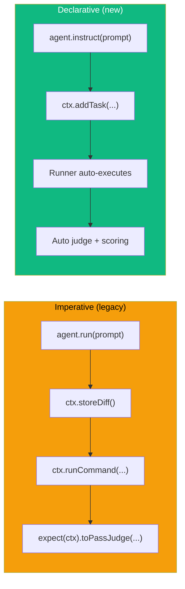
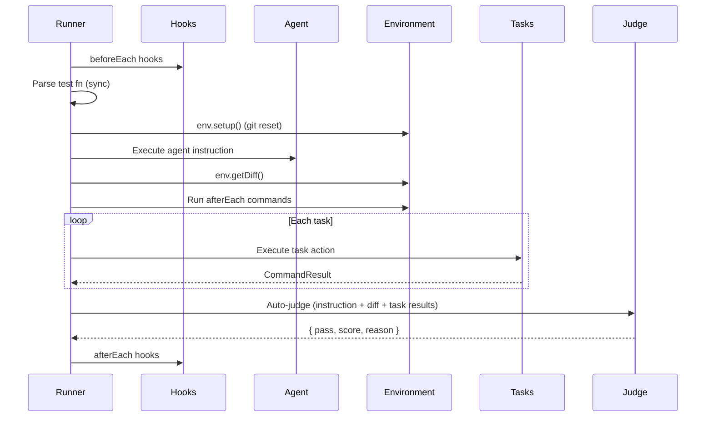

# Declarative Pipeline

The **declarative pipeline** is an alternative to the imperative `agent.run()` approach. Instead of manually running the agent and calling `expect().toPassJudge()`, you **declare** what the agent should do and what tasks to verify — the runner handles execution, evaluation, and scoring automatically.

## Why Declarative?



| Feature           | Imperative                      | Declarative                     |
| ----------------- | ------------------------------- | ------------------------------- |
| Agent execution   | Manual `agent.run()`            | Auto via `agent.instruct()`     |
| Diff capture      | Manual `ctx.storeDiff()`        | Automatic                       |
| Task verification | Manual commands                 | `ctx.addTask()` with criteria   |
| Judge evaluation  | Manual `expect().toPassJudge()` | Automatic with weighted scoring |
| Test function     | `async` required                | Sync config builder             |

## Basic Example

```ts
import { test, describe } from "agent-eval";

test("add close button to Banner", ({ agent, ctx }) => {
  // 1. Declare what the agent should do
  agent.instruct("Add a close button to the Banner component");

  // 2. Declare verification tasks with criteria
  ctx.addTask({
    name: "Build",
    action: () => ctx.exec("pnpm build"),
    criteria: "TypeScript build must succeed with zero errors",
    weight: 2,
  });

  ctx.addTask({
    name: "Tests",
    action: () => ctx.exec("pnpm test"),
    criteria: "All existing tests must pass",
    weight: 3,
  });

  ctx.addTask({
    name: "Lint",
    action: () => ctx.exec("pnpm lint"),
    criteria: "No new lint warnings or errors",
  });
});
```

::: tip No `async` needed
Declarative test functions are **synchronous** — they just declare the plan. The runner handles all async execution.
:::

## Single-Instruct Policy

Each test can call `agent.instruct()` **exactly once**. This enforces a clean separation between instruction and verification:

```ts
// ✅ Valid
test("task", ({ agent }) => {
  agent.instruct("Do something");
});

// ❌ Throws: "Single-Instruct Policy"
test("task", ({ agent }) => {
  agent.instruct("First");
  agent.instruct("Second"); // Error!
});

// ❌ Throws: "Cannot use run() after instruct()"
test("task", async ({ agent }) => {
  agent.instruct("instruction");
  await agent.run("prompt"); // Error!
});

// ❌ Throws: "Cannot use instruct() after run()"
test("task", async ({ agent }) => {
  await agent.run("prompt");
  agent.instruct("instruction"); // Error!
});
```

## Task Definition

Tasks are declared with `ctx.addTask()`:

```ts
ctx.addTask({
  name: "Build", // Required: task identifier
  action: () => ctx.exec("pnpm build"), // Required: function returning CommandResult
  criteria: "Build succeeds", // Required: judge evaluation criteria
  weight: 2, // Optional: scoring weight (default: 1)
});
```

### Task Properties

| Property   | Type                           | Required | Description                     |
| ---------- | ------------------------------ | -------- | ------------------------------- |
| `name`     | `string`                       | ✅       | Human-readable task name        |
| `action`   | `() => Promise<CommandResult>` | ✅       | Function that executes the task |
| `criteria` | `string`                       | ✅       | What the judge evaluates        |
| `weight`   | `number`                       | ❌       | Scoring weight (default: 1)     |

### Weighted Scoring

The judge receives all task results with their weights. Higher-weight tasks have more influence on the final score:

```ts
ctx.addTask({ name: "Build", ..., weight: 2 });  // 2x importance
ctx.addTask({ name: "Tests", ..., weight: 3 });   // 3x importance
ctx.addTask({ name: "Lint", ..., weight: 1 });    // 1x importance (default)
```

## Execution Flow



## Lifecycle Hooks

Use `beforeEach()` and `afterEach()` for shared setup/teardown:

```ts
import { describe, test, beforeEach, afterEach } from "agent-eval";

describe("Banner component", () => {
  beforeEach(async (ctx) => {
    // Runs before each test in this describe block
    await ctx.exec("pnpm install");
  });

  afterEach(async (ctx) => {
    // Runs after each test (even on failure)
    await ctx.exec("pnpm clean");
  });

  test("add close button", ({ agent, ctx }) => {
    agent.instruct("Add close button");
    ctx.addTask({ name: "Build", action: () => ctx.exec("pnpm build"), criteria: "succeeds" });
  });
});
```

### Hook Scoping

Hooks follow Vitest-style scoping rules:

- **Top-level hooks** match all tests
- **Hooks inside `describe()`** match only tests in that suite and nested suites
- `afterEach` hooks run even when tests fail

## Dry-Run Mode

Preview the execution plan without running agents:

```bash
agenteval run --dry-run
```

Output:

```
🔍 Dry-Run Plan for "add close button"
  Mode:        declarative
  Instruction: Add a close button to the Banner component
  Runners:     copilot, claude
  Tasks:
    1. Build (weight: 2) — TypeScript build must succeed
    2. Tests (weight: 3) — All tests must pass
  After-each:  pnpm lint
  Hooks:       1 beforeEach, 1 afterEach
```

## Backward Compatibility

The imperative API (`agent.run()` + `expect().toPassJudge()`) continues to work unchanged. You can mix imperative and declarative tests in the same test file — just not in the same test.

```ts
// Imperative test (still works)
test("old style", async ({ agent, ctx }) => {
  await agent.run("do something");
  ctx.storeDiff();
  await ctx.runCommand("build", "pnpm build");
  await expect(ctx).toPassJudge({ criteria: "it works" });
});

// Declarative test (new)
test("new style", ({ agent, ctx }) => {
  agent.instruct("do something");
  ctx.addTask({ name: "build", action: () => ctx.exec("pnpm build"), criteria: "it works" });
});
```
