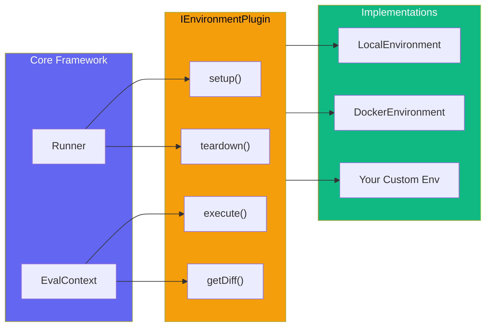
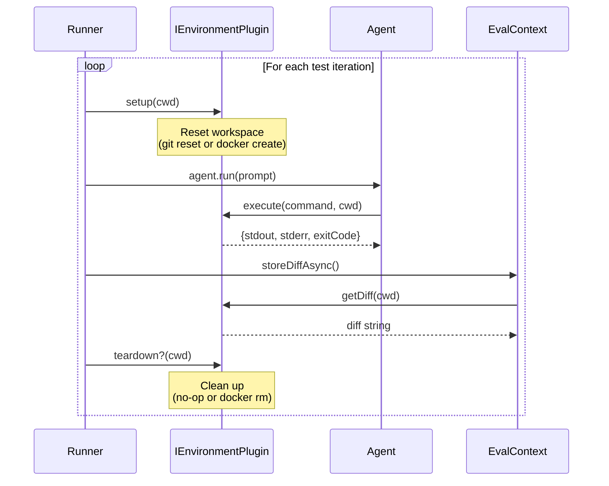
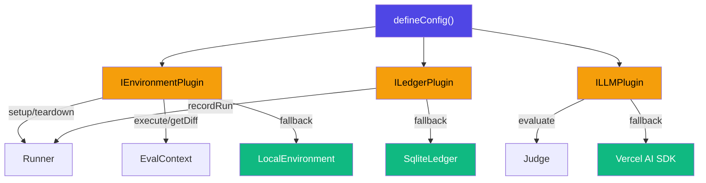

# Execution Environments

AgentEval abstracts where and how agent tests execute through **Environment Plugins**. By default, tests run locally using Git for workspace isolation. With environment plugins, you can run tests in Docker containers, remote VMs, or any custom sandboxed environment.

## Overview



## IEnvironmentPlugin Interface

Every environment plugin must implement this interface:

```ts
interface IEnvironmentPlugin {
  readonly name: string;

  /** Prepare workspace before each test iteration */
  setup(cwd: string): void | Promise<void>;

  /** Execute a shell command in the environment */
  execute(
    command: string,
    cwd: string,
    options?: { timeout?: number },
  ): EnvironmentCommandResult | Promise<EnvironmentCommandResult>;

  /** Capture the git diff (staged + unstaged) */
  getDiff(cwd: string): string | Promise<string>;

  /** Optional cleanup after each test iteration */
  teardown?(cwd: string): void | Promise<void>;
}

interface EnvironmentCommandResult {
  stdout: string;
  stderr: string;
  exitCode: number;
}
```

## Built-in Environments

### LocalEnvironment (Default)

Runs tests directly on the host machine using `child_process.execSync` and Git CLI. This is the zero-dependency default — if you don't configure an `environment`, this is what you get.

| Method       | Implementation                                |
| ------------ | --------------------------------------------- |
| `setup()`    | `git reset --hard HEAD` + `git clean -fd`     |
| `execute()`  | `child_process.execSync` with captured output |
| `getDiff()`  | `git diff --cached` + `git diff`              |
| `teardown()` | Not needed (no-op)                            |

```ts
import { defineConfig } from "agent-eval";

export default defineConfig({
  // LocalEnvironment is used automatically when no environment is specified
  runners: [{ name: "my-agent", type: "cli", command: "my-agent {{prompt}}" }],
  judge: { provider: "openai", model: "gpt-4o" },
});
```

### DockerEnvironment

Runs each test iteration inside a Docker container with the project directory mounted as a volume. Provides strong isolation — the agent cannot modify the host filesystem directly.

| Method       | Implementation                                     |
| ------------ | -------------------------------------------------- |
| `setup()`    | `docker create` with volume mount + `docker start` |
| `execute()`  | `docker exec` inside the running container         |
| `getDiff()`  | `docker exec git diff` inside the container        |
| `teardown()` | `docker rm -f` to remove the container             |

```ts
import { defineConfig, DockerEnvironment } from "agent-eval";

export default defineConfig({
  environment: new DockerEnvironment({
    image: "node:22-slim",
    workDir: "/workspace", // default
  }),
  runners: [{ name: "my-agent", type: "cli", command: "my-agent {{prompt}}" }],
  judge: { provider: "openai", model: "gpt-4o" },
});
```

#### DockerEnvironment Options

| Option       | Type       | Default      | Description                                    |
| ------------ | ---------- | ------------ | ---------------------------------------------- |
| `image`      | `string`   | —            | Docker image to use (e.g., `node:22-slim`)     |
| `dockerfile` | `string`   | —            | Path to Dockerfile to build (instead of image) |
| `workDir`    | `string`   | `/workspace` | Working directory inside the container         |
| `dockerArgs` | `string[]` | `[]`         | Additional `docker create` arguments           |

#### Building from Dockerfile

```ts
new DockerEnvironment({
  dockerfile: "./Dockerfile.eval",
  workDir: "/app",
  dockerArgs: ["--memory=2g", "--cpus=2"],
});
```

## Execution Flow



## Creating Custom Environments

Implement `IEnvironmentPlugin` to support any execution environment:

### SSH Remote Environment (Example)

```ts
import type { IEnvironmentPlugin, EnvironmentCommandResult } from "agent-eval";

class SSHEnvironment implements IEnvironmentPlugin {
  readonly name = "ssh";

  constructor(
    private host: string,
    private user: string,
  ) {}

  async setup(cwd: string): Promise<void> {
    await this.exec(`cd ${cwd} && git reset --hard HEAD && git clean -fd`);
  }

  async execute(
    command: string,
    cwd: string,
    options?: { timeout?: number },
  ): Promise<EnvironmentCommandResult> {
    return this.exec(`cd ${cwd} && ${command}`);
  }

  async getDiff(cwd: string): Promise<string> {
    const result = await this.exec(`cd ${cwd} && git diff --cached && git diff`);
    return result.stdout;
  }

  private async exec(cmd: string): Promise<EnvironmentCommandResult> {
    // Use ssh2 library or shell out to ssh
    const { execSync } = await import("node:child_process");
    try {
      const stdout = execSync(`ssh ${this.user}@${this.host} '${cmd}'`, {
        encoding: "utf-8",
      });
      return { stdout, stderr: "", exitCode: 0 };
    } catch (err: unknown) {
      const e = err as { stdout?: string; stderr?: string; status?: number };
      return { stdout: e.stdout ?? "", stderr: e.stderr ?? "", exitCode: e.status ?? 1 };
    }
  }
}
```

### Temporary Clone Environment (Example)

```ts
import type { IEnvironmentPlugin, EnvironmentCommandResult } from "agent-eval";
import { execSync } from "node:child_process";
import { mkdtempSync, rmSync } from "node:fs";
import { join } from "node:path";
import { tmpdir } from "node:os";

class TempCloneEnvironment implements IEnvironmentPlugin {
  readonly name = "temp-clone";
  private tempDir?: string;

  setup(cwd: string): void {
    this.tempDir = mkdtempSync(join(tmpdir(), "agenteval-"));
    execSync(`git clone ${cwd} ${this.tempDir}`, { stdio: "pipe" });
  }

  execute(command: string, _cwd: string): EnvironmentCommandResult {
    try {
      const stdout = execSync(command, {
        cwd: this.tempDir!,
        encoding: "utf-8",
        stdio: "pipe",
      });
      return { stdout, stderr: "", exitCode: 0 };
    } catch (err: unknown) {
      const e = err as { stdout?: string; stderr?: string; status?: number };
      return { stdout: e.stdout ?? "", stderr: e.stderr ?? "", exitCode: e.status ?? 1 };
    }
  }

  getDiff(_cwd: string): string {
    const staged = execSync("git diff --cached", { cwd: this.tempDir!, encoding: "utf-8" });
    const unstaged = execSync("git diff", { cwd: this.tempDir!, encoding: "utf-8" });
    return [staged, unstaged].filter(Boolean).join("\n");
  }

  teardown(): void {
    if (this.tempDir) {
      rmSync(this.tempDir, { recursive: true, force: true });
      this.tempDir = undefined;
    }
  }
}
```

## Environment vs Plugin Architecture

The environment plugin works alongside the other plugins (ledger, LLM, judge):



## Validation

Environment plugins are validated at startup alongside other plugins. If a plugin is missing required methods, you'll see a clear error:

```
❌ Plugin validation failed:

  EnvironmentPlugin:
    ✗ Missing method: setup (expected: method)
    ✗ Missing method: execute (expected: method)
    ✗ Missing method: getDiff (expected: method)
```

See [Plugin Architecture](/guide/plugin-architecture) for details on plugin validation.
