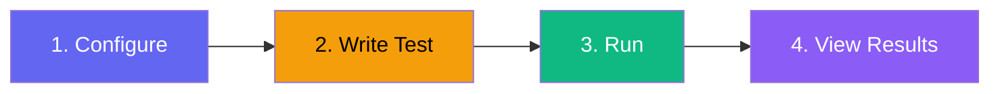
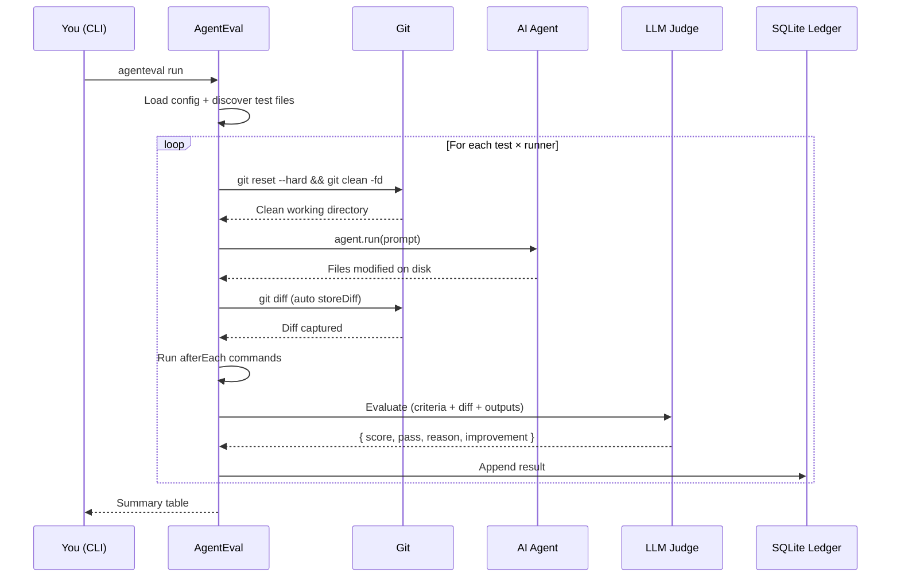

# Getting Started

## Prerequisites

- **Node.js ≥ 22** (required for `node:sqlite`)
- **pnpm** (recommended) or npm/yarn
- An **API key** for your chosen LLM provider (see [Environment Variables](#environment-variables))

## Installation

```bash
pnpm add -D agent-eval
```

## Quick Setup



### 1. Create a config file

```ts
// agenteval.config.ts
import { defineConfig } from "agent-eval";

export default defineConfig({
  runners: [
    {
      name: "copilot",
      type: "cli",
      command: 'gh copilot suggest "{{prompt}}"',
    },
  ],
  judge: {
    provider: "anthropic",
    model: "claude-sonnet-4-20250514",
  },
  // Automatically run after each agent execution
  afterEach: [
    { name: "test", command: "pnpm test" },
    { name: "typecheck", command: "pnpm build" },
  ],
});
```

### 2. Write your first eval test

Test files use `*.eval.ts` or `*.agent-eval.ts` naming convention:

```ts
// evals/banner.eval.ts
import { test, expect } from "agent-eval";

test("Add a Close button to the Banner", async ({ agent, ctx }) => {
  // 1. Trigger the agent — storeDiff() runs automatically after this
  await agent.run("Add a Close button inside the banner component");

  // 2. Judge the result — afterEach commands already ran
  await expect(ctx).toPassJudge({
    criteria: `
      - Uses a proper close button component
      - Has aria-label 'Close'
      - Tests still pass
      - Build succeeds
    `,
  });
});
```

::: tip No boilerplate needed
`storeDiff()` is called **automatically** after `agent.run()`. Commands defined in `afterEach` (tests, builds, linters) also run automatically. Your test files only need the prompt and the criteria.
:::

### 3. Run the evaluation

```bash
# Run all eval tests
npx agenteval run

# Shorthand — equivalent to `agenteval run`
npx agenteval .
```

### 4. View the results

```bash
# Terminal view (last 20 entries)
npx agenteval ledger

# Export as JSON
npx agenteval ledger --json > results.json

# Launch the visual dashboard
npx agenteval view
```

## What Happens



1. **Config loaded** — AgentEval reads your `agenteval.config.ts`
2. **Test files discovered** — Files matching `*.eval.ts` and `*.agent-eval.ts` are found
3. **Git reset** — Working directory is reset to HEAD before each run
4. **Agent executes** — Your configured agent runs the prompt
5. **Context captured** — Git diff is stored automatically, afterEach commands execute
6. **Judge evaluates** — An LLM scores the agent's output (0.0–1.0) and suggests improvements
7. **Ledger updated** — Results are stored in `.agenteval/ledger.sqlite` (SQLite)

## Environment Variables

Set API keys for your LLM providers:

| Variable            | Provider  | Required when using         |
| ------------------- | --------- | --------------------------- |
| `ANTHROPIC_API_KEY` | Anthropic | Anthropic runners or judges |
| `OPENAI_API_KEY`    | OpenAI    | OpenAI runners or judges    |

You can also pass `apiKey` directly in the config, but env vars are recommended.

## File Naming Convention

| Pattern            | Example                 |
| ------------------ | ----------------------- |
| `*.eval.ts`        | `banner.eval.ts`        |
| `*.agent-eval.ts`  | `banner.agent-eval.ts`  |
| `*.eval.js`        | `banner.eval.js`        |
| `*.agent-eval.mts` | `banner.agent-eval.mts` |

Customize with the `testFiles` config option. See [Configuration](/guide/configuration).

## Database Location

Results are stored in `.agenteval/ledger.sqlite` by default. Override with:

- **Config:** `outputDir: "./custom-output"` in `agenteval.config.ts`
- **CLI flag:** `agenteval run -o ./my-results`

::: tip
Add `.agenteval/` to your `.gitignore`.
:::
