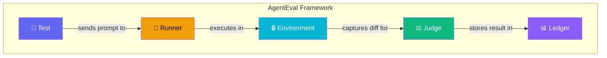
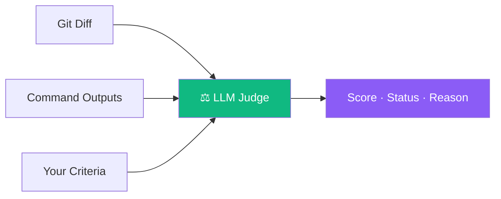
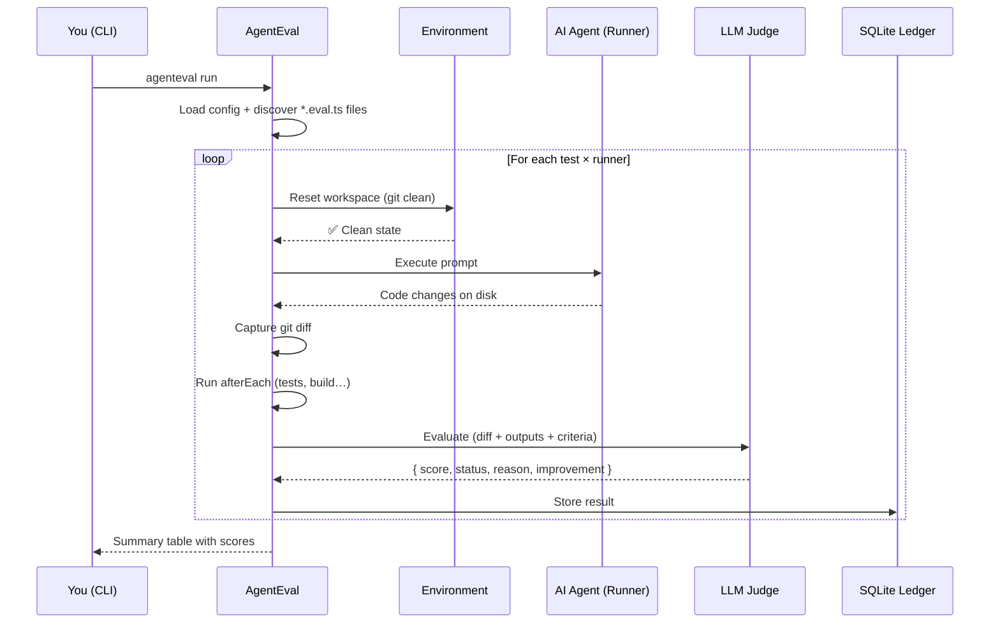

# Introduction

## What is AgentEval?

**AgentEval** is a local, privacy-first testing framework designed to **evaluate AI coding agents**. It gives you a familiar, Vitest-like developer experience — `test()`, `expect()`, `describe()` — but instead of testing your application code, you test the **quality and reliability of AI agents** that write code for you.


Think of it this way: **Vitest tests your code — AgentEval tests the AI that writes your code.**

## Why Evaluate AI Agents?

AI coding agents (Copilot, Claude Code, Aider, Cursor…) are powerful, but they are **non-deterministic**. The same prompt can produce different results depending on the model, the context, the temperature, or even the time of day. This raises critical questions:

- **Is Agent A actually better than Agent B** for my codebase?
- **Did upgrading the model** improve or regress the output quality?
- **Does the agent pass my tests**, follow my conventions, and produce clean diffs?
- **How much does each run cost** in tokens and time?

Without structured evaluation, you're flying blind — relying on gut feeling instead of data.

### The Problem with Manual Testing

Most teams evaluate AI agents informally:

1. Try a prompt manually
2. Eyeball the output
3. Say "yeah, looks good" or "nah, let's try another model"

This approach **doesn't scale**, **isn't reproducible**, and **produces no historical data**. You can't answer "is Claude Sonnet better than GPT-4 for React components?" without running the same prompts across both agents and comparing the results systematically.

### What AgentEval Solves

| Without AgentEval           | With AgentEval                        |
| --------------------------- | ------------------------------------- |
| Manual, ad-hoc testing      | Automated, repeatable evaluations     |
| No historical data          | SQLite ledger with full history       |
| "I think model X is better" | Score trends, pass rates, comparisons |
| No isolation between runs   | Git reset + clean between each test   |
| No cost tracking            | Token usage, timing, cost per run     |

## Core Concepts

AgentEval is built around five core concepts. Understanding them will help you get the most out of the framework.



### 🧪 Test

A **test** is a scenario you want to evaluate. It contains a **prompt** (what you ask the AI agent to do) and **criteria** (how to judge the result). Tests are written in TypeScript files with a familiar `test()` / `describe()` API.

```ts
test("Add a Close button to the Banner", async ({ agent, ctx }) => {
  await agent.run("Add a Close button inside the banner component");

  await expect(ctx).toPassJudge({
    criteria: "Uses a proper button element with aria-label 'Close'",
  });
});
```

### 🏃 Runner

A **runner** is the AI agent being evaluated. It can be:

- **A CLI tool** — Copilot CLI, Claude Code, Aider, or any command-line agent
- **An API model** — Anthropic, OpenAI, Ollama, or any LLM via the Vercel AI SDK

You can define **multiple runners** in your config to compare agents head-to-head on the same tests.

```ts
import { AnthropicModel, CliModel } from "agent-eval/llm";

export default defineConfig({
  runners: [
    { name: "copilot", model: new CliModel({ command: 'gh copilot suggest "{{prompt}}"' }) },
    { name: "claude", model: new AnthropicModel({ model: "claude-sonnet-4-20250514" }) },
  ],
});
```

Every test runs once per runner. If you have 5 tests and 3 runners, AgentEval executes 15 evaluations.

### 🔒 Environment

The **environment** provides **isolation** between test runs. Before each evaluation, it resets the workspace to a clean state so the next agent starts fresh.

- **LocalEnvironment** (default) — Uses `git reset --hard && git clean -fd` to restore the repo
- **DockerEnvironment** — Spins up an isolated Docker container per run

Without environment isolation, agents would see each other's leftover changes, making results unreliable.

### ⚖️ Judge

The **judge** is an LLM that evaluates the agent's output. It receives:

- The **git diff** (what the agent changed)
- The **command outputs** (test results, build logs)
- The **criteria** you defined in the test

It returns a structured verdict:

| Field         | Description                                         |
| ------------- | --------------------------------------------------- |
| `score`       | A number from 0.0 to 1.0                            |
| `status`      | `PASS` (≥ 0.7), `WARN` (0.4–0.7), or `FAIL` (< 0.4) |
| `reason`      | A detailed explanation of the score                 |
| `improvement` | Suggestions for how the agent could do better       |



::: tip Judge ≠ Runner
The **judge** and the **runner** are separate models. You can use Claude as a runner and GPT-4 as a judge — or vice versa. This separation ensures impartial evaluation.
:::

### 📊 Ledger

The **ledger** is the storage backend where all evaluation results are saved. By default, AgentEval uses a local SQLite database (`.agenteval/ledger.sqlite`).

Every run records:

- Test name, runner, score, status, reason
- Full git diff and command outputs
- Token usage (prompt + completion) and timing data
- Task results (tests, builds, linters)

This gives you a **complete history** to track improvements over time, compare agents, and identify regressions.

## How It All Fits Together

Here's the full execution flow when you run `npx agenteval run`:



1. **Config loaded** — AgentEval reads `agenteval.config.ts`
2. **Tests discovered** — All `*.eval.ts` files are collected
3. **Sequential execution** — Each test × runner pair runs one at a time (no parallelism — agents mutate the filesystem)
4. **Environment reset** — Git workspace is cleaned before each run
5. **Agent executes** — The runner (CLI or API) processes the prompt
6. **Context captured** — Git diff is stored, afterEach commands (tests, build) run automatically
7. **Judge evaluates** — An LLM scores the result with structured output
8. **Ledger updated** — Everything is persisted to SQLite

## Who Is This For?

AgentEval is designed for:

- **Engineering teams** evaluating which AI agent to adopt
- **AI tool builders** benchmarking their agent against competitors
- **Individual developers** who want data-driven insight into agent performance
- **Open-source maintainers** tracking how well agents handle their codebase

## Next Steps

Ready to get started? Head to the [Getting Started](/guide/getting-started) guide to install AgentEval and run your first evaluation.
