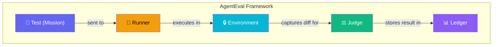
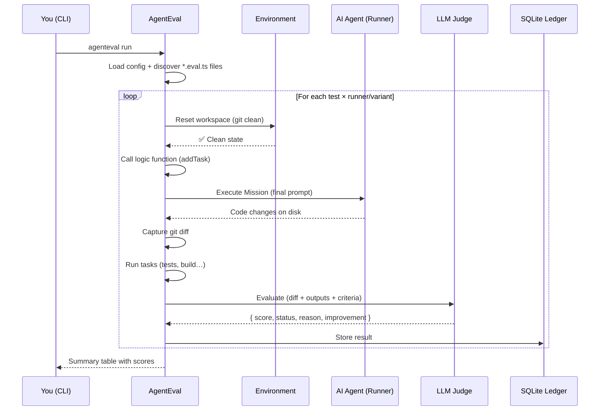

# Introduction

## What is AgentEval?

**AgentEval** is a local, privacy-first testing framework designed to **evaluate AI coding agents**. It gives you a familiar, Vitest-like developer experience — `test()`, `expect()`, `describe()` — but instead of testing your application code, you test the **quality and reliability of AI agents** that write code for you.


```mermaid
flowchart LR
    A["Mission (Prompt)"] --> B["AI Agent"]
    B --> C["Code Changes"]
    C --> D["AgentEval"]
    D --> E["Score · Pass/Fail · Reason"]

    style A fill:#6366f1,color:#fff
    style B fill:#f59e0b,color:#000
    style D fill:#10b981,color:#fff
    style E fill:#8b5cf6,color:#fff
```

Think of it this way: **Vitest tests your code — AgentEval tests the AI that writes your code.**

## Why Evaluate AI Agents?

AI coding agents (Copilot, Claude Code, Aider, Cursor…) are powerful, but they are **non-deterministic**. The same prompt can produce different results depending on the model, the context, the temperature, or even the time of day. This raises critical questions:

- **Is Agent A actually better than Agent B** for my codebase?
- **Did upgrading the model** improve or regress the output quality?
- **Does the agent pass my tests**, follow my conventions, and produce clean diffs?
- **How much does each run cost** in tokens and time?

Without structured evaluation, you're flying blind — relying on data instead of gut feeling.

## Core Concepts

AgentEval is built around five core concepts.


```mermaid
flowchart TD
    subgraph Framework["AgentEval Framework"]
        TEST["🧪 Test (Mission)"]
        RUNNER["🏃 Runner"]
        ENV["🔒 Environment"]
        JUDGE["⚖️ Judge"]
        LEDGER["📊 Ledger"]
    end

    TEST -->|"sent to"| RUNNER
    RUNNER -->|"executes in"| ENV
    ENV -->|"captures diff for"| JUDGE
    JUDGE -->|"stores result in"| LEDGER

    style TEST fill:#6366f1,color:#fff
    style RUNNER fill:#f59e0b,color:#000
    style ENV fill:#06b6d4,color:#fff
    style JUDGE fill:#10b981,color:#fff
    style LEDGER fill:#8b5cf6,color:#fff
```

### 🧪 Test (Mission)

A **test** is a scenario you want to evaluate. It contains a **mission** (the base prompt) and **logic** (how to judge the result).

```ts
test("Add Close Button", "Add a close button to the Banner component", ({ ctx }) => {
  expect(ctx).toPassJudge({
    criteria: "Uses a proper button element with aria-label 'Close'",
  });
});
```

### 🏃 Runner

A **runner** is the AI agent being evaluated. You define a **registry** of runners in your config.

Every test runs against a **default runner** or specific **variants** (A/B testing).

### 🔒 Environment

The **environment** provides **isolation** between test runs. Before each evaluation, it resets the workspace to a clean state.

### ⚖️ Judge

The **judge** is an LLM that evaluates the agent's output. It receives the **git diff**, **command outputs**, and the **criteria**.

### 📊 Ledger

The **ledger** stores all evaluation results in a local SQLite database. It provides a **visual dashboard** with 9 custom themes and a hierarchical tree-view explorer.

## How It All Fits Together


```mermaid
sequenceDiagram
    participant CLI as You (CLI)
    participant AE as AgentEval
    participant ENV as Environment
    participant AGENT as AI Agent (Runner)
    participant JUDGE as LLM Judge
    participant DB as SQLite Ledger

    CLI->>AE: agenteval run
    AE->>AE: Load config + discover *.eval.ts files

    loop For each test × runner/variant
        AE->>ENV: Reset workspace (git clean)
        ENV-->>AE: ✅ Clean state
        AE->>AE: Call logic function (addTask)
        AE->>AGENT: Execute Mission (final prompt)
        AGENT-->>AE: Code changes on disk
        AE->>AE: Capture git diff
        AE->>AE: Run tasks (tests, build…)
        AE->>JUDGE: Evaluate (diff + outputs + criteria)
        JUDGE-->>AE: { score, status, reason, improvement }
        AE->>DB: Store result
    end

    AE-->>CLI: Summary table with scores
```
