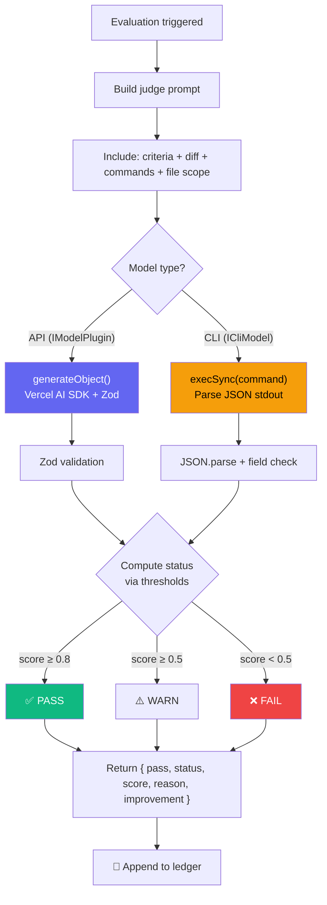
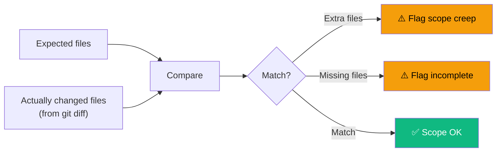
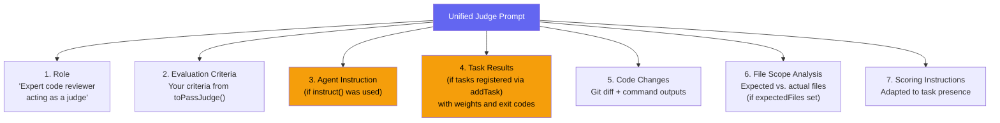

# Judges

The **LLM-as-a-Judge** pattern uses a language model to evaluate agent outputs against criteria you define.

::: danger Use a capable model
The judge is the **most critical component** of your evaluation pipeline. It must understand code, parse git diffs, interpret test output, and make nuanced pass/fail decisions. **Always use a strong, frontier-class model** as the judge — never a small or local model.

**Recommended:** `claude-sonnet-4-20250514`, `claude-opus-4-20250514`, `gpt-4o`

**Avoid:** `gpt-3.5-turbo`, `claude-haiku`, local models (llama3, mistral, codellama) — they lack the reasoning depth for reliable code evaluation and will produce noisy, unreliable scores.
:::

::: tip Avoid self-evaluation bias
When possible, use a **different provider** for the runner and the judge. If your agent uses Claude, judge with GPT-4o (and vice versa). This prevents the model from being biased toward its own outputs.
:::

## How It Works


```mermaid
flowchart TD
    A["Evaluation triggered"] --> B["Build judge prompt"]
    B --> C["Include: criteria + diff + commands + file scope"]

    C --> D{"Model type?"}
    D -- "API (IModelPlugin)" --> E["generateObject()<br/>Vercel AI SDK + Zod"]
    D -- "CLI (ICliModel)" --> F["execSync(command)<br/>Parse JSON stdout"]

    E --> J["Zod validation"]
    F --> J2["JSON.parse + field check"]
    J --> K{"Compute status<br/>via thresholds"}
    J2 --> K
    K -- "score ≥ 0.8" --> L["✅ PASS"]
    K -- "score ≥ 0.5" --> L2["⚠️ WARN"]
    K -- "score < 0.5" --> M["❌ FAIL"]
    L --> N["Return { pass, status, score, reason, improvement }"]
    L2 --> N
    M --> N
    N --> O["📝 Append to ledger"]

    style E fill:#6366f1,color:#fff
    style F fill:#f59e0b,color:#000
    style L fill:#10b981,color:#fff
    style M fill:#ef4444,color:#fff
```

1. AgentEval builds a prompt with:
   - Your evaluation criteria
   - The captured git diff
   - All command outputs (test results, build logs)
   - **File scope analysis** (expected vs. actual files changed)
2. The judge LLM returns a structured response:
   ```json
   { "pass": true, "score": 0.85, "reason": "...", "improvement": "..." }
   ```
3. The score is evaluated against [thresholds](/guide/configuration#scoring-thresholds):
   - Score ≥ warn (0.8) = **PASS**
   - Score ≥ fail (0.5) = **WARN** (passes, but flagged)
   - Score < fail (0.5) = **FAIL** (throws error)

## Supported Providers

### Anthropic

```ts
import { AnthropicModel } from "agent-eval/llm";

judge: {
  name: "claude-judge",
  model: new AnthropicModel({ model: "claude-sonnet-4-20250514" }),
}
```

Requires `ANTHROPIC_API_KEY` environment variable (or `apiKey` in constructor).

| Model                      | Notes                        |
| -------------------------- | ---------------------------- |
| `claude-sonnet-4-20250514` | Recommended — best cost/perf |
| `claude-opus-4-20250514`   | Most capable, higher cost    |
| `claude-haiku-3-20250305`  | Fastest, cheapest            |

### OpenAI

```ts
import { OpenAIModel } from "agent-eval/llm";

judge: {
  model: new OpenAIModel({ model: "gpt-4o" }),
}
```

Requires `OPENAI_API_KEY` environment variable (or `apiKey` in constructor).

| Model           | Notes           |
| --------------- | --------------- |
| `gpt-4o`        | Recommended     |
| `gpt-4-turbo`   | High capability |
| `gpt-3.5-turbo` | Budget option   |

### Ollama (Local)

```ts
import { OllamaModel } from "agent-eval/llm";

judge: {
  model: new OllamaModel({ model: "llama3" }),
}
```

No API key needed. Runs entirely on your machine.

::: warning
Local models lack the reasoning depth for reliable code evaluation. Use them only for experimentation, not production evaluations.
:::

### Custom / Enterprise Provider

Any provider can be used by implementing `IModelPlugin`:

```ts
import type { IModelPlugin } from "agent-eval";

class CompanyModel implements IModelPlugin {
  readonly name = "company";
  readonly modelId = "judge-v2";

  async createModel() {
    const { createOpenAI } = await import("@ai-sdk/openai");
    return createOpenAI({
      baseURL: "https://llm.internal.company.com/v1",
      apiKey: process.env.INTERNAL_LLM_KEY,
    })("judge-v2");
  }
}

// In config:
judge: {
  model: new CompanyModel();
}
```

This works with **Azure OpenAI**, **Together AI**, **Fireworks**, **Groq**, and any provider exposing an OpenAI-compatible API.

### CLI Model as Judge

You can also use a CLI-based model (e.g., `claude`, `gemini`) as the judge. The CLI command must output valid JSON matching `{ pass, score, reason, improvement }`.

```ts
import { CliModel } from "agent-eval/llm";

judge: {
  model: new CliModel({
    command: 'claude -p "{{prompt}}" --output-format json',
  }),
}
```

The framework will:

1. Build the judge evaluation prompt (same as API models)
2. Replace `{{prompt}}` in the CLI command with the prompt
3. Execute the command and capture stdout
4. Parse the JSON output to extract `{ pass, score, reason, improvement }`

If the `pass` field is missing, it's inferred from the score (`score >= 0.5` → `pass: true`).

::: tip Custom output parsing
If your CLI tool's stdout isn't raw JSON (e.g., it includes extra output or uses a different format), implement `parseOutput` on your `CliModel` to extract the relevant JSON:

```ts
new CliModel({
  command: 'my-tool "{{prompt}}"',
  parseOutput: ({ stdout, stderr }) => ({
    agentOutput: extractJsonFromOutput(stdout),
  }),
});
```

:::

::: warning
CLI judges are less reliable than API judges — they depend on the CLI tool outputting valid JSON. Always use `maxRetries` to handle occasional parsing failures.
:::

## Retry Configuration

The judge **must** return valid structured data (`{ pass, score, reason, improvement }`). If the LLM returns an unparseable or invalid response, the judge automatically retries.

```ts
judge: {
  model: new AnthropicModel({ model: "claude-sonnet-4-20250514" }),
  maxRetries: 3, // default: 2
}
```

| Option       | Type        | Default | Description                                          |
| ------------ | ----------- | ------- | ---------------------------------------------------- |
| `name`       | `string`    | —       | Human-readable name for the judge                    |
| `model`      | `LlmConfig` | —       | LLM for judge evaluation (API or CLI model)          |
| `maxRetries` | `number`    | `2`     | Number of retry attempts on failure (0 = no retries) |

After all attempts are exhausted, the judge throws an error with the last failure message.

## Expected Files (Scope Analysis)

Tell the judge which files should have been modified to detect scope creep:

```ts
await expect(ctx).toPassJudge({
  criteria: "Add close button to Banner",
  expectedFiles: ["src/components/Banner.tsx", "src/components/Banner.test.tsx"],
});
```

The judge prompt includes a **file scope analysis** section:


```mermaid
flowchart LR
    A["Expected files"] --> C["Compare"]
    B["Actually changed files<br/>(from git diff)"] --> C
    C --> D{"Match?"}
    D -- "Extra files" --> E["⚠️ Flag scope creep"]
    D -- "Missing files" --> F["⚠️ Flag incomplete"]
    D -- "Match" --> G["✅ Scope OK"]

    style E fill:#f59e0b,color:#000
    style F fill:#f59e0b,color:#000
    style G fill:#10b981,color:#fff
```

This is powerful for ensuring agents make **surgical changes** rather than modifying half the codebase.

## Scoring

| Score   | Meaning            |
| ------- | ------------------ |
| 1.0     | Perfect execution  |
| 0.7–0.9 | Good, minor issues |
| 0.4–0.6 | Partial success    |
| 0.1–0.3 | Major issues       |
| 0.0     | Complete failure   |

The judge is instructed to be "strict but fair" and award partial credit.

### Scoring Thresholds

The raw score is mapped to a three-level status using configurable thresholds:

| Condition                                 | Status  | `pass`  |
| ----------------------------------------- | ------- | ------- |
| score ≥ warn threshold (default: **0.8**) | ✅ PASS | `true`  |
| score ≥ fail threshold (default: **0.5**) | ⚠️ WARN | `true`  |
| score < fail threshold                    | ❌ FAIL | `false` |

Configure thresholds in your config:

```ts
export default defineConfig({
  thresholds: { warn: 0.8, fail: 0.5 },
});
```

## Judge Result Structure

Every judge evaluation returns these fields, all stored in the ledger:

| Field         | Type        | Description                                                             |
| ------------- | ----------- | ----------------------------------------------------------------------- |
| `pass`        | boolean     | `true` if status is PASS or WARN                                        |
| `status`      | TestStatus? | `"PASS"`, `"WARN"`, or `"FAIL"` — computed by the runner via thresholds |
| `score`       | number      | Score between 0.0 and 1.0                                               |
| `reason`      | string      | Detailed explanation of the score                                       |
| `improvement` | string      | Actionable suggestions for improving the agent's output                 |

The `improvement` field is the judge's **opinion on how the agent could do better**. This is visible in the dashboard's "Improve" tab for each run.

## Judge Prompt Anatomy

The judge uses a **single, unified prompt** that adapts dynamically based on the available context. The prompt always includes the role, criteria, code changes, and scoring instructions. Additional sections are included only when relevant:


```mermaid
flowchart TD
    A["Unified Judge Prompt"] --> B["1. Role<br/>'Expert code reviewer<br/>acting as a judge'"]
    A --> C["2. Evaluation Criteria<br/>Your criteria from toPassJudge()"]
    A --> D["3. Agent Instruction<br/>(if instruct() was used)"]
    A --> E["4. Task Results<br/>(if tasks registered via addTask)<br/>with weights and exit codes"]
    A --> F["5. Code Changes<br/>Git diff + command outputs"]
    A --> G["6. File Scope Analysis<br/>Expected vs. actual files<br/>(if expectedFiles set)"]
    A --> H["7. Scoring Instructions<br/>Adapted to task presence"]

    style A fill:#6366f1,color:#fff
    style D fill:#f59e0b,color:#000
    style E fill:#f59e0b,color:#000
```

Sections marked in amber are **conditionally included** — only when the test uses `instruct()` or `addTask()`.

The response is enforced via Zod structured output (`generateObject`) for API models, or JSON parsing for CLI models — guaranteeing `{ pass, score, reason, improvement }`.
