# Judges

The **LLM-as-a-Judge** pattern uses a language model to evaluate agent outputs against criteria you define.

::: danger Use a capable model
The judge is the **most critical component** of your evaluation pipeline. It must understand code, parse git diffs, interpret test output, and make nuanced pass/fail decisions. **Always use a strong, frontier-class model** as the judge — never a small or local model.

**Recommended:** `claude-sonnet-4-20250514`, `claude-opus-4-20250514`, `gpt-4o`

**Avoid:** `gpt-3.5-turbo`, `claude-haiku`, local models (llama3, mistral, codellama) — they lack the reasoning depth for reliable code evaluation and will produce noisy, unreliable scores.
:::

::: tip Avoid self-evaluation bias
When possible, use a **different provider** for the runner and the judge. If your agent uses Claude, judge with GPT-4o (and vice versa). This prevents the model from being biased toward its own outputs.
:::

## How It Works

```mermaid
flowchart TD
    A["Evaluation triggered"] --> B["Build judge prompt"]
    B --> C["Include: criteria + diff + commands + file scope"]

    C --> D{"Judge type?"}
    D -- API --> E["generateObject()<br/>Vercel AI SDK + Zod"]
    D -- CLI --> F["execSync(command)<br/>parse JSON from stdout"]

    F --> G{"Valid JSON?"}
    G -- No --> H{"Retries left?"}
    H -- Yes --> F
    H -- No --> I["❌ Throw Error"]
    G -- Yes --> J["Zod validation"]

    E --> J
    J --> K{"Compute status<br/>via thresholds"}
    K -- "score ≥ 0.8" --> L["✅ PASS"]
    K -- "score ≥ 0.5" --> L2["⚠️ WARN"]
    K -- "score < 0.5" --> M["❌ FAIL"]
    L --> N["Return { pass, status, score, reason, improvement }"]
    L2 --> N
    M --> N
    N --> O["📝 Append to ledger"]

    style E fill:#6366f1,color:#fff
    style L fill:#10b981,color:#fff
    style M fill:#ef4444,color:#fff
    style I fill:#ef4444,color:#fff
```



1. AgentEval builds a prompt with:
   - Your evaluation criteria
   - The captured git diff
   - All command outputs (test results, build logs)
   - **File scope analysis** (expected vs. actual files changed)
2. The judge LLM returns a structured response:
   ```json
   { "pass": true, "score": 0.85, "reason": "...", "improvement": "..." }
   ```
3. The score is evaluated against [thresholds](/guide/configuration#scoring-thresholds):
   - Score ≥ warn (0.8) = **PASS**
   - Score ≥ fail (0.5) = **WARN** (passes, but flagged)
   - Score < fail (0.5) = **FAIL** (throws error)

## Supported Providers

### Anthropic

```ts
judge: {
  provider: "anthropic",
  model: "claude-sonnet-4-20250514",
}
```

Requires `ANTHROPIC_API_KEY` environment variable (or `apiKey` in config).

| Model                      | Notes                        |
| -------------------------- | ---------------------------- |
| `claude-sonnet-4-20250514` | Recommended — best cost/perf |
| `claude-opus-4-20250514`   | Most capable, higher cost    |
| `claude-haiku-3-20250305`  | Fastest, cheapest            |

### OpenAI

```ts
judge: {
  provider: "openai",
  model: "gpt-4o",
}
```

Requires `OPENAI_API_KEY` environment variable (or `apiKey` in config).

| Model           | Notes           |
| --------------- | --------------- |
| `gpt-4o`        | Recommended     |
| `gpt-4-turbo`   | High capability |
| `gpt-3.5-turbo` | Budget option   |

### Ollama (Local)

```ts
judge: {
  provider: "ollama",
  model: "llama3",
  baseURL: "http://localhost:11434/v1", // default
}
```

No API key needed. Runs entirely on your machine.

::: warning
Local models lack the reasoning depth for reliable code evaluation. Use them only for experimentation, not production evaluations.
:::

### Custom / Enterprise Provider

Any OpenAI-compatible API can be used as a judge via the `openai` provider with a custom `baseURL`:

```ts
judge: {
  provider: "openai",
  model: "company-judge-v2",
  baseURL: "https://llm.internal.company.com/v1",
  apiKey: process.env.INTERNAL_LLM_KEY,
}
```

This works with **Azure OpenAI**, **Together AI**, **Fireworks**, **Groq**, and any provider exposing an OpenAI-compatible chat completions API.

### CLI Judge

You can use **any CLI tool** as a judge — including `claude`, `gh copilot`, or a custom script. The CLI must output JSON with `{ pass, score, reason }`.

```ts
judge: {
  type: "cli",
  command: 'claude -p "Evaluate this code change: {{prompt}}" --output-format json',
  maxRetries: 3, // Retry on invalid JSON (default: 2)
}
```

::: tip Use `{{prompt_file}}` for long prompts
Git diffs can be thousands of lines. To avoid shell escaping issues, use `{{prompt_file}}` — AgentEval writes the full prompt to a temp file and replaces the placeholder with the file path:

```ts
judge: {
  type: "cli",
  command: "cat {{prompt_file}} | claude -p --output-format json",
}
```

:::

**The CLI must return valid JSON:**

```json
{
  "pass": true,
  "score": 0.85,
  "reason": "The implementation is correct...",
  "improvement": "Consider adding tests"
}
```

AgentEval extracts the first JSON object containing `pass`, `score`, and `reason` from stdout (preamble text and markdown fences are ignored). Failed attempts are automatically retried up to `maxRetries` times.

## Per-Test Model Override

You can override the judge model for specific evaluations:

```ts
await expect(ctx).toPassJudge({
  criteria: "...",
  model: "claude-opus-4-20250514", // More capable model for complex eval
});
```

This is useful when some tests need a stronger model for accurate evaluation while most can use a cheaper default.

## Expected Files (Scope Analysis)

Tell the judge which files should have been modified to detect scope creep:

```ts
await expect(ctx).toPassJudge({
  criteria: "Add close button to Banner",
  expectedFiles: ["src/components/Banner.tsx", "src/components/Banner.test.tsx"],
});
```

The judge prompt includes a **file scope analysis** section:

```mermaid
flowchart LR
    A["Expected files"] --> C["Compare"]
    B["Actually changed files<br/>(from git diff)"] --> C
    C --> D{"Match?"}
    D -- "Extra files" --> E["⚠️ Flag scope creep"]
    D -- "Missing files" --> F["⚠️ Flag incomplete"]
    D -- "Match" --> G["✅ Scope OK"]

    style E fill:#f59e0b,color:#000
    style F fill:#f59e0b,color:#000
    style G fill:#10b981,color:#fff
```



This is powerful for ensuring agents make **surgical changes** rather than modifying half the codebase.

## Scoring

| Score   | Meaning            |
| ------- | ------------------ |
| 1.0     | Perfect execution  |
| 0.7–0.9 | Good, minor issues |
| 0.4–0.6 | Partial success    |
| 0.1–0.3 | Major issues       |
| 0.0     | Complete failure   |

The judge is instructed to be "strict but fair" and award partial credit.

### Scoring Thresholds

The raw score is mapped to a three-level status using configurable thresholds:

| Condition                                 | Status  | `pass`  |
| ----------------------------------------- | ------- | ------- |
| score ≥ warn threshold (default: **0.8**) | ✅ PASS | `true`  |
| score ≥ fail threshold (default: **0.5**) | ⚠️ WARN | `true`  |
| score < fail threshold                    | ❌ FAIL | `false` |

Configure thresholds in your config:

```ts
export default defineConfig({
  thresholds: { warn: 0.8, fail: 0.5 },
});
```

## Judge Result Structure

Every judge evaluation returns these fields, all stored in the ledger:

| Field         | Type        | Description                                                             |
| ------------- | ----------- | ----------------------------------------------------------------------- |
| `pass`        | boolean     | `true` if status is PASS or WARN                                        |
| `status`      | TestStatus? | `"PASS"`, `"WARN"`, or `"FAIL"` — computed by the runner via thresholds |
| `score`       | number      | Score between 0.0 and 1.0                                               |
| `reason`      | string      | Detailed explanation of the score                                       |
| `improvement` | string      | Actionable suggestions for improving the agent's output                 |

The `improvement` field is the judge's **opinion on how the agent could do better**. This is visible in the dashboard's "Improve" tab for each run.

## Judge Prompt Anatomy

The judge uses a **single, unified prompt** that adapts dynamically based on the available context. The prompt always includes the role, criteria, code changes, and scoring instructions. Additional sections are included only when relevant:


Sections marked in amber are **conditionally included** — only when the test uses `instruct()` or `addTask()`.

The response is enforced via Zod structured output (`generateObject`) for API judges, guaranteeing `{ pass, score, reason, improvement }` — no prompt injection or malformed JSON. For CLI judges, the JSON is parsed from stdout and validated against the same schema.
