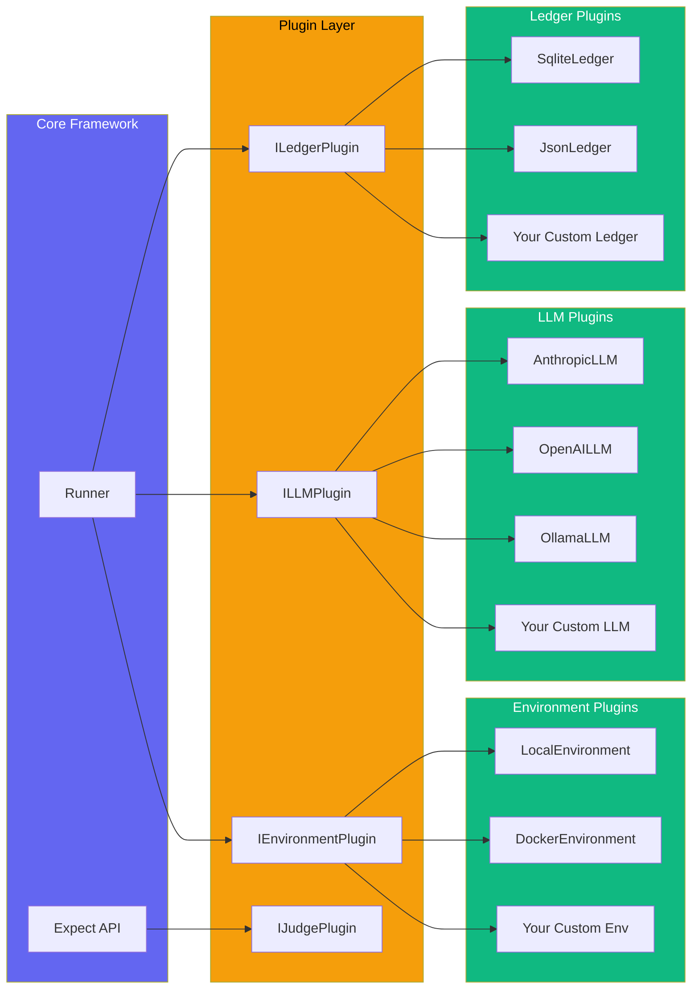
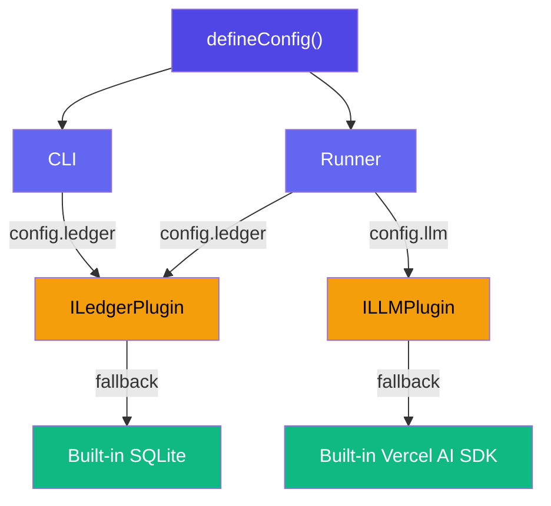

# Plugin Architecture

AgentEval uses a **SOLID plugin architecture** that decouples storage, LLM providers, and judge logic. This lets you swap backends without touching your test code.

## Overview



## Plugin Interfaces

### ILedgerPlugin

The ledger plugin handles all storage operations — recording runs, querying results, and managing score overrides.

```ts
interface ILedgerPlugin {
  readonly name: string;

  initialize(): void | Promise<void>;
  recordRun(entry: LedgerEntry): void | Promise<void>;
  getRuns(testId?: string): LedgerEntry[] | Promise<LedgerEntry[]>;
  getRunById(id: number): LedgerEntry | undefined | Promise<LedgerEntry | undefined>;
  getTestIds(): string[] | Promise<string[]>;
  getTestTree(): TestTreeNode[] | Promise<TestTreeNode[]>;
  getLatestEntries(): Map<string, LedgerEntry> | Promise<Map<string, LedgerEntry>>;
  getStats(testId?: string): RunnerStats[] | Promise<RunnerStats[]>;
  overrideRunScore(
    runId: number,
    score: number,
    reason: string,
  ): ScoreOverride | Promise<ScoreOverride>;
  getRunOverrides(runId: number): ScoreOverride[] | Promise<ScoreOverride[]>;
  close?(): void | Promise<void>;
}
```

### ILLMPlugin

The LLM plugin abstracts AI provider calls for both judge evaluation and API-based agent runners.

```ts
interface ILLMPlugin {
  readonly name: string;
  readonly provider: string;
  readonly defaultModel: string;

  evaluate(options: LLMEvaluationOptions): Promise<JudgeResult>;
  generate?(options: LLMGenerationOptions): Promise<AgentFileOutput>;
}
```

### IJudgePlugin

The judge plugin allows custom judge implementations beyond the default LLM-as-a-Judge.

```ts
interface IJudgePlugin {
  readonly name: string;
  judge(
    ctx: TestContext,
    criteria: string,
    config: JudgeConfig,
    options?: { model?: string; expectedFiles?: string[] },
  ): Promise<JudgeResult>;
}
```

### IEnvironmentPlugin

The environment plugin abstracts where and how commands execute — locally, in Docker, via SSH, etc.

```ts
interface IEnvironmentPlugin {
  readonly name: string;
  setup(cwd: string): void | Promise<void>;
  execute(
    command: string,
    cwd: string,
    options?: { timeout?: number },
  ): EnvironmentCommandResult | Promise<EnvironmentCommandResult>;
  getDiff(cwd: string): string | Promise<string>;
  teardown?(cwd: string): void | Promise<void>;
}
```

See [Execution Environments](/guide/environments) for detailed usage and examples.

## Built-in Plugins

### Ledger Plugins

| Plugin         | Storage              | Node.js | Best for                |
| -------------- | -------------------- | ------- | ----------------------- |
| `SqliteLedger` | SQLite (node:sqlite) | 22+     | Production, SQL queries |
| `JsonLedger`   | JSONL files          | Any     | Simplicity, portability |

### LLM Plugins

| Plugin         | Provider           | SDK                           |
| -------------- | ------------------ | ----------------------------- |
| `AnthropicLLM` | Anthropic (Claude) | `@ai-sdk/anthropic`           |
| `OpenAILLM`    | OpenAI (GPT)       | `@ai-sdk/openai`              |
| `OllamaLLM`    | Ollama (local)     | `@ai-sdk/openai` (compatible) |

## Configuration

Plugins are configured via `defineConfig()`:

```ts
import { defineConfig, JsonLedger, AnthropicLLM } from "agent-eval";

export default defineConfig({
  // Use JSONL storage instead of SQLite
  ledger: new JsonLedger({ outputDir: ".agenteval" }),

  // Use Anthropic as the LLM provider
  llm: new AnthropicLLM({
    defaultModel: "claude-sonnet-4-20250514",
    apiKey: process.env.ANTHROPIC_API_KEY,
  }),

  runners: [
    /* ... */
  ],
  judge: { provider: "anthropic", model: "claude-sonnet-4-20250514" },
});
```

When plugins are **not** configured, the framework falls back to the built-in SQLite ledger and Vercel AI SDK.

## Creating Custom Plugins

### Custom Ledger

```ts
import type { ILedgerPlugin, LedgerEntry } from "agent-eval";

class MongoLedger implements ILedgerPlugin {
  readonly name = "mongodb";

  async initialize() {
    // Connect to MongoDB
  }

  async recordRun(entry: LedgerEntry) {
    // Insert into collection
  }

  async getRuns(testId?: string) {
    // Query collection
  }

  // ... implement all ILedgerPlugin methods
}
```

### Custom LLM

Extend `BaseLLMPlugin` for providers using the Vercel AI SDK:

```ts
import { BaseLLMPlugin } from "agent-eval";

class MyLLM extends BaseLLMPlugin {
  readonly name = "my-provider";
  readonly provider = "custom";

  protected async createModel(modelName: string) {
    // Return an AI SDK model instance
    const { createOpenAI } = await import("@ai-sdk/openai");
    return createOpenAI({ baseURL: "https://my-api.example.com" })(modelName);
  }
}
```

Or implement `ILLMPlugin` directly for non-Vercel AI SDK providers:

```ts
import type { ILLMPlugin, JudgeResult } from "agent-eval";

class CustomLLM implements ILLMPlugin {
  readonly name = "custom";
  readonly provider = "my-api";
  readonly defaultModel = "v1";

  async evaluate(options) {
    const response = await fetch("https://my-api.example.com/evaluate", {
      method: "POST",
      body: JSON.stringify({ prompt: options.prompt }),
    });
    return response.json() as Promise<JudgeResult>;
  }
}
```

## Dependency Flow



## Architecture Decision

See [ADR-007: SOLID Architecture](/guide/architecture#adr-007-solid-plugin-architecture) for the rationale behind this design.
