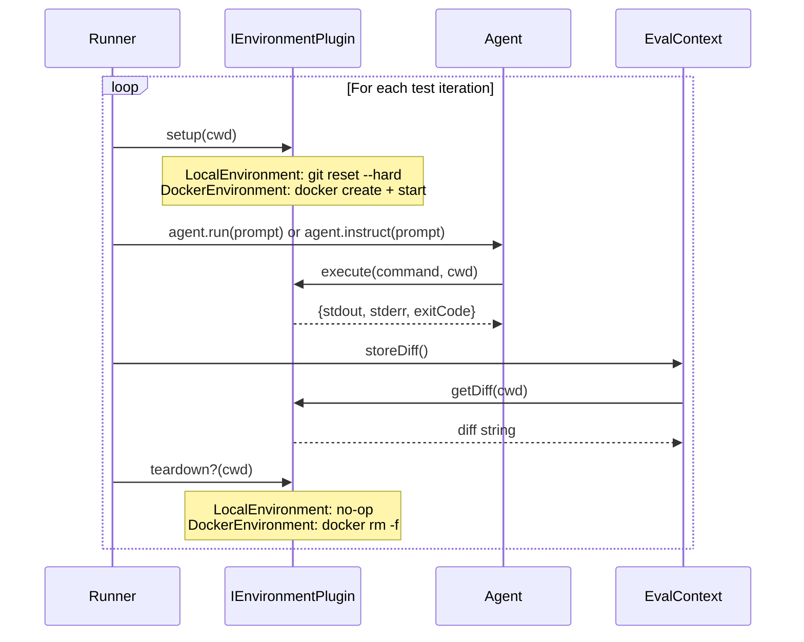
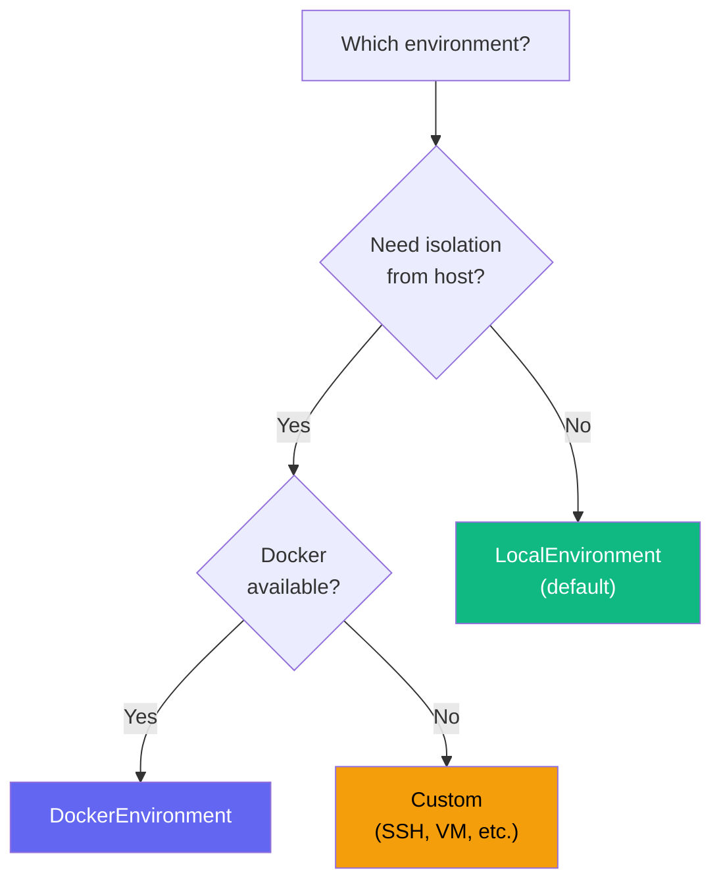

# Environment / Execution Plugins

Environment plugins control **where and how** agent tests execute — locally via Git, inside Docker containers, over SSH, or any custom sandbox. They implement the `IEnvironmentPlugin` interface.

## Interface

```ts
interface IEnvironmentPlugin {
  readonly name: string;

  /** Prepare workspace before each test iteration */
  setup(cwd: string): void | Promise<void>;

  /** Execute a shell command in the environment */
  execute(
    command: string,
    cwd: string,
    options?: { timeout?: number },
  ): EnvironmentCommandResult | Promise<EnvironmentCommandResult>;

  /** Capture the git diff (staged + unstaged) */
  getDiff(cwd: string): string | Promise<string>;

  /** Optional cleanup after each test iteration */
  teardown?(cwd: string): void | Promise<void>;
}

interface EnvironmentCommandResult {
  stdout: string;
  stderr: string;
  exitCode: number;
}
```

## Built-in Plugins

### LocalEnvironment (Default)

Runs tests directly on the host machine. Uses Git for workspace isolation and `child_process.execSync` for command execution. This is the zero-dependency default.

```ts
import { defineConfig, LocalEnvironment } from "agent-eval";

export default defineConfig({
  // LocalEnvironment is used automatically when no environment is specified
  environment: new LocalEnvironment(),
  // ...
});
```

| Lifecycle    | Implementation                                |
| ------------ | --------------------------------------------- |
| `setup()`    | `git reset --hard HEAD` + `git clean -fd`     |
| `execute()`  | `child_process.execSync` with captured output |
| `getDiff()`  | `git diff --cached` + `git diff`              |
| `teardown()` | No-op                                         |

::: tip When to use
Use `LocalEnvironment` when:

- Running evals on your local machine
- You trust the agents you're testing
- You want zero configuration overhead
  :::

### DockerEnvironment

Runs each test iteration inside a **Docker container** with the project directory mounted as a volume. Provides strong isolation — the agent cannot modify the host filesystem directly.

```ts
import { defineConfig, DockerEnvironment } from "agent-eval";

export default defineConfig({
  environment: new DockerEnvironment({
    image: "node:22-slim",
    workDir: "/workspace",
  }),
  // ...
});
```

| Option       | Type       | Default      | Description                                 |
| ------------ | ---------- | ------------ | ------------------------------------------- |
| `image`      | `string`   | —            | Docker image to use (e.g., `node:22-slim`)  |
| `dockerfile` | `string`   | —            | Path to Dockerfile (alternative to `image`) |
| `workDir`    | `string`   | `/workspace` | Working directory inside the container      |
| `dockerArgs` | `string[]` | `[]`         | Additional `docker create` arguments        |

| Lifecycle    | Implementation                                     |
| ------------ | -------------------------------------------------- |
| `setup()`    | `docker create` with volume mount + `docker start` |
| `execute()`  | `docker exec` inside the running container         |
| `getDiff()`  | `docker exec git diff` inside the container        |
| `teardown()` | `docker rm -f` removes the container               |

#### Using a Dockerfile

```ts
new DockerEnvironment({
  dockerfile: "./Dockerfile.eval",
  workDir: "/app",
  dockerArgs: ["--memory=2g", "--cpus=2"],
});
```

#### Full example with Docker

```ts
import { defineConfig, DockerEnvironment, AnthropicLLM } from "agent-eval";

export default defineConfig({
  environment: new DockerEnvironment({
    image: "node:22-slim",
    dockerArgs: ["--memory=4g"],
  }),

  llm: new AnthropicLLM({ defaultModel: "claude-sonnet-4-20250514" }),

  runners: [
    {
      name: "claude-code",
      type: "cli",
      command: 'claude -p "{{prompt}}" --allowedTools "Edit,Write,Bash"',
    },
  ],
  judge: { provider: "anthropic", model: "claude-sonnet-4-20250514" },
});
```

::: warning Docker required
Docker must be installed and running on the host machine. The user running AgentEval needs permission to create and manage containers.
:::

## Execution Flow



## Choosing an Environment



| Feature         | LocalEnvironment | DockerEnvironment  |
| --------------- | ---------------- | ------------------ |
| Setup required  | None             | Docker installed   |
| Host isolation  | None (shared FS) | Full (container)   |
| Performance     | Fast             | Container overhead |
| Git integration | Native           | Via mounted volume |
| Best for        | Local dev, CI    | Untrusted agents   |

## Creating a Custom Environment

### SSH Remote Environment

Run tests on a remote machine via SSH:

```ts
import type { IEnvironmentPlugin, EnvironmentCommandResult } from "agent-eval";

class SSHEnvironment implements IEnvironmentPlugin {
  readonly name = "ssh";

  constructor(
    private host: string,
    private user: string,
  ) {}

  async setup(cwd: string): Promise<void> {
    await this.ssh(`cd ${cwd} && git reset --hard HEAD && git clean -fd`);
  }

  async execute(command: string, cwd: string): Promise<EnvironmentCommandResult> {
    return this.ssh(`cd ${cwd} && ${command}`);
  }

  async getDiff(cwd: string): Promise<string> {
    const result = await this.ssh(`cd ${cwd} && git diff --cached && git diff`);
    return result.stdout;
  }

  private async ssh(cmd: string): Promise<EnvironmentCommandResult> {
    const { execSync } = await import("node:child_process");
    try {
      const stdout = execSync(`ssh ${this.user}@${this.host} '${cmd}'`, { encoding: "utf-8" });
      return { stdout, stderr: "", exitCode: 0 };
    } catch (err: unknown) {
      const e = err as { stdout?: string; stderr?: string; status?: number };
      return { stdout: e.stdout ?? "", stderr: e.stderr ?? "", exitCode: e.status ?? 1 };
    }
  }
}
```

### Temporary Clone Environment

Clone the project into a temp directory for each test:

```ts
import type { IEnvironmentPlugin, EnvironmentCommandResult } from "agent-eval";
import { execSync } from "node:child_process";
import { mkdtempSync, rmSync } from "node:fs";
import { join } from "node:path";
import { tmpdir } from "node:os";

class TempCloneEnvironment implements IEnvironmentPlugin {
  readonly name = "temp-clone";
  private tempDir?: string;

  setup(cwd: string): void {
    this.tempDir = mkdtempSync(join(tmpdir(), "agenteval-"));
    execSync(`git clone ${cwd} ${this.tempDir}`, { stdio: "pipe" });
  }

  execute(command: string): EnvironmentCommandResult {
    try {
      const stdout = execSync(command, { cwd: this.tempDir!, encoding: "utf-8", stdio: "pipe" });
      return { stdout, stderr: "", exitCode: 0 };
    } catch (err: unknown) {
      const e = err as { stdout?: string; stderr?: string; status?: number };
      return { stdout: e.stdout ?? "", stderr: e.stderr ?? "", exitCode: e.status ?? 1 };
    }
  }

  getDiff(): string {
    const staged = execSync("git diff --cached", { cwd: this.tempDir!, encoding: "utf-8" });
    const unstaged = execSync("git diff", { cwd: this.tempDir!, encoding: "utf-8" });
    return [staged, unstaged].filter(Boolean).join("\n");
  }

  teardown(): void {
    if (this.tempDir) {
      rmSync(this.tempDir, { recursive: true, force: true });
      this.tempDir = undefined;
    }
  }
}
```

### Usage

```ts
import { defineConfig } from "agent-eval";
import { SSHEnvironment } from "./my-plugins/ssh-environment";

export default defineConfig({
  environment: new SSHEnvironment("build-server.internal", "ci"),
  // ...
});
```
