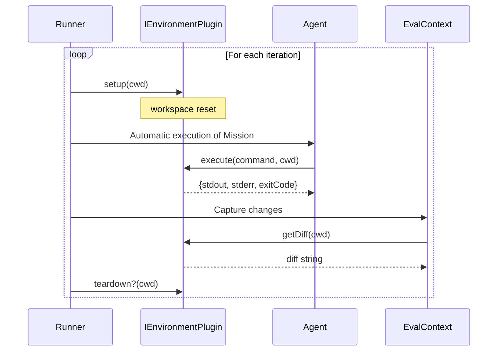

# Environment / Execution Plugins

Environment plugins control **where and how** agent tests execute — locally via Git, inside Docker containers, over SSH, or any custom sandbox. They implement the `IEnvironmentPlugin` interface.

## Interface

```ts
interface IEnvironmentPlugin {
  readonly name: string;

  /** Prepare workspace before each test iteration */
  setup(cwd: string): void | Promise<void>;

  /** Execute a shell command in the environment */
  execute(
    command: string,
    cwd: string,
    options?: { timeout?: number },
  ): EnvironmentCommandResult | Promise<EnvironmentCommandResult>;

  /** Capture the git diff (staged + unstaged) */
  getDiff(cwd: string): string | Promise<string>;

  /** Optional cleanup after each test iteration */
  teardown?(cwd: string): void | Promise<void>;
}

interface EnvironmentCommandResult {
  stdout: string;
  stderr: string;
  exitCode: number;
}
```

## Built-in Plugins

### LocalEnvironment (Default)

Runs tests directly on the host machine. Uses Git for workspace isolation and `child_process.execSync` for command execution. This is the zero-dependency default.

```ts
import { defineConfig } from "@tlahey/agent-eval";
import { LocalEnvironment } from "@tlahey/agent-eval/environment";

export default defineConfig({
  environment: new LocalEnvironment(),
});
```

| Lifecycle    | Implementation                                |
| ------------ | --------------------------------------------- |
| `setup()`    | `git reset --hard HEAD` + `git clean -fd`     |
| `execute()`  | `child_process.execSync` with captured output |
| `getDiff()`  | `git diff --cached` + `git diff`              |
| `teardown()` | No-op                                         |

### DockerEnvironment

Runs each test iteration inside a **Docker container** with the project directory mounted as a volume. Provides strong isolation.

```ts
import { defineConfig } from "@tlahey/agent-eval";
import { DockerEnvironment } from "@tlahey/agent-eval/environment";

export default defineConfig({
  environment: new DockerEnvironment({
    image: "node:22-slim",
    workDir: "/workspace",
  }),
});
```

| Option       | Type       | Default      | Description                                  |
| :----------- | :--------- | :----------- | :------------------------------------------- |
| `image`      | `string`   | —            | Docker image to use.                         |
| `dockerfile` | `string`   | —            | Path to Dockerfile (alternative to `image`). |
| `workDir`    | `string`   | `/workspace` | Working directory inside the container.      |
| `dockerArgs` | `string[]` | `[]`         | Additional `docker create` arguments.        |

## Execution Flow


```mermaid
sequenceDiagram
    participant R as Runner
    participant E as IEnvironmentPlugin
    participant A as Agent
    participant C as EvalContext

    loop For each iteration
        R->>E: setup(cwd)
        Note over E: workspace reset

        R->>A: Automatic execution of Mission
        A->>E: execute(command, cwd)
        E-->>A: {stdout, stderr, exitCode}

        R->>C: Capture changes
        C->>E: getDiff(cwd)
        E-->>C: diff string

        R->>E: teardown?(cwd)
    end
```

## Creating a Custom Environment

### SSH Remote Environment

Run tests on a remote machine via SSH:

```ts
import type { IEnvironmentPlugin, EnvironmentCommandResult } from "@tlahey/agent-eval";

class SSHEnvironment implements IEnvironmentPlugin {
  readonly name = "ssh";

  constructor(
    private host: string,
    private user: string,
  ) {}

  async setup(cwd: string): Promise<void> {
    await this.ssh(`cd ${cwd} && git reset --hard HEAD && git clean -fd`);
  }

  async execute(command: string, cwd: string): Promise<EnvironmentCommandResult> {
    return this.ssh(`cd ${cwd} && ${command}`);
  }

  async getDiff(cwd: string): Promise<string> {
    const result = await this.ssh(`cd ${cwd} && git diff --cached && git diff`);
    return result.stdout;
  }

  private async ssh(cmd: string): Promise<EnvironmentCommandResult> {
    const { execSync } = await import("node:child_process");
    try {
      const stdout = execSync(`ssh ${this.user}@${this.host} '${cmd}'`, { encoding: "utf-8" });
      return { stdout, stderr: "", exitCode: 0 };
    } catch (err: any) {
      return { stdout: err.stdout ?? "", stderr: err.stderr ?? "", exitCode: err.status ?? 1 };
    }
  }
}
```
