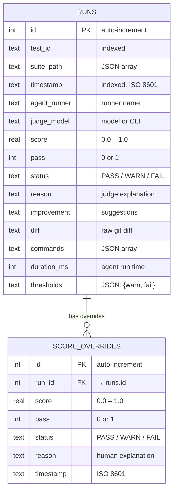
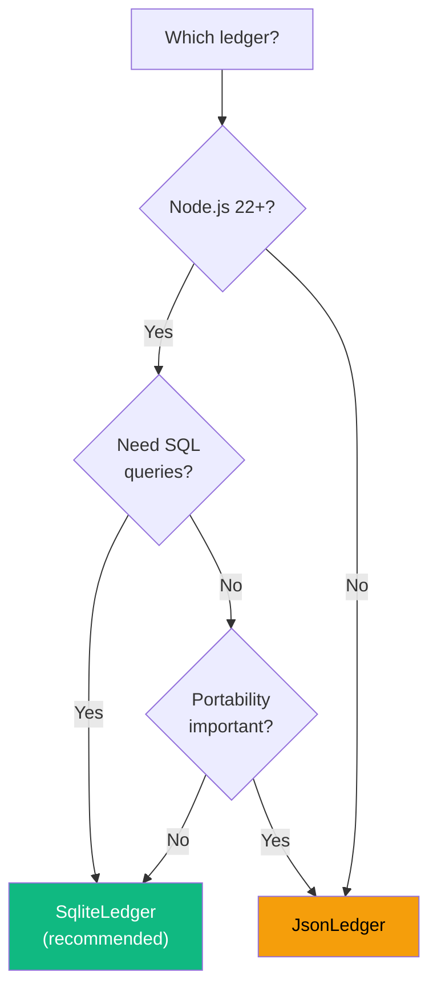

# Ledger / Storage Plugins

Ledger plugins handle **result persistence** — recording runs, querying history, computing stats, and managing score overrides. They implement the `ILedgerPlugin` interface.

## Interface

```ts
interface ILedgerPlugin {
  readonly name: string;

  initialize(): void | Promise<void>;
  recordRun(entry: LedgerEntry): void | Promise<void>;
  getRuns(testId?: string): LedgerEntry[] | Promise<LedgerEntry[]>;
  getRunById(id: number): LedgerEntry | undefined | Promise<LedgerEntry | undefined>;
  getTestIds(): string[] | Promise<string[]>;
  getTestTree(): TestTreeNode[] | Promise<TestTreeNode[]>;
  getLatestEntries(): Map<string, LedgerEntry> | Promise<Map<string, LedgerEntry>>;
  getStats(testId?: string): RunnerStats[] | Promise<RunnerStats[]>;
  overrideRunScore(
    runId: number,
    score: number,
    reason: string,
  ): ScoreOverride | Promise<ScoreOverride>;
  getRunOverrides(runId: number): ScoreOverride[] | Promise<ScoreOverride[]>;
  close?(): void | Promise<void>;
}
```

## Built-in Plugins

### SqliteLedger (Default)

Uses Node 22's built-in `node:sqlite` for zero-dependency SQL storage. This is the default when no ledger plugin is configured.

```ts
import { defineConfig } from "agent-eval";
import { SqliteLedger } from "agent-eval/ledger/sqlite";

export default defineConfig({
  ledger: new SqliteLedger({ outputDir: ".agenteval" }),
  // ...
});
```

| Option      | Type     | Default      | Description                      |
| ----------- | -------- | ------------ | -------------------------------- |
| `outputDir` | `string` | `.agenteval` | Directory for the `.sqlite` file |

**Features:**

- SQL-powered aggregations (stats, filtering, grouping)
- Indexed queries on `test_id` and `timestamp`
- Score override audit trail (`score_overrides` table)
- Dashboard API support (all endpoints)

::: info Node.js 22+ required
`node:sqlite` (`DatabaseSync`) is only available in Node.js 22+. The module is experimental and produces `ExperimentalWarning` at startup.
:::

**Database schema:**



### JsonLedger

Stores results as JSONL (one JSON object per line). Works with any Node.js version.

```ts
import { defineConfig } from "agent-eval";
import { JsonLedger } from "agent-eval/ledger/json";

export default defineConfig({
  ledger: new JsonLedger({ outputDir: ".agenteval" }),
  // ...
});
```

| Option      | Type     | Default      | Description                  |
| ----------- | -------- | ------------ | ---------------------------- |
| `outputDir` | `string` | `.agenteval` | Directory for `.jsonl` files |

**Features:**

- Human-readable JSONL format
- No native dependencies (works everywhere)
- Easy to version control or pipe to other tools

**Trade-offs:**

- No SQL queries — stats are computed in-memory
- Slower for large datasets (full file scan)
- No indexed queries

## Choosing a Ledger



| Feature             | SqliteLedger       | JsonLedger         |
| ------------------- | ------------------ | ------------------ |
| Node.js version     | 22+                | Any                |
| Query language      | SQL                | In-memory          |
| Performance (large) | Fast (indexed)     | Slower (file scan) |
| Dashboard support   | Full               | Full               |
| Score overrides     | Audit trail table  | In-memory          |
| Dependencies        | `node:sqlite`      | None               |
| Format              | Binary (`.sqlite`) | Text (`.jsonl`)    |

## Creating a Custom Ledger

Implement `ILedgerPlugin` to store results anywhere — MongoDB, PostgreSQL, a remote API, etc.

```ts
import type {
  ILedgerPlugin,
  LedgerEntry,
  ScoreOverride,
  RunnerStats,
  TestTreeNode,
} from "agent-eval";

class PostgresLedger implements ILedgerPlugin {
  readonly name = "postgres";
  private pool: any;

  constructor(private connectionString: string) {}

  async initialize() {
    const { Pool } = await import("pg");
    this.pool = new Pool({ connectionString: this.connectionString });
    await this.pool.query(`
      CREATE TABLE IF NOT EXISTS runs (
        id SERIAL PRIMARY KEY,
        test_id TEXT NOT NULL,
        timestamp TIMESTAMPTZ DEFAULT NOW(),
        score REAL,
        pass BOOLEAN,
        status TEXT,
        reason TEXT,
        improvement TEXT
      )
    `);
  }

  async recordRun(entry: LedgerEntry) {
    await this.pool.query(
      "INSERT INTO runs (test_id, score, pass, status, reason, improvement) VALUES ($1,$2,$3,$4,$5,$6)",
      [entry.testId, entry.score, entry.pass, entry.status, entry.reason, entry.improvement],
    );
  }

  async getRuns(testId?: string) {
    const { rows } = testId
      ? await this.pool.query("SELECT * FROM runs WHERE test_id = $1", [testId])
      : await this.pool.query("SELECT * FROM runs");
    return rows;
  }

  // ... implement remaining ILedgerPlugin methods

  async close() {
    await this.pool.end();
  }
}
```

### Usage

```ts
import { defineConfig } from "agent-eval";
import { PostgresLedger } from "./my-plugins/postgres-ledger";

export default defineConfig({
  ledger: new PostgresLedger("postgresql://localhost:5432/agenteval"),
  // ...
});
```
