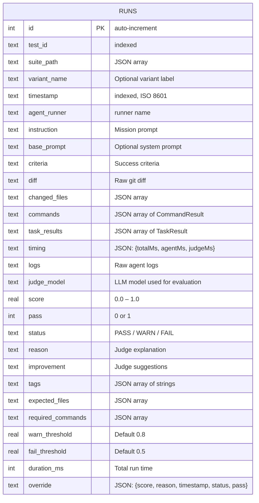
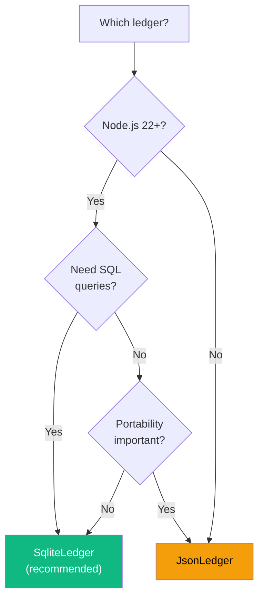

# Ledger / Storage Plugins

Ledger plugins handle **result persistence** — recording runs, querying history, computing stats, and managing score overrides. They implement the `ILedgerPlugin` interface.

## Interface

```ts
interface ILedgerPlugin {
  readonly name: string;

  initialize(): void | Promise<void>;
  recordRun(entry: LedgerEntry): void | Promise<void>;
  getRuns(testId?: string): LedgerEntry[] | Promise<LedgerEntry[]>;
  getRunById(id: number): LedgerEntry | undefined | Promise<LedgerEntry | undefined>;
  getTestIds(): string[] | Promise<string[]>;
  /** Get all unique tags across all runs */
  getTags(): string[] | Promise<string[]>;
  getTestTree(): TestTreeNode[] | Promise<TestTreeNode[]>;
  getLatestEntries(): Map<string, LedgerEntry> | Promise<Map<string, LedgerEntry>>;
  getStats(testId?: string): RunnerStats[] | Promise<RunnerStats[]>;
  overrideRunScore(
    runId: number,
    score: number,
    reason: string,
  ): ScoreOverride | Promise<ScoreOverride>;
  getRunOverrides(runId: number): ScoreOverride[] | Promise<ScoreOverride[]>;
  close?(): void | Promise<void>;
}
```

## Built-in Plugins

### SqliteLedger (Default)

Uses Node 22's built-in `node:sqlite` for zero-dependency SQL storage. This is the default when no ledger plugin is configured.

```ts
import { defineConfig } from "@tlahey/agent-eval";
import { SqliteLedger } from "agent-eval/ledger";

export default defineConfig({
  ledger: new SqliteLedger({ outputDir: ".agenteval" }),
  // ...
});
```

| Option      | Type     | Default      | Description                      |
| ----------- | -------- | ------------ | -------------------------------- |
| `outputDir` | `string` | `.agenteval` | Directory for the `.sqlite` file |

**Features:**

- SQL-powered aggregations (stats, filtering, grouping)
- Indexed queries on `test_id` and `timestamp`
- **Score overrides** stored directly in the `runs` table for fast access
- Dashboard API support (all endpoints)

::: info Node.js 22+ required
`node:sqlite` (`DatabaseSync`) is only available in Node.js 22+. The module is experimental and produces `ExperimentalWarning` at startup.
:::

**Database schema:**


```mermaid
erDiagram
    RUNS {
        int id PK "auto-increment"
        text test_id "indexed"
        text suite_path "JSON array"
        text variant_name "Optional variant label"
        text timestamp "indexed, ISO 8601"
        text agent_runner "runner name"
        text instruction "Mission prompt"
        text base_prompt "Optional system prompt"
        text criteria "Success criteria"
        text diff "Raw git diff"
        text changed_files "JSON array"
        text commands "JSON array of CommandResult"
        text task_results "JSON array of TaskResult"
        text timing "JSON: {totalMs, agentMs, judgeMs}"
        text logs "Raw agent logs"
        text judge_model "LLM model used for evaluation"
        real score "0.0 – 1.0"
        int pass "0 or 1"
        text status "PASS / WARN / FAIL"
        text reason "Judge explanation"
        text improvement "Judge suggestions"
        text tags "JSON array of strings"
        text expected_files "JSON array"
        text required_commands "JSON array"
        real warn_threshold "Default 0.8"
        real fail_threshold "Default 0.5"
        int duration_ms "Total run time"
        text override "JSON: {score, reason, timestamp, status, pass}"
    }
```

### JsonLedger

Stores results as JSONL (one JSON object per line). Works with any Node.js version.

```ts
import { defineConfig } from "@tlahey/agent-eval";
import { JsonLedger } from "agent-eval/ledger";

export default defineConfig({
  ledger: new JsonLedger({ outputDir: ".agenteval" }),
  // ...
});
```

| Option      | Type     | Default      | Description                  |
| ----------- | -------- | ------------ | ---------------------------- |
| `outputDir` | `string` | `.agenteval` | Directory for `.jsonl` files |

**Features:**

- Human-readable JSONL format
- No native dependencies (works everywhere)
- Easy to version control or pipe to other tools

**Trade-offs:**

- No SQL queries — stats are computed in-memory
- Slower for large datasets (full file scan)
- Overrides require rewriting the file

## Choosing a Ledger


```mermaid
flowchart TD
    A["Which ledger?"] --> B{"Node.js 22+?"}
    B -- Yes --> C{"Need SQL<br/>queries?"}
    C -- Yes --> D["SqliteLedger<br/>(recommended)"]
    C -- No --> E{"Portability<br/>important?"}
    E -- Yes --> F["JsonLedger"]
    E -- No --> D
    B -- No --> F

    style D fill:#10b981,color:#fff
    style F fill:#f59e0b,color:#000
```

| Feature             | SqliteLedger       | JsonLedger         |
| ------------------- | ------------------ | ------------------ |
| Node.js version     | 22+                | Any                |
| Query language      | SQL                | In-memory          |
| Performance (large) | Fast (indexed)     | Slower (file scan) |
| Dashboard support   | Full               | Full               |
| Score overrides     | Embedded JSON      | File Rewrite       |
| Dependencies        | `node:sqlite`      | None               |
| Format              | Binary (`.sqlite`) | Text (`.jsonl`)    |

## Creating a Custom Ledger

Implement `ILedgerPlugin` to store results anywhere — MongoDB, PostgreSQL, a remote API, etc.

```ts
import type {
  ILedgerPlugin,
  LedgerEntry,
  ScoreOverride,
  RunnerStats,
  TestTreeNode,
} from "@tlahey/agent-eval";

class PostgresLedger implements ILedgerPlugin {
  readonly name = "postgres";
  private pool: any;

  constructor(private connectionString: string) {}

  async initialize() {
    const { Pool } = await import("pg");
    this.pool = new Pool({ connectionString: this.connectionString });
    // ... setup table schema ...
  }

  async recordRun(entry: LedgerEntry) {
    // ... insert run ...
  }

  async getRuns(testId?: string) {
    // ... select runs ...
  }

  async getTags(): Promise<string[]> {
    // ... select unique tags ...
    return [];
  }

  // ... implement remaining ILedgerPlugin methods
}
```
