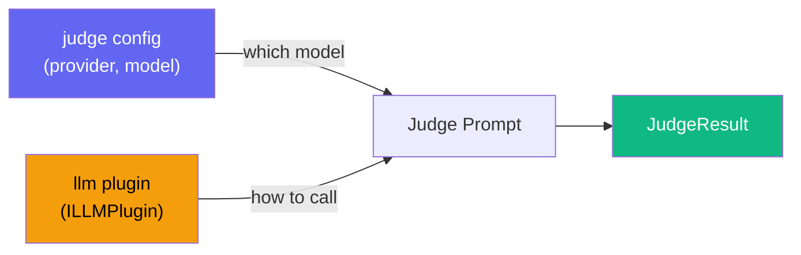

# LLM / Model Plugins

LLM plugins abstract AI provider calls for **judge evaluation** and **API-based agent runners**. They implement the `ILLMPlugin` interface.

## Interface

```ts
interface ILLMPlugin {
  readonly name: string;
  readonly provider: string;
  readonly defaultModel: string;

  /** Evaluate agent output (used by the judge) */
  evaluate(options: LLMEvaluationOptions): Promise<JudgeResult>;

  /** Generate structured file output (used by API runners) — optional */
  generate?(options: LLMGenerationOptions): Promise<AgentFileOutput>;
}
```

## Built-in Plugins

### AnthropicLLM

Uses Anthropic's Claude models via `@ai-sdk/anthropic`.

```ts
import { defineConfig, AnthropicLLM } from "agent-eval";

export default defineConfig({
  llm: new AnthropicLLM({
    defaultModel: "claude-sonnet-4-20250514",
    apiKey: process.env.ANTHROPIC_API_KEY, // optional — reads env var by default
  }),

  runners: [
    {
      name: "claude-api",
      type: "api",
      api: { provider: "anthropic", model: "claude-sonnet-4-20250514" },
    },
  ],
  judge: { provider: "anthropic", model: "claude-sonnet-4-20250514" },
});
```

| Option         | Type     | Default             | Description                |
| -------------- | -------- | ------------------- | -------------------------- |
| `defaultModel` | `string` | —                   | Default model name         |
| `apiKey`       | `string` | `ANTHROPIC_API_KEY` | API key (env var fallback) |

**Recommended models:**

| Model                      | Best for              |
| -------------------------- | --------------------- |
| `claude-sonnet-4-20250514` | Best cost/performance |
| `claude-opus-4-20250514`   | Most capable          |
| `claude-haiku-3-20250305`  | Fastest, cheapest     |

### OpenAILLM

Uses OpenAI's GPT models via `@ai-sdk/openai`.

```ts
import { defineConfig, OpenAILLM } from "agent-eval";

export default defineConfig({
  llm: new OpenAILLM({
    defaultModel: "gpt-4o",
    apiKey: process.env.OPENAI_API_KEY,
  }),

  runners: [{ name: "gpt-4o", type: "api", api: { provider: "openai", model: "gpt-4o" } }],
  judge: { provider: "openai", model: "gpt-4o" },
});
```

| Option         | Type     | Default          | Description                |
| -------------- | -------- | ---------------- | -------------------------- |
| `defaultModel` | `string` | —                | Default model name         |
| `apiKey`       | `string` | `OPENAI_API_KEY` | API key (env var fallback) |
| `baseURL`      | `string` | —                | Custom API endpoint        |

**Recommended models:**

| Model           | Best for              |
| --------------- | --------------------- |
| `gpt-4o`        | Best cost/performance |
| `gpt-4-turbo`   | High capability       |
| `gpt-3.5-turbo` | Budget option         |

::: tip Custom endpoints
Use `baseURL` to connect to any OpenAI-compatible API: Azure OpenAI, Together AI, Fireworks, Groq, etc.

```ts
new OpenAILLM({
  defaultModel: "internal-model-v2",
  baseURL: "https://llm.internal.company.com/v1",
  apiKey: process.env.INTERNAL_LLM_KEY,
});
```

:::

### OllamaLLM

Run models **locally** with [Ollama](https://ollama.ai/). No API key required.

```ts
import { defineConfig, OllamaLLM } from "agent-eval";

export default defineConfig({
  llm: new OllamaLLM({
    defaultModel: "llama3",
    baseURL: "http://localhost:11434/v1", // default
  }),

  runners: [{ name: "llama3", type: "api", api: { provider: "ollama", model: "llama3" } }],
  judge: { provider: "ollama", model: "llama3" },
});
```

| Option         | Type     | Default                     | Description         |
| -------------- | -------- | --------------------------- | ------------------- |
| `defaultModel` | `string` | —                           | Default model name  |
| `baseURL`      | `string` | `http://localhost:11434/v1` | Ollama API endpoint |

::: warning Not recommended as judge
Local models lack the reasoning depth for reliable code evaluation. Use them only for experimentation, not production evaluations.
:::

**Popular models:**

| Model            | Best for               |
| ---------------- | ---------------------- |
| `llama3`         | General purpose        |
| `codellama`      | Code-specialized       |
| `deepseek-coder` | Strong code generation |
| `mistral`        | Fast, general-purpose  |

## Creating a Custom LLM Plugin

### Option 1: Extend BaseLLMPlugin (Vercel AI SDK)

If your provider is compatible with the Vercel AI SDK:

```ts
import { BaseLLMPlugin } from "agent-eval";

class AzureLLM extends BaseLLMPlugin {
  readonly name = "azure-openai";
  readonly provider = "azure";

  protected async createModel(modelName: string) {
    const { createAzure } = await import("@ai-sdk/azure");
    return createAzure({
      resourceName: "my-resource",
      apiKey: process.env.AZURE_API_KEY,
    })(modelName);
  }
}
```

### Option 2: Implement ILLMPlugin directly

For non-Vercel providers or custom APIs:

```ts
import type { ILLMPlugin, JudgeResult } from "agent-eval";

class CustomLLM implements ILLMPlugin {
  readonly name = "custom-api";
  readonly provider = "custom";
  readonly defaultModel = "v1";

  async evaluate(options) {
    const response = await fetch("https://api.example.com/evaluate", {
      method: "POST",
      headers: { "Content-Type": "application/json" },
      body: JSON.stringify({ prompt: options.prompt, model: options.model }),
    });
    return response.json() as Promise<JudgeResult>;
  }

  async generate(options) {
    const response = await fetch("https://api.example.com/generate", {
      method: "POST",
      body: JSON.stringify({ prompt: options.prompt }),
    });
    return response.json();
  }
}
```

## LLM Plugin vs Judge Config

The `llm` plugin and `judge` config option work together:



- **`judge`** in config defines _which model_ to use and its settings
- **`llm`** plugin defines _how_ to call the model (API client, SDK, custom logic)
- When no `llm` plugin is set, the built-in Vercel AI SDK is used based on `judge.provider`
