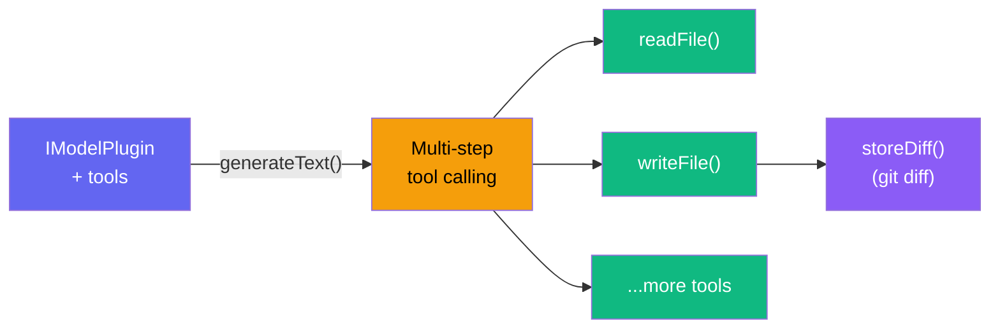
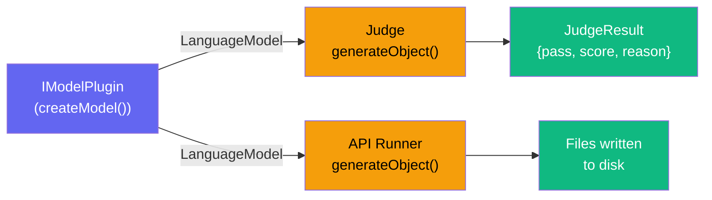

# LLM / Model Plugins

Model plugins abstract AI provider calls for **judge evaluation** and **API-based agent runners**. They implement the `IModelPlugin` interface.

## Interface

```ts
interface IModelPlugin {
  readonly name: string;
  readonly modelId: string;
  readonly settings?: ModelSettings;
  readonly tools?: Record<string, unknown>;
  createModel(): unknown | Promise<unknown>;
}
```

The framework calls `createModel()` whenever it needs a model — for judge evaluation (`generateObject()`) or for API runners (`generateObject()` without tools, `generateText()` with tools).

## ModelSettings

Generation settings forwarded to the AI SDK at call time:

```ts
interface ModelSettings {
  temperature?: number; // 0 = deterministic, 1 = creative
  maxTokens?: number; // Max tokens in the response
  topP?: number; // Nucleus sampling (0-1)
  maxSteps?: number; // Max tool-calling rounds (default: 10)
}
```

`maxSteps` only applies when `tools` are provided — it controls how many rounds of tool calling the model can perform.

## Built-in Plugins

### AnthropicModel

Uses Anthropic's Claude models via `@ai-sdk/anthropic`.

```ts
import { defineConfig } from "agent-eval";
import { AnthropicModel, CliModel } from "agent-eval/llm";

export default defineConfig({
  runners: [{ name: "copilot", model: new CliModel({ command: "gh copilot -p '{{prompt}}'" }) }],
  judge: {
    name: "claude-sonnet",
    model: new AnthropicModel({ model: "claude-sonnet-4-20250514" }),
  },
});
```

| Option   | Type     | Default             | Description                |
| -------- | -------- | ------------------- | -------------------------- |
| `model`  | `string` | —                   | Model identifier           |
| `apiKey` | `string` | `ANTHROPIC_API_KEY` | API key (env var fallback) |

**Recommended models:**

| Model                      | Best for              |
| -------------------------- | --------------------- |
| `claude-sonnet-4-20250514` | Best cost/performance |
| `claude-opus-4-20250514`   | Most capable          |
| `claude-haiku-3-20250305`  | Fastest, cheapest     |

### OpenAIModel

Uses OpenAI's GPT models via `@ai-sdk/openai`.

```ts
import { defineConfig } from "agent-eval";
import { OpenAIModel } from "agent-eval/llm";

const gpt4o = new OpenAIModel({ model: "gpt-4o" });

export default defineConfig({
  runners: [{ name: "gpt-4o", model: gpt4o }],
  judge: { name: "gpt-4o", model: gpt4o },
});
```

| Option    | Type     | Default          | Description                |
| --------- | -------- | ---------------- | -------------------------- |
| `model`   | `string` | —                | Model identifier           |
| `apiKey`  | `string` | `OPENAI_API_KEY` | API key (env var fallback) |
| `baseURL` | `string` | —                | Custom API endpoint        |

**Recommended models:**

| Model           | Best for              |
| --------------- | --------------------- |
| `gpt-4o`        | Best cost/performance |
| `gpt-4-turbo`   | High capability       |
| `gpt-3.5-turbo` | Budget option         |

::: tip Custom endpoints
Use `baseURL` to connect to any OpenAI-compatible API: Azure OpenAI, Together AI, Fireworks, Groq, etc.

```ts
new OpenAIModel({
  model: "internal-model-v2",
  baseURL: "https://llm.internal.company.com/v1",
  apiKey: process.env.INTERNAL_LLM_KEY,
});
```

:::

### OllamaModel

Run models **locally** with [Ollama](https://ollama.ai/). No API key required.

```ts
import { defineConfig } from "agent-eval";
import { OllamaModel } from "agent-eval/llm";

const llama = new OllamaModel({ model: "llama3" });

export default defineConfig({
  runners: [{ name: "llama3", model: llama }],
  judge: { name: "llama3", model: llama },
});
```

| Option    | Type     | Default                     | Description         |
| --------- | -------- | --------------------------- | ------------------- |
| `model`   | `string` | —                           | Model identifier    |
| `baseURL` | `string` | `http://localhost:11434/v1` | Ollama API endpoint |

::: warning Not recommended as judge
Local models lack the reasoning depth for reliable code evaluation. Use them only for experimentation, not production evaluations.
:::

**Popular models:**

| Model            | Best for               |
| ---------------- | ---------------------- |
| `llama3`         | General purpose        |
| `codellama`      | Code-specialized       |
| `deepseek-coder` | Strong code generation |
| `mistral`        | Fast, general-purpose  |

### GitHubModelsModel

Uses GitHub Models inference API (`models.github.ai`). OpenAI-compatible, with **structured JSON output** and **tool calling** support.

```ts
import { defineConfig } from "agent-eval";
import { GitHubModelsModel } from "agent-eval/llm";

export default defineConfig({
  runners: [
    {
      name: "gpt-5-mini",
      model: new GitHubModelsModel({
        model: "openai/gpt-5-mini",
        settings: { temperature: 1, maxTokens: 4096, topP: 1 },
      }),
    },
  ],
  judge: {
    name: "gpt-5-mini",
    model: new GitHubModelsModel({ model: "openai/gpt-5-mini" }),
  },
});
```

| Option     | Type                      | Default                                | Description                        |
| ---------- | ------------------------- | -------------------------------------- | ---------------------------------- |
| `model`    | `string`                  | `"openai/gpt-4o"`                      | Model ID (catalog format)          |
| `token`    | `string`                  | `GH_COPILOT_TOKEN` → `GITHUB_TOKEN`    | GitHub token for auth              |
| `baseURL`  | `string`                  | `"https://models.github.ai/inference"` | Inference endpoint                 |
| `settings` | `ModelSettings`           | —                                      | Generation settings                |
| `tools`    | `Record<string, unknown>` | —                                      | AI SDK tools for agentic execution |

::: tip Recommended as judge
GitHubModelsModel uses `structuredOutputs: true` which guarantees valid JSON output — ideal for the judge role.
:::

**Available models (catalog format):**

| Model ID             | Best for              |
| -------------------- | --------------------- |
| `openai/gpt-5-mini`  | Fast, cost-effective  |
| `openai/gpt-4o`      | Best cost/performance |
| `meta/llama-4-scout` | Open-source option    |

## Tools (Agentic Execution) {#tools}

Any `IModelPlugin` can declare **tools** — AI SDK tool definitions the model can call during execution. When tools are present, the runner switches from `generateObject()` (file schema) to `generateText()` with multi-step tool calling.

The framework passes tools directly to the [AI SDK](https://ai-sdk.dev/docs/foundations/tools). You define the tools, the model calls them. File changes are captured by `storeDiff()` via git.

### Example: API runner with tools

```ts
import { defineConfig } from "agent-eval";
import { GitHubModelsModel } from "agent-eval/llm";
import { tool } from "ai";
import { z } from "zod";
import { readFileSync, writeFileSync, mkdirSync } from "fs";
import { dirname } from "path";

const coder = new GitHubModelsModel({
  model: "openai/gpt-5-mini",
  settings: { temperature: 0.7, maxTokens: 8192, maxSteps: 15 },
  tools: {
    readFile: tool({
      description: "Read a file from the project",
      parameters: z.object({ path: z.string() }),
      execute: async ({ path }) => readFileSync(path, "utf-8"),
    }),
    writeFile: tool({
      description: "Write content to a file (creates directories if needed)",
      parameters: z.object({ path: z.string(), content: z.string() }),
      execute: async ({ path, content }) => {
        mkdirSync(dirname(path), { recursive: true });
        writeFileSync(path, content, "utf-8");
        return `wrote ${path}`;
      },
    }),
    listFiles: tool({
      description: "List files in a directory",
      parameters: z.object({ dir: z.string() }),
      execute: async ({ dir }) => {
        const { readdirSync } = await import("fs");
        return readdirSync(dir, { recursive: true }).join("\n");
      },
    }),
  },
});

export default defineConfig({
  runners: [{ name: "gpt-5-mini-agent", model: coder }],
  judge: {
    name: "gpt-5-mini",
    model: new GitHubModelsModel({ model: "openai/gpt-5-mini" }),
  },
});
```

### How it works


```mermaid
flowchart LR
    MP["IModelPlugin<br/>+ tools"] --> |"generateText()"| TS["Multi-step<br/>tool calling"]
    TS --> TC1["readFile()"]
    TS --> TC2["writeFile()"]
    TS --> TCN["...more tools"]
    TC2 --> GD["storeDiff()<br/>(git diff)"]

    style MP fill:#6366f1,color:#fff
    style TS fill:#f59e0b,color:#000
    style TC1 fill:#10b981,color:#fff
    style TC2 fill:#10b981,color:#fff
    style TCN fill:#10b981,color:#fff
    style GD fill:#8b5cf6,color:#fff
```

::: info Tools vs no tools

- **No tools** → `generateObject()` with file schema → framework writes files to disk
- **With tools** → `generateText()` with multi-step → tools handle everything, git captures changes
  :::

## Creating a Custom Model Plugin

Implement the `IModelPlugin` interface:

```ts
import type { IModelPlugin } from "agent-eval";

class MistralModel implements IModelPlugin {
  readonly name = "mistral";
  readonly modelId: string;

  constructor(private opts: { model: string; apiKey?: string }) {
    this.modelId = opts.model;
  }

  async createModel() {
    const { createMistral } = await import("@ai-sdk/mistral");
    return createMistral({ apiKey: this.opts.apiKey })(this.opts.model);
  }
}
```

The returned object must be a Vercel AI SDK `LanguageModel` instance (or any object compatible with `generateObject()` / `generateText()`).

## How Model Plugins Are Used


```mermaid
flowchart LR
    MP["IModelPlugin<br/>(createModel())"] --> |"LanguageModel"| J["Judge<br/>generateObject()"]
    MP --> |"LanguageModel"| AR["API Runner<br/>generateObject()"]
    J --> R["JudgeResult<br/>{pass, score, reason}"]
    AR --> F["Files written<br/>to disk"]

    style MP fill:#6366f1,color:#fff
    style J fill:#f59e0b,color:#000
    style AR fill:#f59e0b,color:#000
    style R fill:#10b981,color:#fff
    style F fill:#10b981,color:#fff
```

- The **judge** calls `config.judge.model.createModel()` to get the model, then uses `generateObject()` with a Zod schema to get structured `{ pass, score, reason }`.
- The **API runner** calls its model plugin's `createModel()` to get the model, then uses `generateObject()` with a file schema to generate code files.

## ICliModel

CLI models represent shell-based agents (IDE tools, CLI wrappers, custom scripts). They implement the `ICliModel` interface instead of `IModelPlugin`.

### Interface

```ts
interface ICliModel {
  readonly type: "cli";
  readonly name: string;
  readonly command: string;
  parseOutput?: CliOutputParser;
}
```

The optional `parseOutput` callback extracts structured metrics from the CLI tool's raw output:

```ts
interface CliOutputMetrics {
  tokenUsage?: TokenUsage; // Extracted token counts
  agentOutput?: string; // Cleaned output (e.g., JSON unwrapped)
}

type CliOutputParser = (output: { stdout: string; stderr: string }) => CliOutputMetrics;
```

When `parseOutput` is not provided, the runner uses raw stdout as agent output with no token data.

### Creating a CLI Model with Token Parsing

Use `CliModel` from `agent-eval/llm` — it implements `ICliModel`:

```ts
import { CliModel } from "agent-eval/llm";

// Simple CLI — no token parsing (e.g., Copilot)
const copilot = new CliModel({
  command: 'gh copilot suggest "{{prompt}}"',
});

// CLI with token usage extraction (e.g., Claude Code)
const claudeCode = new CliModel({
  command: 'claude -p "{{prompt}}" --output-format json --allowedTools "Edit,Write,Bash"',
  parseOutput: ({ stdout }) => {
    const json = JSON.parse(stdout);
    return {
      tokenUsage: json.usage
        ? {
            inputTokens: json.usage.input_tokens,
            outputTokens: json.usage.output_tokens,
            totalTokens: json.usage.input_tokens + json.usage.output_tokens,
          }
        : undefined,
      agentOutput: json.result,
    };
  },
});
```

::: info Token availability

- **API models** (`IModelPlugin`): Token usage is always available from the Vercel AI SDK response.
- **CLI models with `parseOutput`**: Token usage depends on what the CLI tool exposes.
- **CLI models without `parseOutput`**: Token usage is `undefined` — the dashboard shows "N/A".
  :::
