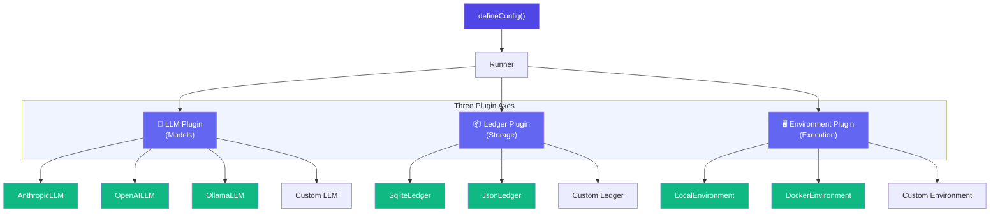
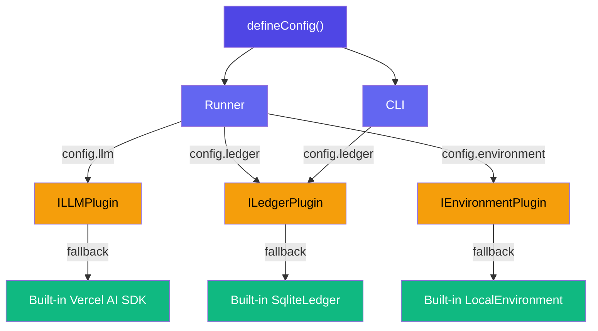

# Plugins

AgentEval uses a **plugin architecture** that decouples storage, LLM providers, and execution environments. This lets you swap backends without touching your test code.

## Overview



## Plugin Categories

| Plugin          | Purpose                              | Default            | Alternatives                             |
| --------------- | ------------------------------------ | ------------------ | ---------------------------------------- |
| **LLM**         | Judge evaluation & API runners       | Vercel AI SDK      | `AnthropicLLM`, `OpenAILLM`, `OllamaLLM` |
| **Ledger**      | Result storage & querying            | `SqliteLedger`     | `JsonLedger`, custom                     |
| **Environment** | Workspace setup, command exec, diffs | `LocalEnvironment` | `DockerEnvironment`, custom              |

## Quick Configuration

```ts
import { defineConfig, OpenAILLM, SqliteLedger, LocalEnvironment } from "agent-eval";

export default defineConfig({
  // 🤖 LLM plugin — used for judge + API runners
  llm: new OpenAILLM({ defaultModel: "gpt-4o" }),

  // 📦 Ledger plugin — where results are stored
  ledger: new SqliteLedger({ outputDir: ".agenteval" }),

  // 🖥️ Environment plugin — how tests execute
  environment: new LocalEnvironment(),

  runners: [
    /* ... */
  ],
  judge: { provider: "openai", model: "gpt-4o" },
});
```

::: tip Default behavior
If you don't configure any plugins, AgentEval uses sensible defaults:

- **LLM**: Built-in Vercel AI SDK (reads `judge.provider` from config)
- **Ledger**: `SqliteLedger` with `outputDir: ".agenteval"`
- **Environment**: `LocalEnvironment` (git reset + local exec)
  :::

## Plugin Interfaces

All plugins implement a typed interface. See the detailed pages for each:

- **[LLM / Models](./plugins-llm)** — `ILLMPlugin` for judge evaluation and API-based runners
- **[Ledger / Storage](./plugins-ledger)** — `ILedgerPlugin` for result persistence and querying
- **[Environments](./plugins-environments)** — `IEnvironmentPlugin` for workspace isolation and command execution

## Plugin Validation

AgentEval validates plugins at startup. Missing or invalid methods produce clear error messages:

```
❌ Plugin validation failed:

  LLMPlugin "my-custom-llm":
    ✗ Missing method: evaluate (expected: method)

  EnvironmentPlugin "my-env":
    ✗ Missing method: setup (expected: method)
    ✗ Missing method: getDiff (expected: method)
```

## Creating Custom Plugins

Each plugin category has a typed interface you can implement:

```ts
import type { ILLMPlugin, ILedgerPlugin, IEnvironmentPlugin } from "agent-eval";

// Implement one or more interfaces
class MyLLM implements ILLMPlugin {
  /* ... */
}
class MyLedger implements ILedgerPlugin {
  /* ... */
}
class MyEnv implements IEnvironmentPlugin {
  /* ... */
}
```

See each plugin page for complete interface definitions and examples.

## Dependency Flow


