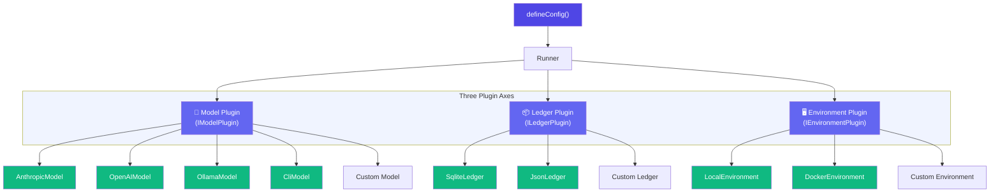
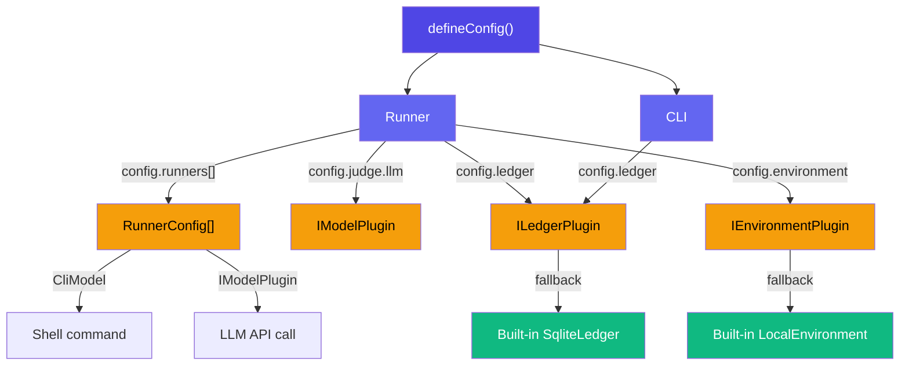

# Plugins

AgentEval uses a **plugin architecture** that decouples models, storage, and execution environments. Runners are plain config objects — not plugins. This lets you swap backends without touching your test code.

## Overview


```mermaid
flowchart TB
    CONFIG["defineConfig()"] --> RUNNER["Runner"]

    subgraph Plugins["Three Plugin Axes"]
        direction LR
        MODEL["🤖 Model Plugin<br/>(IModelPlugin)"]
        LEDGER["📦 Ledger Plugin<br/>(ILedgerPlugin)"]
        ENV["🖥️ Environment Plugin<br/>(IEnvironmentPlugin)"]
    end

    RUNNER --> MODEL
    RUNNER --> LEDGER
    RUNNER --> ENV

    MODEL --> AN["AnthropicModel"]
    MODEL --> OA["OpenAIModel"]
    MODEL --> OL["OllamaModel"]
    MODEL --> CL["CliModel"]
    MODEL --> CM["Custom Model"]

    LEDGER --> SQ["SqliteLedger"]
    LEDGER --> JS["JsonLedger"]
    LEDGER --> CU["Custom Ledger"]

    ENV --> LE["LocalEnvironment"]
    ENV --> DE["DockerEnvironment"]
    ENV --> CE["Custom Environment"]

    style CONFIG fill:#4f46e5,color:#fff
    style Plugins fill:#f0f4ff
    style MODEL fill:#6366f1,color:#fff
    style LEDGER fill:#6366f1,color:#fff
    style ENV fill:#6366f1,color:#fff
    style AN fill:#10b981,color:#fff
    style OA fill:#10b981,color:#fff
    style OL fill:#10b981,color:#fff
    style CL fill:#10b981,color:#fff
    style SQ fill:#10b981,color:#fff
    style JS fill:#10b981,color:#fff
    style LE fill:#10b981,color:#fff
    style DE fill:#10b981,color:#fff
```

## Plugin Categories

| Plugin          | Interface            | Purpose                           | Built-in                                                   |
| --------------- | -------------------- | --------------------------------- | ---------------------------------------------------------- |
| **Model**       | `IModelPlugin`       | Wraps LLM providers (judge + API) | `AnthropicModel`, `OpenAIModel`, `OllamaModel`, `CliModel` |
| **Ledger**      | `ILedgerPlugin`      | Result storage and querying       | `SqliteLedger`, `JsonLedger`                               |
| **Environment** | `IEnvironmentPlugin` | Workspace setup, exec, diffs      | `LocalEnvironment`, `DockerEnvironment`                    |

::: tip Runners are not plugins
Runners are plain config objects (`RunnerConfig`), not plugin instances. See the [Runners](./runners) page for details.
:::

## Import Map

Plugins are **not** re-exported from the main `"agent-eval"` entry point. Each plugin has its own sub-path to keep your bundle lean (unused providers are never loaded).

| Import                           | What you get                                                          |
| -------------------------------- | --------------------------------------------------------------------- |
| `agent-eval`                     | Core: `test`, `expect`, `describe`, `defineConfig`, types, interfaces |
| `agent-eval/providers/openai`    | `OpenAIModel`                                                         |
| `agent-eval/providers/anthropic` | `AnthropicModel`                                                      |
| `agent-eval/providers/ollama`    | `OllamaModel`                                                         |
| `agent-eval/providers/cli`       | `CliModel` (shell command model)                                      |
| `agent-eval/ledger/sqlite`       | `SqliteLedger`                                                        |
| `agent-eval/ledger/json`         | `JsonLedger`                                                          |
| `agent-eval/environment/local`   | `LocalEnvironment`                                                    |
| `agent-eval/environment/docker`  | `DockerEnvironment`                                                   |

::: tip Why sub-path imports?
Each provider plugin dynamically imports its AI SDK package (`@ai-sdk/openai`, `@ai-sdk/anthropic`, etc.). By isolating them in separate entry points, **only the providers you actually use are loaded** — no unnecessary dependencies.
:::

## Quick Configuration

```ts
import { defineConfig } from "agent-eval";
import { CliModel } from "agent-eval/providers/cli";
import { OpenAIModel } from "agent-eval/providers/openai";
import { SqliteLedger } from "agent-eval/ledger/sqlite";
import { LocalEnvironment } from "agent-eval/environment/local";

const gpt4o = new OpenAIModel({ model: "gpt-4o" });

export default defineConfig({
  // Runners are plain config objects: { name, model }
  runners: [
    { name: "copilot", model: new CliModel({ command: "gh copilot -p '{{prompt}}'" }) },
    { name: "gpt-4o", model: gpt4o },
  ],
  judge: { llm: gpt4o },
  ledger: new SqliteLedger({ outputDir: ".agenteval" }),
  environment: new LocalEnvironment(),
});
```

::: tip Default behavior
If you don't configure ledger or environment plugins, AgentEval uses sensible defaults:

- **Ledger**: `SqliteLedger` with `outputDir: ".agenteval"`
- **Environment**: `LocalEnvironment` (git reset + local exec)
  :::

## Plugin Interfaces

All plugins implement a typed interface. See the detailed pages for each:

- **[Models (LLM)](./plugins-llm)** — `IModelPlugin` for wrapping LLM providers
- **[Ledger (Storage)](./plugins-ledger)** — `ILedgerPlugin` for result persistence and querying
- **[Environments](./plugins-environments)** — `IEnvironmentPlugin` for workspace isolation and command execution

Runners are plain config objects (`RunnerConfig`) documented in the [Runners](./runners) page.

## Plugin Validation

AgentEval validates plugins at startup. Missing or invalid methods produce clear error messages:

```
❌ Plugin validation failed:

  ModelPlugin "my-custom-model":
    ✗ Missing method: createModel (expected: method)

  EnvironmentPlugin "my-env":
    ✗ Missing method: setup (expected: method)
    ✗ Missing method: getDiff (expected: method)
```

## Creating Custom Plugins

Each plugin category has a typed interface you can implement:

```ts
import type { IModelPlugin, ILedgerPlugin, IEnvironmentPlugin } from "agent-eval";

class MyModel implements IModelPlugin {
  /* ... */
}
class MyLedger implements ILedgerPlugin {
  /* ... */
}
class MyEnv implements IEnvironmentPlugin {
  /* ... */
}
```

See each plugin page for complete interface definitions and examples.

## Dependency Flow


```mermaid
flowchart TB
    CONFIG["defineConfig()"] --> RUNNER["Runner"]
    CONFIG --> CLI["CLI"]

    RUNNER -->|"config.runners[]"| RC["RunnerConfig[]"]
    RUNNER -->|"config.judge.llm"| MP["IModelPlugin"]
    RUNNER -->|"config.ledger"| LEDGER["ILedgerPlugin"]
    RUNNER -->|"config.environment"| ENV["IEnvironmentPlugin"]
    CLI -->|"config.ledger"| LEDGER

    RC -->|"CliModel"| CLIR["Shell command"]
    RC -->|"IModelPlugin"| APIR["LLM API call"]
    LEDGER -->|"fallback"| SQLITE["Built-in SqliteLedger"]
    ENV -->|"fallback"| LOCAL["Built-in LocalEnvironment"]

    style CONFIG fill:#4f46e5,color:#fff
    style RUNNER fill:#6366f1,color:#fff
    style CLI fill:#6366f1,color:#fff
    style RC fill:#f59e0b,color:#000
    style MP fill:#f59e0b,color:#000
    style LEDGER fill:#f59e0b,color:#000
    style ENV fill:#f59e0b,color:#000
    style SQLITE fill:#10b981,color:#fff
    style LOCAL fill:#10b981,color:#fff
```
