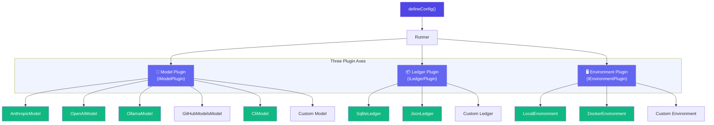
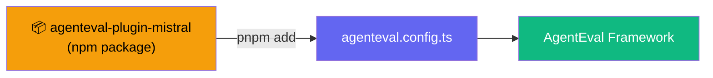
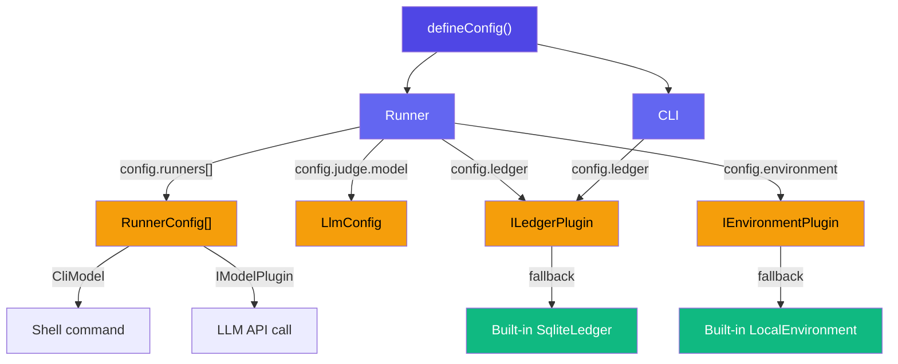

# Plugins

AgentEval uses a **plugin architecture** that decouples models, storage, and execution environments. Runners are plain config objects — not plugins. This lets you swap backends without touching your test code.

## Overview


```mermaid
flowchart TB
    CONFIG["defineConfig()"] --> RUNNER["Runner"]

    subgraph Plugins["Three Plugin Axes"]
        direction LR
        MODEL["🤖 Model Plugin<br/>(IModelPlugin)"]
        LEDGER["📦 Ledger Plugin<br/>(ILedgerPlugin)"]
        ENV["🖥️ Environment Plugin<br/>(IEnvironmentPlugin)"]
    end

    RUNNER --> MODEL
    RUNNER --> LEDGER
    RUNNER --> ENV

    MODEL --> AN["AnthropicModel"]
    MODEL --> OA["OpenAIModel"]
    MODEL --> OL["OllamaModel"]
    MODEL --> GH["GitHubModelsModel"]
    MODEL --> CL["CliModel"]
    MODEL --> CM["Custom Model"]

    LEDGER --> SQ["SqliteLedger"]
    LEDGER --> JS["JsonLedger"]
    LEDGER --> CU["Custom Ledger"]

    ENV --> LE["LocalEnvironment"]
    ENV --> DE["DockerEnvironment"]
    ENV --> CE["Custom Environment"]

    style CONFIG fill:#4f46e5,color:#fff
    style Plugins fill:#f0f4ff
    style MODEL fill:#6366f1,color:#fff
    style LEDGER fill:#6366f1,color:#fff
    style ENV fill:#6366f1,color:#fff
    style AN fill:#10b981,color:#fff
    style OA fill:#10b981,color:#fff
    style OL fill:#10b981,color:#fff
    style CL fill:#10b981,color:#fff
    style SQ fill:#10b981,color:#fff
    style JS fill:#10b981,color:#fff
    style LE fill:#10b981,color:#fff
    style DE fill:#10b981,color:#fff
```

## Plugin Categories

| Plugin          | Interface            | Purpose                           | Built-in                                                                        |
| --------------- | -------------------- | --------------------------------- | ------------------------------------------------------------------------------- |
| **Model**       | `IModelPlugin`       | Wraps LLM providers (judge + API) | `AnthropicModel`, `OpenAIModel`, `OllamaModel`, `GitHubModelsModel`, `CliModel` |
| **Ledger**      | `ILedgerPlugin`      | Result storage and querying       | `SqliteLedger`, `JsonLedger`                                                    |
| **Environment** | `IEnvironmentPlugin` | Workspace setup, exec, diffs      | `LocalEnvironment`, `DockerEnvironment`                                         |

::: tip Runners are not plugins
Runners are plain config objects (`RunnerConfig`), not plugin instances. See the [Runners](./runners) page for details.
:::

## Import Map

Plugins are **not** re-exported from the main `"agent-eval"` entry point. Each plugin category has its own barrel export:

| Import                   | What you get                                                                    |
| ------------------------ | ------------------------------------------------------------------------------- |
| `agent-eval`             | Core: `test`, `expect`, `describe`, `defineConfig`, types, interfaces           |
| `agent-eval/llm`         | `AnthropicModel`, `OpenAIModel`, `OllamaModel`, `GitHubModelsModel`, `CliModel` |
| `agent-eval/ledger`      | `SqliteLedger`, `JsonLedger`                                                    |
| `agent-eval/environment` | `LocalEnvironment`, `DockerEnvironment`                                         |

::: tip Why separate entry points?
Each plugin category dynamically imports its dependencies (`@ai-sdk/openai`, `@ai-sdk/anthropic`, `node:sqlite`, etc.). By isolating them in separate entry points, **only the plugins you actually use are loaded** — no unnecessary dependencies.
:::

## Quick Configuration

```ts
import { defineConfig } from "agent-eval";
import { CliModel, OpenAIModel } from "agent-eval/llm";
import { SqliteLedger } from "agent-eval/ledger";
import { LocalEnvironment } from "agent-eval/environment";

const gpt4o = new OpenAIModel({ model: "gpt-4o" });

export default defineConfig({
  // Runners are plain config objects: { name, model }
  runners: [
    { name: "copilot", model: new CliModel({ command: "gh copilot -p '{{prompt}}'" }) },
    { name: "gpt-4o", model: gpt4o },
  ],
  judge: { name: "gpt-4o", model: gpt4o },
  ledger: new SqliteLedger({ outputDir: ".agenteval" }),
  environment: new LocalEnvironment(),
});
```

::: tip Default behavior
If you don't configure ledger or environment plugins, AgentEval uses sensible defaults:

- **Ledger**: `SqliteLedger` with `outputDir: ".agenteval"`
- **Environment**: `LocalEnvironment` (git reset + local exec)
  :::

## Plugin Interfaces

All plugins implement a typed interface. See the detailed pages for each:

- **[Models (LLM)](./plugins-llm)** — `IModelPlugin` for wrapping LLM providers
- **[Ledger (Storage)](./plugins-ledger)** — `ILedgerPlugin` for result persistence and querying
- **[Environments](./plugins-environments)** — `IEnvironmentPlugin` for workspace isolation and command execution

Runners are plain config objects (`RunnerConfig`) documented in the [Runners](./runners) page.

## Plugin Validation

AgentEval validates plugins at startup. Missing or invalid methods produce clear error messages:

```
❌ Plugin validation failed:

  ModelPlugin "my-custom-model":
    ✗ Missing method: createModel (expected: method)

  EnvironmentPlugin "my-env":
    ✗ Missing method: setup (expected: method)
    ✗ Missing method: getDiff (expected: method)
```

## Creating Custom Plugins

Each plugin category has a typed interface you can implement. Custom plugins can live **inside your project** or be published as **standalone npm packages** that anyone can install and use.

### Inline Plugin (same project)

Create a plugin directly in your codebase:

```ts
// my-plugins/mistral-model.ts
import type { IModelPlugin } from "agent-eval";

export class MistralModel implements IModelPlugin {
  readonly name = "mistral";
  readonly modelId: string;

  constructor(private opts: { model: string; apiKey?: string }) {
    this.modelId = opts.model;
  }

  async createModel() {
    const { createMistral } = await import("@ai-sdk/mistral");
    return createMistral({ apiKey: this.opts.apiKey })(this.opts.model);
  }
}
```

Then import it in your config:

```ts
// agenteval.config.ts
import { defineConfig } from "agent-eval";
import { MistralModel } from "./my-plugins/mistral-model";

export default defineConfig({
  runners: [{ name: "mistral", model: new MistralModel({ model: "mistral-large-latest" }) }],
  judge: { name: "mistral", model: new MistralModel({ model: "mistral-large-latest" }) },
});
```

### External Plugin (npm package)

You can publish a plugin as an **independent npm package** so others can install and use it. This is the recommended approach for reusable plugins.


```mermaid
flowchart LR
    PKG["📦 agenteval-plugin-mistral<br/>(npm package)"] -->|"pnpm add"| CONFIG["agenteval.config.ts"]
    CONFIG --> AE["AgentEval Framework"]

    style PKG fill:#f59e0b,color:#000
    style CONFIG fill:#6366f1,color:#fff
    style AE fill:#10b981,color:#fff
```

#### Step 1: Create the package

```bash
mkdir agenteval-plugin-mistral && cd agenteval-plugin-mistral
npm init -y
pnpm add agent-eval @ai-sdk/mistral
```

#### Step 2: Implement the interface

```ts
// src/index.ts
import type { IModelPlugin } from "agent-eval";

export class MistralModel implements IModelPlugin {
  readonly name = "mistral";
  readonly modelId: string;

  constructor(private opts: { model: string; apiKey?: string }) {
    this.modelId = opts.model;
  }

  async createModel() {
    const { createMistral } = await import("@ai-sdk/mistral");
    return createMistral({ apiKey: this.opts.apiKey })(this.opts.model);
  }
}
```

#### Step 3: Publish

```bash
npm publish
```

#### Step 4: Use in any project

```bash
pnpm add -D agent-eval agenteval-plugin-mistral
```

```ts
// agenteval.config.ts
import { defineConfig } from "agent-eval";
import { MistralModel } from "agenteval-plugin-mistral";

export default defineConfig({
  runners: [{ name: "mistral", model: new MistralModel({ model: "mistral-large-latest" }) }],
  judge: { name: "mistral", model: new MistralModel({ model: "mistral-large-latest" }) },
});
```

::: tip Naming convention
We recommend prefixing community plugins with `agenteval-plugin-` for discoverability:

- `agenteval-plugin-mistral` — Mistral model plugin
- `agenteval-plugin-postgres` — PostgreSQL ledger plugin
- `agenteval-plugin-kubernetes` — K8s environment plugin
  :::

### What You Can Build

Any of the three plugin types can be external packages:

| Plugin type     | Interface            | Example packages                                                                 |
| --------------- | -------------------- | -------------------------------------------------------------------------------- |
| **Model**       | `IModelPlugin`       | `agenteval-plugin-mistral`, `agenteval-plugin-cohere`, `agenteval-plugin-gemini` |
| **Ledger**      | `ILedgerPlugin`      | `agenteval-plugin-postgres`, `agenteval-plugin-mongodb`, `agenteval-plugin-s3`   |
| **Environment** | `IEnvironmentPlugin` | `agenteval-plugin-kubernetes`, `agenteval-plugin-ssh`, `agenteval-plugin-wasm`   |

All interfaces are exported from the main `"agent-eval"` entry point — your package only needs `agent-eval` as a **peer dependency**:

```json
{
  "name": "agenteval-plugin-mistral",
  "peerDependencies": {
    "agent-eval": ">=0.1.0"
  }
}
```

See each plugin page for complete interface definitions and examples:

- **[Models (LLM)](./plugins-llm)** — `IModelPlugin` for wrapping LLM providers
- **[Ledger (Storage)](./plugins-ledger)** — `ILedgerPlugin` for result persistence and querying
- **[Environments](./plugins-environments)** — `IEnvironmentPlugin` for workspace isolation and command execution

Runners are plain config objects (`RunnerConfig`) documented in the [Runners](./runners) page.

## Dependency Flow


```mermaid
flowchart TB
    CONFIG["defineConfig()"] --> RUNNER["Runner"]
    CONFIG --> CLI["CLI"]

    RUNNER -->|"config.runners[]"| RC["RunnerConfig[]"]
    RUNNER -->|"config.judge.model"| MP["LlmConfig"]
    RUNNER -->|"config.ledger"| LEDGER["ILedgerPlugin"]
    RUNNER -->|"config.environment"| ENV["IEnvironmentPlugin"]
    CLI -->|"config.ledger"| LEDGER

    RC -->|"CliModel"| CLIR["Shell command"]
    RC -->|"IModelPlugin"| APIR["LLM API call"]
    LEDGER -->|"fallback"| SQLITE["Built-in SqliteLedger"]
    ENV -->|"fallback"| LOCAL["Built-in LocalEnvironment"]

    style CONFIG fill:#4f46e5,color:#fff
    style RUNNER fill:#6366f1,color:#fff
    style CLI fill:#6366f1,color:#fff
    style RC fill:#f59e0b,color:#000
    style MP fill:#f59e0b,color:#000
    style LEDGER fill:#f59e0b,color:#000
    style ENV fill:#f59e0b,color:#000
    style SQLITE fill:#10b981,color:#fff
    style LOCAL fill:#10b981,color:#fff
```
