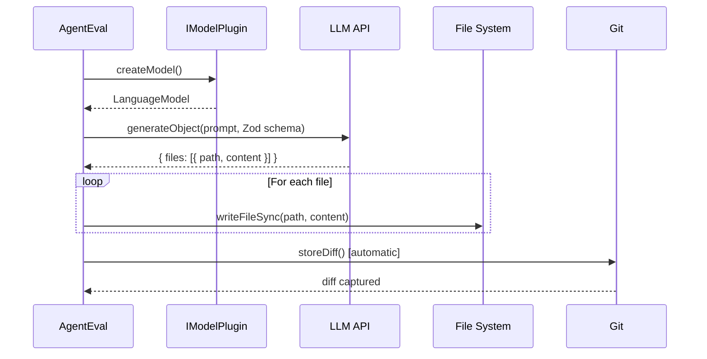
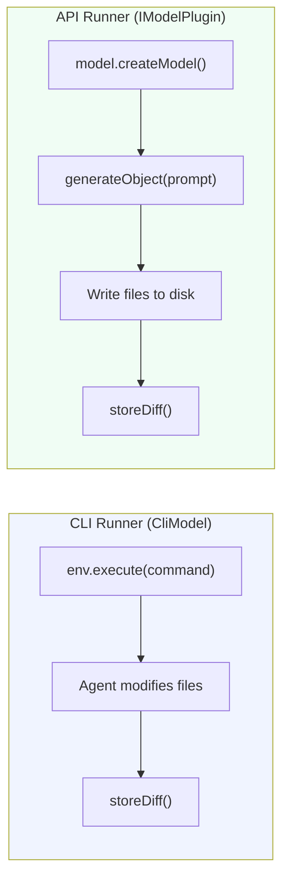

# Runners

Runners define **how** AgentEval triggers an AI coding agent. There are two runner types: **CLI runners** (spawn a shell command via `CliModel`) and **API runners** (call an LLM directly via an `IModelPlugin`).

Runners are **plain config objects** with the `RunnerConfig` type: `{ name: string; model: IModelPlugin | ICliModel }`. No class instantiation needed for API runners — just pass an `IModelPlugin` directly. Each runner must have a **unique `name`** — duplicate names throw an error at startup.

You can mix both types in the same config to compare CLI agents against API agents on identical tasks.

## Runner Types at a Glance

| Type       | How it works                                         | Best for                              |
| ---------- | ---------------------------------------------------- | ------------------------------------- |
| CLI runner | Spawns a shell command with `{{prompt}}` placeholder | IDE agents, CLI tools, custom scripts |
| API runner | Calls an LLM via Vercel AI SDK `generateObject()`    | Direct model comparison, headless CI  |

```ts
import type { RunnerConfig } from "agent-eval";

// RunnerConfig type
interface RunnerConfig {
  name: string;
  model: IModelPlugin | ICliModel;
}
```

---

## CLI Runners

CLI runners execute a shell command. Use `CliModel` from `agent-eval/providers/cli`. The `{{prompt}}` placeholder is replaced with the test instruction at runtime. The agent is expected to modify files on disk.

```ts
import { CliModel } from "agent-eval/providers/cli";

{
  name: "my-agent",
  model: new CliModel({ command: 'my-agent-cli "{{prompt}}"' }),
}
```

### Available CLI Agent Examples

#### GitHub Copilot CLI

```ts
{
  name: "copilot-cli",
  model: new CliModel({ command: 'gh copilot suggest -t shell "{{prompt}}"' }),
}
```

::: info Prerequisites
Install the [GitHub CLI](https://cli.github.com/) and authenticate with `gh auth login`. The Copilot extension is required: `gh extension install github/gh-copilot`.
:::

#### Aider

[Aider](https://aider.chat/) is an AI pair programming tool that works in your terminal.

```ts
{
  name: "aider-sonnet",
  model: new CliModel({ command: 'aider --message "{{prompt}}" --yes --no-auto-commits' }),
}
```

::: tip
Use `--no-auto-commits` so AgentEval captures the raw diff before any commit. Use `--yes` to skip confirmation prompts.
:::

#### Cursor (via CLI)

[Cursor](https://cursor.sh/) can be invoked via its CLI for headless agent runs.

```ts
{
  name: "cursor",
  model: new CliModel({ command: 'cursor --agent "{{prompt}}"' }),
}
```

#### Cline (VS Code Extension CLI)

[Cline](https://github.com/cline/cline) can be triggered headlessly via its CLI mode.

```ts
{
  name: "cline",
  model: new CliModel({ command: 'cline --task "{{prompt}}"' }),
}
```

#### Claude Code (Anthropic CLI)

[Claude Code](https://docs.anthropic.com/en/docs/claude-code) is Anthropic's official agentic coding tool.

```ts
{
  name: "claude-code",
  model: new CliModel({ command: 'claude -p "{{prompt}}" --allowedTools "Edit,Write,Bash"' }),
}
```

#### OpenAI Codex CLI

```ts
{
  name: "codex",
  model: new CliModel({ command: 'codex "{{prompt}}" --approval-mode full-auto' }),
}
```

#### Custom Script

You can wrap any logic in a script and use it as a runner:

```ts
{
  name: "custom-agent",
  model: new CliModel({ command: 'node ./scripts/my-agent.mjs "{{prompt}}"' }),
}
```

Your script receives the prompt as a CLI argument and should modify files in the current working directory. See `apps/example-target-app/scripts/mock-agent.mjs` for an example.

---

## API Runners

API runners call an LLM directly using the [Vercel AI SDK](https://sdk.vercel.ai/). The model returns a structured `files[]` array, and AgentEval writes them to disk.

This is useful when you want to:

- Compare raw model capabilities without agent tooling overhead
- Run evaluations in CI without installing CLI agents
- Benchmark different models on the same task

An API runner is a plain config object with an `IModelPlugin` as its `model`:

```ts
import { AnthropicModel } from "agent-eval/providers/anthropic";

{
  name: "claude-api",
  model: new AnthropicModel({ model: "claude-sonnet-4-20250514" }),
}
```

### API Runners with Different Providers

#### Anthropic

```ts
import { AnthropicModel } from "agent-eval/providers/anthropic";

{
  name: "claude-sonnet",
  model: new AnthropicModel({ model: "claude-sonnet-4-20250514" }),
}
```

| Model                      | Notes                |
| -------------------------- | -------------------- |
| `claude-sonnet-4-20250514` | Best cost/perf ratio |
| `claude-opus-4-20250514`   | Most capable         |
| `claude-haiku-3-20250305`  | Fastest, cheapest    |

#### OpenAI

```ts
import { OpenAIModel } from "agent-eval/providers/openai";

{
  name: "gpt-4o",
  model: new OpenAIModel({ model: "gpt-4o" }),
}
```

| Model           | Notes                |
| --------------- | -------------------- |
| `gpt-4o`        | Best cost/perf ratio |
| `gpt-4-turbo`   | High capability      |
| `gpt-3.5-turbo` | Fast, budget option  |

#### Ollama (Local)

Run models locally with [Ollama](https://ollama.ai/). No API key required.

```ts
import { OllamaModel } from "agent-eval/providers/ollama";

{
  name: "llama3-local",
  model: new OllamaModel({ model: "llama3" }),
}
```

| Model            | Notes                  |
| ---------------- | ---------------------- |
| `llama3`         | Meta's open model      |
| `codellama`      | Code-specialized       |
| `deepseek-coder` | Strong code generation |
| `mistral`        | Fast, general-purpose  |

::: info
Start Ollama before running: `ollama serve`. Pull models with `ollama pull llama3`.
:::

#### Custom Model Provider

Any OpenAI-compatible API can be used via `OpenAIModel` with a custom `baseURL`:

```ts
import { OpenAIModel } from "agent-eval/providers/openai";

{
  name: "company-llm",
  model: new OpenAIModel({
    model: "internal-model-v2",
    baseURL: "https://llm.internal.company.com/v1",
    apiKey: process.env.INTERNAL_LLM_KEY,
  }),
}
```

This works with Azure OpenAI, Together AI, Fireworks, Groq, and any provider exposing an OpenAI-compatible API.

---

## How API Runners Work


```mermaid
sequenceDiagram
    participant AE as AgentEval
    participant MP as IModelPlugin
    participant LLM as LLM API
    participant FS as File System
    participant Git as Git

    AE->>MP: createModel()
    MP-->>AE: LanguageModel
    AE->>LLM: generateObject(prompt, Zod schema)
    LLM-->>AE: { files: [{ path, content }] }
    loop For each file
        AE->>FS: writeFileSync(path, content)
    end
    AE->>Git: storeDiff() [automatic]
    Git-->>AE: diff captured
```

1. AgentEval calls the model plugin's `createModel()` to get a LanguageModel
2. Sends the test prompt via `generateObject()` with a Zod schema
3. The model returns structured output: `{ files: [{ path, content }] }`
4. AgentEval writes each file to disk in the project directory
5. `storeDiff()` is called automatically, followed by any `afterEach` commands

---

## CLI vs API Runner Comparison


```mermaid
flowchart LR
    subgraph CLI["CLI Runner (CliModel)"]
        A["env.execute(command)"] --> B["Agent modifies files"]
        B --> C["storeDiff()"]
    end

    subgraph API["API Runner (IModelPlugin)"]
        D["model.createModel()"] --> E["generateObject(prompt)"]
        E --> F["Write files to disk"]
        F --> G["storeDiff()"]
    end

    style CLI fill:#f0f4ff
    style API fill:#f0fdf4
```

::: tip Environment Plugin
Both CLI and API runners execute within the configured [environment plugin](/guide/plugins-environments). By default, the **LocalEnvironment** is used (git reset + local exec). You can configure Docker or custom environments — see [Environments](/guide/plugins-environments).
:::

| Aspect        | CLI Runner               | API Runner                    |
| ------------- | ------------------------ | ----------------------------- |
| **Execution** | Spawns shell command     | HTTP API call                 |
| **Agent**     | IDE agents, CLI tools    | Raw LLM models                |
| **Timeout**   | 600s default             | Network-dependent             |
| **Output**    | Agent writes files       | AgentEval writes from JSON    |
| **CI**        | Needs agent installed    | Only needs API key            |
| **Use case**  | Real-world agent testing | Model comparison, headless CI |

---

## Creating a Custom Model

Implement the `IModelPlugin` interface to create a custom model for use in runners:

```ts
import type { IModelPlugin } from "agent-eval";

class BrowserAgentModel implements IModelPlugin {
  readonly name = "browser-agent";
  readonly modelId = "playwright-agent";

  createModel() {
    // Return a LanguageModel instance or custom model object
    return myCustomModel;
  }
}

// Use it in a runner config
{ name: "browser-agent", model: new BrowserAgentModel() }
```

---

## Environment Variables

API runners (via model plugins) use environment variables for authentication:

| Provider  | Variable            | Notes                          |
| --------- | ------------------- | ------------------------------ |
| Anthropic | `ANTHROPIC_API_KEY` | Or set `apiKey` in constructor |
| OpenAI    | `OPENAI_API_KEY`    | Or set `apiKey` in constructor |
| Ollama    | —                   | No key needed (local)          |

---

## Error Handling

| Scenario                  | Behavior                                  |
| ------------------------- | ----------------------------------------- |
| Command not found         | Error logged, test recorded as FAIL       |
| Agent timeout (600s)      | Process killed, test recorded as FAIL     |
| API rate limit            | Error thrown, test recorded as FAIL       |
| Non-zero exit code        | Captured in context, available to judge   |
| Agent produces no changes | Empty diff, judge evaluates (likely FAIL) |

::: tip
A failing agent execution never crashes the entire run. Each test is wrapped in a try/catch, and failures are recorded in the ledger for later analysis.
:::

---

## Comparing Runners

Use the `matrix` option to select which runners to execute per run:

```ts
import { defineConfig } from "agent-eval";
import { CliModel } from "agent-eval/providers/cli";
import { AnthropicModel } from "agent-eval/providers/anthropic";
import { OpenAIModel } from "agent-eval/providers/openai";

export default defineConfig({
  runners: [
    { name: "claude-api", model: new AnthropicModel({ model: "claude-sonnet-4-20250514" }) },
    { name: "gpt-4o", model: new OpenAIModel({ model: "gpt-4o" }) },
    {
      name: "aider",
      model: new CliModel({ command: 'aider --message "{{prompt}}" --yes --no-auto-commits' }),
    },
  ],

  // Run all three on every test
  // Or filter to specific runners:
  // matrix: { runners: ["claude-api", "gpt-4o"] },
});
```

The [dashboard](/guide/dashboard) Analytics page plots score-over-time per runner, making it easy to compare agent performance.
