# Writing Tests

## Test Lifecycle

Every eval test follows a precise lifecycle:

```mermaid
flowchart TD
    A["test() registers evaluation"] --> B["Runner picks up test"]
    B --> C["🔄 Git reset (clean state)"]
    C --> D["🤖 agent.run(prompt)"]
    D --> E["📸 Auto storeDiff()"]
    E --> F["⚙️ afterEach commands"]
    F --> G["⚖️ expect(ctx).toPassJudge()"]
    G --> H{"score ≥ warn\nthreshold?"}
    H -- "≥ 0.8" --> I["✅ PASS → Ledger"]
    H -- "≥ 0.5" --> I2["⚠️ WARN → Ledger"]
    H -- "< 0.5" --> J["❌ FAIL → Ledger"]

    style D fill:#f59e0b,color:#000
    style G fill:#10b981,color:#fff
    style I fill:#10b981,color:#fff
    style I2 fill:#f59e0b,color:#000
    style J fill:#ef4444,color:#fff
```



## File Naming

Test files are discovered automatically using these patterns:

- `*.eval.ts` / `*.eval.js` / `*.eval.mts` / `*.eval.mjs`
- `*.agent-eval.ts` / `*.agent-eval.js` / `*.agent-eval.mts` / `*.agent-eval.mjs`

Place them anywhere in your project (except `node_modules/` and `dist/`).

## Basic Structure

Every eval test follows this pattern:

```ts
import { test, expect } from "agent-eval";

test("Test title", async ({ agent, ctx }) => {
  // 1. Run the agent (storeDiff is called automatically after this)
  await agent.run("Your instruction to the agent");

  // 2. Judge the output
  await expect(ctx).toPassJudge({
    criteria: "Your evaluation criteria in Markdown",
  });
});
```

::: tip Automatic post-agent hooks
`storeDiff()` is called **automatically** after `agent.run()`. You can also define global `afterEach` commands in your config to run tests, builds, or linters automatically — no need to call them manually in every eval file. See [Configuration](./configuration.md#automatic-post-agent-hooks).
:::

## Grouping Tests with describe()

Use `describe()` to organize tests into suites. Suites can be nested:

```ts
import { test, describe, expect } from "agent-eval";

describe("UI Components", () => {
  describe("Banner", () => {
    test("Add close button", async ({ agent, ctx }) => {
      await agent.run("Add a close button to the Banner component");
      await expect(ctx).toPassJudge({ criteria: "Close button implemented" });
    });

    test("Add animation", async ({ agent, ctx }) => {
      await agent.run("Add fade-in animation to Banner");
      await expect(ctx).toPassJudge({ criteria: "Animation is smooth" });
    });
  });

  describe("Search", () => {
    test("Add debounce", async ({ agent, ctx }) => {
      await agent.run("Implement search with debounce");
      await expect(ctx).toPassJudge({ criteria: "Debounce works correctly" });
    });
  });
});
```


The dashboard displays these suites as a collapsible tree in the sidebar, with breadcrumb navigation showing the full suite path.

## The Test Function

The `test()` function receives an object with:

| Parameter | Type          | Description                                     |
| --------- | ------------- | ----------------------------------------------- |
| `agent`   | `AgentHandle` | Handle to trigger the AI agent                  |
| `ctx`     | `TestContext` | Context for capturing diffs and command outputs |
| `judge`   | `JudgeConfig` | The judge configuration (read-only)             |

The `agent` object exposes:

- `agent.run(prompt)` — trigger the agent with a prompt (imperative mode)
- `agent.instruct(prompt)` — declare what the agent should do (declarative mode) — see [Declarative Pipeline](./declarative-pipeline.md)
- `agent.name` — the runner's name (e.g., `"copilot"`)
- `agent.model` — the runner's model (e.g., `"claude-sonnet-4-20250514"`)

## Declarative vs Imperative

AgentEval supports two test styles:

**Imperative** (original) — you control execution:

```ts
test("task", async ({ agent, ctx }) => {
  await agent.run("Add close button");
  await expect(ctx).toPassJudge({ criteria: "works" });
});
```

**Declarative** (new) — you declare, the runner executes:

```ts
test("task", ({ agent, ctx }) => {
  agent.instruct("Add close button");
  ctx.addTask({
    name: "Build",
    action: () => ctx.exec("pnpm build"),
    criteria: "build succeeds",
    weight: 2,
  });
});
```

::: tip
See the full [Declarative Pipeline guide](./declarative-pipeline.md) for details on `addTask()`, weighted scoring, hooks, and dry-run mode.
:::

## Capturing Context

### `ctx.storeDiff()`

Captures the current `git diff` (staged + unstaged). **Called automatically** after `agent.run()`. You only need to call it manually if you want to capture a diff at a specific point before judging.

### `ctx.runCommand(name, command)`

Runs a shell command and stores its result (stdout, stderr, exit code, duration). For commands that should run after every agent execution (tests, builds, linters), use the `afterEach` config option instead.

```ts
// Manual call (for one-off commands in specific tests)
await ctx.runCommand("test", "pnpm test -- Banner");

// Preferred: use afterEach in config for recurring commands
// See Configuration > Automatic Post-Agent Hooks
```

::: info Command timeout
Each `runCommand()` call has a **120-second timeout**. If the command doesn't complete in time, it's killed and the exit code is set to 1.
:::

## Evaluation Criteria

The `criteria` string supports Markdown. Be specific:

```ts
await expect(ctx).toPassJudge({
  criteria: `
    - Component renders a close button with <IconButton>
    - Button has aria-label="Close"
    - Click handler calls onClose prop
    - All existing tests still pass
    - Build compiles without errors
    - No TypeScript errors
  `,
});
```

## Expected Files

Use `expectedFiles` to tell the judge which files **should** have been modified. The judge will flag scope creep if the agent touches unexpected files:

```ts
await expect(ctx).toPassJudge({
  criteria: "Add close button to Banner component",
  expectedFiles: ["src/components/Banner.tsx", "src/components/Banner.test.tsx"],
});
```

The judge prompt includes a **file scope analysis** section that compares the expected files against what was actually changed in the diff. This helps detect agents that modify too many files.

## Judge Result

The judge returns a structured result:

```ts
interface JudgeResult {
  pass: boolean; // true if status is PASS or WARN
  status?: TestStatus; // "PASS" | "WARN" | "FAIL"
  score: number; // 0.0 to 1.0
  reason: string; // Why the agent got this score
  improvement: string; // Suggestions to improve the score
}
```

The `status` is computed from the score and [thresholds](/guide/configuration#scoring-thresholds):

| Status | Condition                         | Default             |
| ------ | --------------------------------- | ------------------- |
| PASS   | `score ≥ warn`                    | `score ≥ 0.8`       |
| WARN   | `score ≥ fail` and `score < warn` | `0.5 ≤ score < 0.8` |
| FAIL   | `score < fail`                    | `score < 0.5`       |

Only **FAIL** throws a `JudgeFailure` error. **WARN** is flagged but still passes.

## Tagged Tests

```ts
test.tagged(["ui", "banner"], "Add Close button", async ({ agent, ctx }) => {
  // ...
});
```

Run only tagged tests: `agenteval run -t ui`

## Skipping Tests

```ts
test.skip("Not ready yet", async ({ agent, ctx }) => {
  // This test is registered but won't execute
});
```

## Multiple Assertions

You can make multiple judge calls in one test:

```ts
test("Complex feature", async ({ agent, ctx }) => {
  await agent.run("Add search with debounce");

  // First judge call — check the UI
  await expect(ctx).toPassJudge({
    criteria: "Search input renders correctly",
  });

  // Second judge call — check the logic (with a stronger model)
  await expect(ctx).toPassJudge({
    criteria: "Debounce is implemented with 300ms delay",
    model: "claude-opus-4-20250514",
  });
});
```

## Error Handling

If a judge call fails (score < fail threshold, default 0.5), it throws a `JudgeFailure` error. The runner catches this error per-test and records the failure in the ledger — **a single test failure never crashes the entire run**.

```mermaid
flowchart LR
    A["toPassJudge()"] --> B{"Resolve\nthresholds"}
    B --> C{"score ≥ warn?"}
    C -- Yes --> D["✅ PASS — return"]
    C -- No --> E{"score ≥ fail?"}
    E -- Yes --> F["⚠️ WARN — return"]
    E -- No --> G["❌ FAIL — throw"]
    G --> H["Runner catches"]
    H --> I["Record in ledger"]
    I --> J["Continue next test"]

    style D fill:#10b981,color:#fff
    style F fill:#f59e0b,color:#000
    style G fill:#ef4444,color:#fff
```


