# Writing Tests

## Test Lifecycle

Every eval test follows a precise lifecycle, driven by **environment plugins** and **lifecycle hooks**:

```mermaid
flowchart TD
    A["test() registers evaluation"] --> B["Runner picks up test"]
    B --> B2["🔧 env.setup(cwd)\n(workspace reset via plugin)"]
    B2 --> B3["📋 Config beforeEach\n(register common tasks)"]
    B3 --> B4["📋 DSL beforeEach\n(register scoped tasks)"]
    B4 --> C{"Mode?"}
    C -- Declarative --> D1["🤖 agent.instruct(prompt)"]
    D1 --> D2["📸 Auto storeDiff()"]
    D2 --> D3["⚙️ afterEach commands"]
    D3 --> D4["✅ Execute tasks"]
    D4 --> D5["⚖️ Judge (toPassJudge criteria + optional tasks)"]
    C -- Imperative --> E1["🤖 agent.run(prompt)"]
    E1 --> E2["📸 Auto storeDiff()"]
    E2 --> E3["⚙️ afterEach commands"]
    E3 --> E4["⚖️ expect(ctx).toPassJudge()"]
    D5 --> F{"score ≥ threshold?"}
    E4 --> F
    F -- "≥ pass" --> G["✅ PASS → Ledger"]
    F -- "≥ warn" --> G2["⚠️ WARN → Ledger"]
    F -- "< warn" --> H["❌ FAIL → Ledger"]
    G --> I["📋 afterEach hooks"]
    G2 --> I
    H --> I
    I --> J["🔧 env.teardown(cwd)"]

    style B2 fill:#6366f1,color:#fff
    style D1 fill:#f59e0b,color:#000
    style E1 fill:#f59e0b,color:#000
    style D5 fill:#10b981,color:#fff
    style E4 fill:#10b981,color:#fff
    style G fill:#10b981,color:#fff
    style G2 fill:#f59e0b,color:#000
    style H fill:#ef4444,color:#fff
```



::: info Environment Setup
The **environment plugin** handles workspace preparation. By default, `LocalEnvironment` runs `git reset --hard HEAD && git clean -fd`. With `DockerEnvironment`, it creates a fresh container. You can implement your own `IEnvironmentPlugin` for custom setups. See [Environments](/guide/environments).
:::

## File Naming

Test files are discovered automatically using these patterns:

- `*.eval.ts` / `*.eval.js` / `*.eval.mts` / `*.eval.mjs`
- `*.agent-eval.ts` / `*.agent-eval.js` / `*.agent-eval.mts` / `*.agent-eval.mjs`

Place them anywhere in your project (except `node_modules/` and `dist/`).

## Basic Structure

Every eval test follows this pattern:

```ts
import { test, expect } from "agent-eval";

test("Test title", async ({ agent, ctx }) => {
  // 1. Run the agent (storeDiff is called automatically after this)
  await agent.run("Your instruction to the agent");

  // 2. Judge the output (MANDATORY — every test must have a judge)
  await expect(ctx).toPassJudge({
    criteria: `
      - Describe what the agent should have done
      - Be specific about expected behavior
      - List files that should be modified
    `,
    expectedFiles: ["src/target-file.ts"], // optional but recommended
  });
});
```

::: tip Automatic post-agent hooks
`storeDiff()` is called **automatically** after `agent.run()`. You can also define global `afterEach` commands in your config to run tests, builds, or linters automatically — no need to call them manually in every eval file. See [Configuration](./configuration.md#automatic-post-agent-hooks).
:::

## Grouping Tests with describe()

Use `describe()` to organize tests into suites. Suites can be nested:

```ts
import { test, describe, expect } from "agent-eval";

describe("UI Components", () => {
  describe("Banner", () => {
    test("Add close button", async ({ agent, ctx }) => {
      await agent.run("Add a close button to the Banner component");
      await expect(ctx).toPassJudge({ criteria: "Close button implemented" });
    });

    test("Add animation", async ({ agent, ctx }) => {
      await agent.run("Add fade-in animation to Banner");
      await expect(ctx).toPassJudge({ criteria: "Animation is smooth" });
    });
  });

  describe("Search", () => {
    test("Add debounce", async ({ agent, ctx }) => {
      await agent.run("Implement search with debounce");
      await expect(ctx).toPassJudge({ criteria: "Debounce works correctly" });
    });
  });
});
```


The dashboard displays these suites as a collapsible tree in the sidebar, with breadcrumb navigation showing the full suite path.

## beforeEach — 3 Levels of Scoping

`beforeEach` can be defined at **three** levels. All applicable hooks run before each test, in order:

```mermaid
flowchart TD
    A["1️⃣ Config-level beforeEach\n(agenteval.config.ts)"] --> B["2️⃣ File-level beforeEach\n(.eval.ts top-level)"]
    B --> C["3️⃣ describe-level beforeEach\n(inside describe block)"]
    C --> D["Test function"]

    style A fill:#6366f1,color:#fff
    style B fill:#f59e0b,color:#000
    style C fill:#10b981,color:#fff
    style D fill:#10b981,color:#fff
```



| Level        | Where                 | Scope                                      | Best for                          |
| ------------ | --------------------- | ------------------------------------------ | --------------------------------- |
| **Config**   | `agenteval.config.ts` | All tests using this config                | Common tasks (test, build, lint)  |
| **File**     | `.eval.ts` top-level  | All tests in that file                     | File-specific setup               |
| **Describe** | Inside `describe()`   | Tests in that describe block + nested ones | Suite-specific verification tasks |

### Level 1 — Config-level (recommended for shared tasks)

```ts
// agenteval.config.ts
import { defineConfig } from "agent-eval";

export default defineConfig({
  runners: [{ name: "copilot", type: "cli", command: 'gh copilot "{{prompt}}"' }],
  judge: { provider: "openai", model: "gpt-4o" },

  beforeEach: ({ ctx }) => {
    ctx.addTask({
      name: "Tests",
      action: () => ctx.exec("pnpm test"),
      criteria: "All tests must pass",
      weight: 3,
    });
    ctx.addTask({
      name: "Build",
      action: () => ctx.exec("pnpm build"),
      criteria: "Build succeeds",
      weight: 2,
    });
  },
});
```

### Level 2 — File-level (top-level in eval file)

```ts
// banner.eval.ts
import { test, beforeEach } from "agent-eval";

beforeEach(({ ctx }) => {
  ctx.addTask({
    name: "Lint",
    action: () => ctx.exec("pnpm lint"),
    criteria: "No linting errors",
  });
});

test("Add close button", ({ agent, ctx }) => {
  agent.instruct("Add a close button to Banner");
  ctx.addTask({
    name: "Button exists",
    action: () => ctx.exec("grep aria-label Banner.tsx"),
    criteria: "Button found",
  });
});
```

### Level 3 — Describe-level (scoped to a suite)

```ts
import { test, describe, beforeEach } from "agent-eval";

describe("Banner", () => {
  beforeEach(({ ctx }) => {
    ctx.addTask({
      name: "Banner test",
      action: () => ctx.exec("pnpm test -- Banner"),
      criteria: "Banner tests pass",
    });
  });

  test("Add close button", ({ agent, ctx }) => {
    agent.instruct("Add a close button");
    // Gets: config beforeEach + describe beforeEach + test-specific tasks
  });
});
```

::: tip Combine all three
All levels can be used together. Config tasks + file tasks + describe tasks are **merged** and all run before the test function. This keeps eval files lean — put common verification in the config, and only add specific tasks where needed.
:::

## The Test Function

The `test()` function receives an object with:

| Parameter | Type          | Description                                     |
| --------- | ------------- | ----------------------------------------------- |
| `agent`   | `AgentHandle` | Handle to trigger the AI agent                  |
| `ctx`     | `TestContext` | Context for capturing diffs and command outputs |
| `judge`   | `JudgeConfig` | The judge configuration (read-only)             |

The `agent` object exposes:

- `agent.run(prompt)` — trigger the agent with a prompt (imperative mode — **must** be followed by `toPassJudge()`)
- `agent.instruct(prompt)` — declare what the agent should do (declarative mode — **must** also call `toPassJudge()` to define judge criteria) — see [Declarative Pipeline](./declarative-pipeline.md)
- `agent.name` — the runner's name (e.g., `"copilot"`)
- `agent.model` — the runner's model (e.g., `"claude-sonnet-4-20250514"`)

## Declarative vs Imperative

AgentEval supports two test styles — both are first-class citizens:

### Imperative — you control execution

You call `agent.run()` to execute the agent, then call `expect(ctx).toPassJudge()` to evaluate the result. This gives you full control over the execution flow:

```ts
test("task", async ({ agent, ctx }) => {
  await agent.run("Add close button");

  await expect(ctx).toPassJudge({
    criteria: `
      - Close button renders with aria-label="Close"
      - Click handler calls onClose prop
      - No TypeScript errors
    `,
    expectedFiles: ["src/components/Banner.tsx", "src/components/Banner.test.tsx"],
  });
});
```

::: warning Judge is mandatory
Every test style (imperative and declarative) **must** call `expect(ctx).toPassJudge()`.  
`agent.instruct()` defines what the agent should implement; `toPassJudge()` defines how the judge evaluates and scores that implementation.  
If a test completes without `toPassJudge()`, AgentEval throws an explicit error.
:::

### Declarative — you declare, the runner executes

You call `agent.instruct()` to declare what the agent should do, optionally add `ctx.addTask()` verification tasks, and **must** finish with `expect(ctx).toPassJudge()` to define final scoring criteria/scope:

```ts
test("task", async ({ agent, ctx }) => {
  agent.instruct("Add close button");
  ctx.addTask({
    name: "Build",
    action: () => ctx.exec("pnpm build"),
    criteria: "build succeeds",
    weight: 2,
  });

  await expect(ctx).toPassJudge({
    criteria: `
      - Feature works as requested
      - Build and tests pass
      - No unnecessary refactors
    `,
    expectedFiles: ["src/components/Banner.tsx"],
  });
});
```

::: tip
See the full [Declarative Pipeline guide](./declarative-pipeline.md) for details on `addTask()`, weighted scoring, hooks, and dry-run mode.
:::

## Capturing Context

### `ctx.storeDiff()`

Captures the current `git diff` (staged + unstaged). **Called automatically** after `agent.run()`. You only need to call it manually if you want to capture a diff at a specific point before judging.

### `ctx.runCommand(name, command)`

Runs a shell command and stores its result (stdout, stderr, exit code, duration). For commands that should run after every agent execution (tests, builds, linters), use the `afterEach` config option instead.

```ts
// Manual call (for one-off commands in specific tests)
await ctx.runCommand("test", "pnpm test -- Banner");

// Preferred: use afterEach in config for recurring commands
// See Configuration > Automatic Post-Agent Hooks
```

::: info Command timeout
Each `runCommand()` call has a **120-second timeout**. If the command doesn't complete in time, it's killed and the exit code is set to 1.
:::

## Evaluation Criteria

The `criteria` string supports Markdown. Be specific:

```ts
await expect(ctx).toPassJudge({
  criteria: `
    - Component renders a close button with <IconButton>
    - Button has aria-label="Close"
    - Click handler calls onClose prop
    - All existing tests still pass
    - Build compiles without errors
    - No TypeScript errors
  `,
});
```

## Expected Files

Use `expectedFiles` to tell the judge which files **should** have been modified. This defines the minimum scope of the change:

```ts
await expect(ctx).toPassJudge({
  criteria: "Add close button to Banner component",
  expectedFiles: ["src/components/Banner.tsx", "src/components/Banner.test.tsx"],
});
```

The judge prompt includes a **file scope analysis** section that compares the expected files against what was actually changed in the diff:

- **Missing expected files** → the judge penalizes the score significantly
- **Extra files modified** → the judge evaluates whether they are necessary for the task. Relevant changes (updating imports, adding new dependencies) are acceptable. Unrelated changes are flagged as **scope creep** and reduce the score
- The judge reports its file scope analysis in the `reason` field of the result

## Judge Result

The judge returns a structured result:

```ts
interface JudgeResult {
  pass: boolean; // true if status is PASS or WARN
  status?: TestStatus; // "PASS" | "WARN" | "FAIL"
  score: number; // 0.0 to 1.0
  reason: string; // Why the agent got this score
  improvement: string; // Suggestions to improve the score
}
```

The `status` is computed from the score and [thresholds](/guide/configuration#scoring-thresholds):

| Status | Condition                         | Default             |
| ------ | --------------------------------- | ------------------- |
| PASS   | `score ≥ warn`                    | `score ≥ 0.8`       |
| WARN   | `score ≥ fail` and `score < warn` | `0.5 ≤ score < 0.8` |
| FAIL   | `score < fail`                    | `score < 0.5`       |

Only **FAIL** throws a `JudgeFailure` error. **WARN** is flagged but still passes.

## Tagged Tests

```ts
test.tagged(["ui", "banner"], "Add Close button", async ({ agent, ctx }) => {
  // ...
});
```

Run only tagged tests: `agenteval run -t ui`

## Skipping Tests

```ts
test.skip("Not ready yet", async ({ agent, ctx }) => {
  // This test is registered but won't execute
});
```

## Multiple Assertions

You can make multiple judge calls in one test:

```ts
test("Complex feature", async ({ agent, ctx }) => {
  await agent.run("Add search with debounce");

  // First judge call — check the UI
  await expect(ctx).toPassJudge({
    criteria: "Search input renders correctly",
  });

  // Second judge call — check the logic (with a stronger model)
  await expect(ctx).toPassJudge({
    criteria: "Debounce is implemented with 300ms delay",
    model: "claude-opus-4-20250514",
  });
});
```

## Error Handling

If a judge call fails (score < fail threshold, default 0.5), it throws a `JudgeFailure` error. The runner catches this error per-test and records the failure in the ledger — **a single test failure never crashes the entire run**.

```mermaid
flowchart LR
    A["toPassJudge()"] --> B{"Resolve\nthresholds"}
    B --> C{"score ≥ warn?"}
    C -- Yes --> D["✅ PASS — return"]
    C -- No --> E{"score ≥ fail?"}
    E -- Yes --> F["⚠️ WARN — return"]
    E -- No --> G["❌ FAIL — throw"]
    G --> H["Runner catches"]
    H --> I["Record in ledger"]
    I --> J["Continue next test"]

    style D fill:#10b981,color:#fff
    style F fill:#f59e0b,color:#000
    style G fill:#ef4444,color:#fff
```


